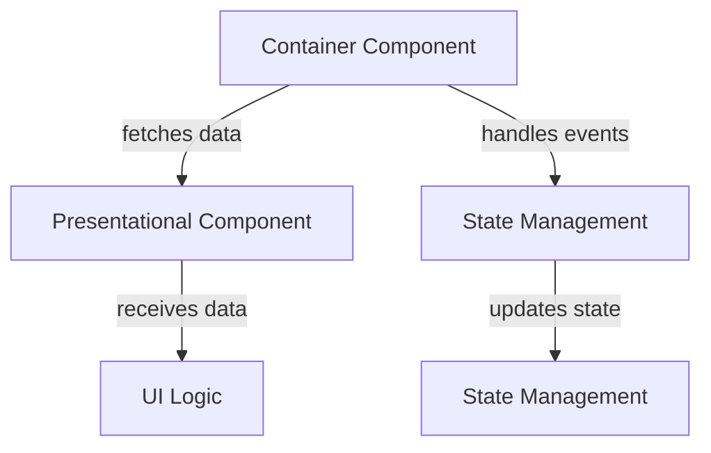

# Container Component

## Description

The Container Component pattern is a design pattern that encapsulates the logic for managing the lifecycle and state of a component. It separates the concerns of data management and presentation, allowing for a cleaner and more maintainable codebase. The Container Component is responsible for fetching data, handling
events, and passing the necessary data to presentational components.

## Motivation

The motivation behind the Container Component pattern is to create a clear separation of concerns in your application. By separating the logic for data management from the presentation logic, you can create more reusable and maintainable components. This pattern also helps to reduce the complexity of your components, making them easier to understand and test.

## Applicability

The Container Component pattern is applicable in scenarios where you have complex components that require data fetching, state management, or event handling. It is particularly useful in applications with a large number of components that need to share data or communicate with each other.

## Structure



## Implementation

```javascript
import React, { useState, useEffect } from 'react';

const ContainerComponent = ({children}) => {
    const [data, setData] = useState(null);
    const [loading, setLoading] = useState(true);

    useEffect(() => {
        const fetchData = async () => {
            try {
                const response = await fetch('https://api.example.com/data');
                const result = await response.json();
                setData(result);
            } catch (error) {
                console.error('Error fetching data:', error);
            } finally {
                setLoading(false);
            }
        };

        fetchData();
    }, []);

    const handleEvent = (event) => {
        // Handle event logic here
    };

    return (
        <>
            {React.Children.map(children, (child) => {
                    if (React.isValidElement(child)) {
                        return React.cloneElement(child, { data, loading, onEvent: handleEvent });
                    }
                    return child;
                })}
        </>
    );
};
```
