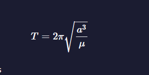

# Algorithms

## Table of contents

- [Algorithms](#algorithms)
  - [Table of contents](#table-of-contents)
  - [Arrays](#arrays)
    - [Recommendation](#recommendation)
    - [1. Smallest Common Multiple -\> Сложность 5/5](#1-smallest-common-multiple---сложность-55)
    - [2. Drop it -\> Сложность 2/5](#2-drop-it---сложность-25)
    - [3. Steamroller -\> Сложность 3/5](#3-steamroller---сложность-35)
    - [4. Map the Debris  -\> Сложность 1/5](#4-map-the-debris----сложность-15)
    - [5. Everything Be True -\> Сложность 3/5](#5-everything-be-true---сложность-35)
  - [Strings](#strings)
    - [1. Compare strings -\> Сложность 3/5](#1-compare-strings---сложность-35)
    - [2. Convert the characters -\> Сложность 2/5](#2-convert-the-characters---сложность-25)
    - [3. Binary Agents -\> Сложность 1/5](#3-binary-agents---сложность-15)
    - [4. Palindrome Checker  -\> Сложность 1/5](#4-palindrome-checker----сложность-15)
  - [Numbers](#numbers)
    - [1. Sum All Odd Fibonacci Numbers -\> Сложность 4/5](#1-sum-all-odd-fibonacci-numbers---сложность-45)
    - [2. Sum all Primes -\> Сложность 5/5](#2-sum-all-primes---сложность-55)
    - [3. Roman Numeral Converter -\> Сложность 5/5](#3-roman-numeral-converter---сложность-55)
  - [Function](#function)
    - [1. Arguments Optional  -\> Сложность 3/5](#1-arguments-optional----сложность-35)
    - [2. Make a Person  -\> Сложность 3/5](#2-make-a-person----сложность-35)

<!--
### 1. Smallest Common Multiple  -> Сложность 1/5
**Условие:**

**Info:**

**Алгоритм:**

```javascript
```
-->

## Arrays

========== Arrays ==========

### Recommendation

Отбить основной цикл и внутренний разделителями

```javascript
function uniteUnique(arr) {
  arrOfArg.map((arr, id) => {
    console.log("+++++++++++++++++++++++++");
    console.log("------arr---------", arr);

    arr.map((el) => {
      console.log("======el=====", el);
    });
  });
}
uniteUnique([1, 3, 2, 2, 2], [5, 2, 1, 4]);
```

### 1. Smallest Common Multiple -> Сложность 5/5

**Условие:**
Найти наименьший общий множитель между двумя или более числами

**Info:**
Найти наименьший множитель между двумя числами на которые оба числа будут делиться одинаково.
1*3 = 3; 2*3 = 6 3*3 = 9....

1. 3 are 3, 6, 9, 12, 15, 18,
2. 4 are 4, 8, 12, 16, 20, ...
3. первое наименьшее число 12

**Алгоритм:**

1. определить минимальное число и максимальное входных данных
2. найти делитель двух чисел
3. найти верхнюю границу двух чисел (через цикл)
4.

```javascript
function smallestCommons(arr) {
  // Setup
  const [min, max] = arr.sort((a, b) => a - b);
  const numberDivisors = max - min + 1;
  // Largest possible value for SCM
  let upperBound = 1;
  for (let i = min; i <= max; i++) {
    upperBound *= i;
  }
  // Test all multiples of 'max'
  for (let multiple = max; multiple <= upperBound; multiple += max) {
    // Check if every value in range divides 'multiple'
    let divisorCount = 0;
    for (let i = min; i <= max; i++) {
      // Count divisors
      if (multiple % i === 0) {
        divisorCount += 1;
      }
    }
    if (divisorCount === numberDivisors) {
      return multiple;
    }
  }
}

smallestCommons([1, 5]);
```

### 2. Drop it -> Сложность 2/5

**Условие:**
По заданному условию отфильтровывать массив

**Алгоритм:**

1. перебрать массив
2. установить флаг в true если условие совпадает
3. возвращать все остальные данные с массива в новый массив

```javascript
function dropElements(arr, func) {
  let flag = false;

  const newArr = arr.reduce((acc, el, id) => {
    if (func(el) && flag === false) {
      flag = true;
    }

    if (flag) {
      acc.push(el);
    }

    return acc;
  }, []);

  return newArr;
}

function dropElements(arr, func) {
  while (
    arr.length > 0
        &&
    !func(arr[0]) // 1 -> 2 -> 3
) {
    arr.shift(); // [ 2, 3, 7, 4 ] -> [ 3, 7, 4 ] -> [ 7, 4 ]
  }
  return arr;
}

dropElements([1, 2, 3, 4], function(n) {return n >= 3;});
```

### 3. Steamroller -> Сложность 3/5

**Условие:**
Исключить вложенные массивы не применяя Array.prototype.flat() Array.prototype.flatMap(). И не использую глобальные переменную
*Пример:* [[["a"]], [["b"]]] ==> ["a", "b"]

**Info:**

**Алгоритм:**

1. перебрать массив
2. проверить вложенные элемент массива на массив
3. применить рекурсию
4. если нет вложенного массив вернуться на следующий элемент родителя

```javascript
    function steamrollArray(arr){
        let result = [];

        arr.forEach(item =>{
            if(Array.isArray(item)){
                result = result.concat(SteamrollArray(item));
            } else {
                result.push(item);
            }
        })

        return result;
    }

    function steamrollArray(arr){
        const flat = [].concat(...arr);
        return flat.some(Array.isArray)? SteamrollArray(flat) : flat;
    }

    steamrollArray([1, [2], [3, [[4]]]]);
```

### 4. Map the Debris  -> Сложность 1/5

**Условие:**

1. вернуть новый массив объектов с обновленными свойствами
2. преобразовать высоту в круговую орбиту
*orbitalPeriod([{name : "sputnik", avgAlt : 35873.5553}]);*
*return [{name: "sputnik", orbitalPeriod: 86400}]*

**Info:**

**Алгоритм:**

1. создать новый массив
2. перебрать массив
3. перебирая массив создать новый объект
4. добавить новый объект в массив
5. вернуть массив

*Kepler's Third Law*


```javascript
function orbitalPeriod(arr) {
    const GM = 398600.4418;
  const earthRadius = 6367.4447;

  return arr.map(({ name, avgAlt }) => {
    const earth = earthRadius + avgAlt;
    const orbitalPeriod = Math.round(2 * Math.PI * Math.sqrt(Math.pow(earth, 3) / GM));
    return { name, orbitalPeriod };
  });
}

```

### 5. Everything Be True -> Сложность 3/5

```javascript
    truthCheck(
    [
        {key:[{key: ""}]},
        {key:{}},
        {key:[]},
        {}
    ],
    "предикат")
```

**Условие:**
Являются ли предикат верным для всех элементов коллекции

**Info:**

**Алгоритм:**

1. перебрать массив .every
2. если элемент коллекции с значением предикат false вернуть false

```javascript
function truthCheck(collection, pre) {
    return collection.every(obj => obj[pre]);
}

function truthCheck(collection, pre) {
  return collection.every(function (element) {
    return element.hasOwnProperty(pre) && Boolean(element[pre]);
  });
}

ruthCheck([{ name: "Quincy", role: "Founder", isBot: false }, { name: "Naomi", role: "", isBot: false }, { name: "Camperbot", role: "Bot", isBot: true }], "isBot");
```

## Strings

1. Базовый Алгоритм работы со словами в стоке  "aasdsda adasd"
   1. разбить строку на массив через str.split(" ")
   2. сделать работу с каждой буквой for(), forEach()
   3. собрать назад все назад в строку arr.join("")

### 1. Compare strings -> Сложность 3/5

**Условие:**
find the missing letter from a string and return it

```javascript
// fiend uniq literals form alphabet
function fearNotLetter(str) {
  let currCharCode = str.charCodeAt(0);
  let missing = undefined;

  str.split("").forEach((letter) => {
    if (letter.charCodeAt(0) === currCharCode) {
      currCharCode++;
    } else {
      missing = String.fromCharCode(currCharCode);
    }
  });

  return missing;
}
```

### 2. Convert the characters -> Сложность 2/5

**Условие:**
Convert the characters &, <, "", '' to name code

**Main Алгоритм:**

1. создать хранилище ключ значение
2. найти символ в строке
3. создать новую строку с новым значением

**Алгоритм 1.:**

1. разбить строку на массив элементов str.split("")
2. создать массив с characters &, <, "", ''
3. перебрать массив
4. найти элемент и заменить на нужный
5. собрать массив в кучу

**Алгоритм 2.:**
Решение два: 1. создать объект ключ characters значение на что надо заменить 2. создать регулярное выражение и заменить по ключу

```javascript
function convertHTML(str) {
  const characterEntries = {
    "&": "&amp;",
    "<": "&lt;",
    ">": "&gt;",
    '"': "&quot;",
    "'": "&apos;",
  };
  return str.replace(/([&<>\"'])/g, (match) => characterEntries[match]);
}
```

### 3. Binary Agents -> Сложность 1/5

**Условие:**
На основе бинарной строки вернуть английскую строку
"01000001 01110010 01100101..." -> "Aren't bonfires..."

**Info:**
"1101".parseInt("1101", 2) -> 13 второй аргумент для определения основания счисления
fromCharCode(13) -> "A"
**Алгоритм:**

1. разбить на массив строк
2. создать массив аккумулятор
3. проходится по элементу массива
4. конвертировать двоичный коды в число parseInt("1101", 2) -> 13
5. конвертировать unicode в символ fromCharCode(code)
6. пушить все в аккумулятор
7. собрать аккумулятор в строку arr.join("")

```javascript
    function binaryAgent(str){
        const biString = str.split(" "); // 1.
        let uniString = []; //2.

        for(let i = 0; i< biString.length; i++){
            let code,
                convertChar

            unicode = parseInt(biString[i],2)
            convertChar = String.fromCharCode(code)
            uniString.push(convertChar);
        }

        return uniString.join("");
    }

```

### 4. Palindrome Checker  -> Сложность 1/5

**Условие:**
Найти палиндром в строке

**пример:**

**Info:**

Палиндром - *это слово или фраза которая читается и в одном направлении и в другом*

**Алгоритм:**

1. очистить строку от спец символов
2. перебрать строку
3. разбить строку на массив
4. перевернуть массив
5. сравнить две строки
6. вернуть результат

```javascript
function palindrome(str) {
    const cleanStr = str.toLowerCase().replace(/[\W_]/g, "");
    const reversedStr = cleanStr.split("").reverse().join("");

    return cleanStr === reversedStr;
}

palindrome("eye");
```

## Numbers

### 1. Sum All Odd Fibonacci Numbers -> Сложность 4/5

**Условие:**
нужно посчитать сумму фибоначчи чисел 0,1,1,2,3,5,8,13,21,34,55

**Алгоритм:**

1. получить предыдущее значение;
2. получить текущее значение;
3. (0) + (1) = (1) => 1 + 1 = (2) => 1 + 2 = (3)
4. сложить предыдущее с текущее -> (2)+(3)=5

    ```javascript
    function fibonacciShort(num) {
      let a = 1,
        b = 1;

      for (let i = 3; i <= num; i++) {
        [a, b] = [b, a + b];
      }
      return b;
    }

    function sumFibs(num) {
      let prev = 0;
      let current = 1;
      let fibonacci = 0;

      while (current <= num) {
        if (current % 2 !== 0) {
          fibonacci += current;
        }

        current += prev;
        prev = current - prev;
      }

      return fibonacci;
    }

    function fibonacci(num) {
      const result = [0, 1];
      for (let i = 2; i < num; i++) {
        const prevNum1 = result[i - 1];
        const prevNum2 = result[i - 2];
        result.push(prevNum1 + prevNum2);
      }

      return result[num];
    }
    ```

### 2. Sum all Primes -> Сложность 5/5

**Условие:**
Нужно возвращать сумму всех простых чисел который меньше либо равны входному числу

**Info:**

1. простое число это натуральное число, единственным делителями которого являются только оно само и единица
   1. 2 это простое число которое делиться на 1 и 2
   2. 4 это не простое число которое делиться на 1,2,4
   3. натуральное число 1 не являются ни простым ни составным
2. разложением на простые множители - это если в натуральном числе все множители простые числа

**Теорема:**
*Каждое натуральное число, отличное от 1, может быть разложено на простые множители, и притом единственным образом (если отожествлять разложения p*q и q*p, где p и q простые числа)*

*Решето Эратосфена применимо к решению этой задачи.*

**Алгоритм:**

1. разложить число начиная с 2 ...
2. исключение составных чисел (которые имею делители отличные от 1 и самого числа)
3. суммируем все оставшиеся просты числа

```javascript
function sumPrimes(num) {
  let primes = [];

  for (let i = 2; i <= num; i++) {
    if (primes.every((prime) => i % prime !== 0)) {
      primes.push(i);
    }
  }

  return primes.reduce((sum, prime) => sum + prime, 0);
}

sumPrimes(assad)
```

### 3. Roman Numeral Converter -> Сложность 5/5

**Условие:**
Преобразовать число в римскую систему

**Info:**

**Алгоритм:**

1. создать объект с ключами и значениями
2. преобразовать число строку и разбить на массив строк
3. перебрать массив
4. преобразовать каждый элемент в число
5.

```javascript
function convertToRoman(num) {
  const romanToNum = {
    1: "I",
    4: "IV",
    5: "V",
    9: "IX",
    10: "X",
    40: "XL",
    50: "L",
    90: "XC",
    100: "C",
    400: "CD",
    500: "D",
    900: "CM",
    1000: "M",
  };

  let digits = [];

  const getComponents = (num) => {
    while (num > 0) {
      let digit = num % 10; // получаем последнюю цифру
      digits.unshift(digit); // добавляем ее в начало массива
      num = Math.floor(num / 10); // удаляем последнюю цифру из числа
    }
    let components = digits.map(
      (digit, index) => digit * Math.pow(10, digits.length - index - 1)
    );
    components = components.filter((component) => component !== 0);
    console.log(components);
    return components;
  };

  const romanNum = getComponents(num).reduce((acc, el, index) => {
    let sign = "";

    if (el < 4) {
      for (let i = 1; i <= el; i++) {
        sign += romanToNum[1];
      }

      return (acc += sign);
    }

    if ((el >= 4) & (el < 9)) {
      if (el === 4) {
        sign += romanToNum[4];
      } else {
        sign += romanToNum[5];

        for (let i = 0; i < el - 5; i++) {
          sign += romanToNum[1];
        }
      }

      return (acc += sign);
    }

    if (el === 9) {
      return (acc += romanToNum[9]);
    }

    if (el >= 10 && el < 40) {
      if (el === 10) {
        sign += romanToNum[10];
      } else {
        sign += romanToNum[10];

        for (let i = 1; i < el / 10; i++) {
          sign += romanToNum[10];
        }
      }

      return (acc += sign);
    }

    if (el >= 40 && el < 50) {
      if (el === 40) {
        sign += romanToNum[40];
      } else {
        sign += romanToNum[40];

        for (let i = 1; i < el / 10; i++) {
          sign += romanToNum[40];
        }
      }

      return (acc += sign);
    }

    if (el >= 50 && el < 90) {
      if (el === 50) {
        sign += romanToNum[50];
      } else {
        sign += romanToNum[50];

        const result = el - 50;
        console.log(result);

        for (let i = 1; i <= result / 10; i++) {
          sign += romanToNum[10];
        }
      }

      return (acc += sign);
    }

    if (el >= 90 && el < 100) {
      if (el === 90) {
        sign += romanToNum[90];
      } else {
        sign += romanToNum[90];

        for (let i = 1; i < el / 90; i++) {
          sign += romanToNum[90];
        }
      }

      return (acc += sign);
    }

    if (el >= 100 && el < 400) {
      if (el === 100) {
        sign += romanToNum[100];
      } else {
        const result = el - 100;
        console.log(result);

        sign += romanToNum[100];

        for (let i = 1; i < result / 10; i++) {
          sign += romanToNum[10];
        }
      }

      return (acc += sign);
    }

    if (el >= 400 && el < 500) {
      if (el === 400) {
        sign += romanToNum[400];
      } else {
        sign += romanToNum[400];

        for (let i = 1; i < el / 400; i++) {
          sign += romanToNum[400];
        }
      }

      return (acc += sign);
    }

    if (el >= 500 && el < 900) {
      if (el === 500) {
        sign += romanToNum[500];
      } else {
        const result = el - 500;

        sign += romanToNum[500];

        for (let i = 0; i < result / 100; i++) {
          sign += romanToNum[100];
        }
      }

      return (acc += sign);
    }

    if (el >= 900 && el < 1000) {
      if (el === 900) {
        sign += romanToNum[900];
      } else {
        const result = el - 900;

        sign += romanToNum[900];

        for (let i = 0; i < result / 100; i++) {
          sign += romanToNum[100];
        }
      }

      return (acc += sign);
    }

    if (el >= 1000) {
      if (el === 1000) {
        sign += romanToNum[1000];
      } else {
        for (let i = 0; i < el / 1000; i++) {
          sign += romanToNum[1000];
        }
      }
      return (acc += sign);
    }

    return acc;
  }, "");

  console.log(romanNum);

  return romanNum;
}

convertToRoman(2000);
```

## Function

### 1. Arguments Optional  -> Сложность 3/5

**Условие:**

1. вызвать функцию с которая будет суммировать текущий аргумент и предыдущее если это число.
2. Если один аргумент число то возвращать function
3. Если не число возвращать undefined

**пример:** *addTogether(2, 3) should return 5, and addTogether(2) should return a function.*

**Info:**

**Алгоритм:**

1. получить аргументы функции
2. сохранить в переменную
3. проверить на число (если не число вернуть undefined)
4. получить второй аргумент
5. проверить на число (если число продолжить)
6. сложить два аргумента через рекурсию

```javascript
function addTogether(){
    const [first, second] = arguments;

    const isFirstNumber = typeof first === "number";
    const isSecondNumber = typeof second === "number";

    if (isFirstNumber) {
        if (arguments.length === 1) {
            return (second) => addTogether(first, second);
        }

        if (isSecondNumber) {
            return first + second;
        }
    }
}

function addTogether(){
    const [first, second] = arguments;

    function addSecond(second){
        if (typeof second === "number") {
            return first + second;
        }
    }

    if (typeof first === "number") {
        if (arguments.length === 1) return addSecond;
        if (arguments.length === 2) return addSecond(second);
    }
}

```

### 2. Make a Person  -> Сложность 3/5

**Условие:**

1. Создать объект Person который будет принимать два аргумента first, last
2. Создать метод getFullName который будет возвращать полное имя
3. Создать метод setFirstName который будет устанавливать имя

**пример:**

**Info:**

Замыкания (Closures) - *это функция внутри функции которая имеет доступ к переменным внешней функции*

**Алгоритм:**

1. создать две переменные с во внутренней области видимости функции
2. установить методы для получения и установки имени
3. создать метод для установки полного имени
4. вернуть полное имя

```javascript
const Person = function(first, last) {
    let firstName = first;
    let lastName = last;

    this.getFullName = function() {
        return this.getFirstName() + " " + this.getLastName();
    };

    this.getFirstName = function() {
        return firstName = first;
    };

    this.getLastName = function() {
        return lastName = last;
    };

    this.setFirstName = function(first) {
        firstName = first;
    };

    this.setLastName = function(last) {
        lastName = last;
    };

    this.setFullName = function(first,last){
        this.setFirstName(first);
        this.setLastName(last);
        return this.getFullName();
    }
};
```
