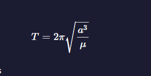

# Algorithms

## Table of contents

- [Algorithms](#algorithms)
  - [Table of contents](#table-of-contents)
  - [Arrays](#arrays)
    - [Recommendation](#recommendation)
    - [1. Smallest Common Multiple -\> Сложность 5/5](#1-smallest-common-multiple---сложность-55)
    - [2. Drop it -\> Сложность 2/5](#2-drop-it---сложность-25)
    - [3. Steamroller -\> Сложность 3/5](#3-steamroller---сложность-35)
    - [4. Map the Debris  -\> Сложность 1/5](#4-map-the-debris----сложность-15)
    - [5. Everything Be True -\> Сложность 3/5](#5-everything-be-true---сложность-35)
    - [6. Checker Cash Register -\> Сложность 5/5](#6-checker-cash-register---сложность-55)

## Arrays

========== Arrays ==========

### Recommendation

Отбить основной цикл и внутренний разделителями

```javascript
function uniteUnique(arr) {
  arrOfArg.map((arr, id) => {
    console.log("+++++++++++++++++++++++++");
    console.log("------arr---------", arr);

    arr.map((el) => {
      console.log("======el=====", el);
    });
  });
}
uniteUnique([1, 3, 2, 2, 2], [5, 2, 1, 4]);
```

### 1. Smallest Common Multiple -> Сложность 5/5

**Условие:**
Найти наименьший общий множитель между двумя или более числами

**Info:**
Найти наименьший множитель между двумя числами на которые оба числа будут делиться одинаково.
1*3 = 3; 2*3 = 6 3*3 = 9....

1. 3 are 3, 6, 9, 12, 15, 18,
2. 4 are 4, 8, 12, 16, 20, ...
3. первое наименьшее число 12

**Алгоритм:**

1. определить минимальное число и максимальное входных данных
2. найти делитель двух чисел
3. найти верхнюю границу двух чисел (через цикл)
4.

```javascript
function smallestCommons(arr) {
  // Setup
  const [min, max] = arr.sort((a, b) => a - b);
  const numberDivisors = max - min + 1;
  // Largest possible value for SCM
  let upperBound = 1;
  for (let i = min; i <= max; i++) {
    upperBound *= i;
  }
  // Test all multiples of 'max'
  for (let multiple = max; multiple <= upperBound; multiple += max) {
    // Check if every value in range divides 'multiple'
    let divisorCount = 0;
    for (let i = min; i <= max; i++) {
      // Count divisors
      if (multiple % i === 0) {
        divisorCount += 1;
      }
    }
    if (divisorCount === numberDivisors) {
      return multiple;
    }
  }
}

smallestCommons([1, 5]);
```

### 2. Drop it -> Сложность 2/5

**Условие:**
По заданному условию отфильтровывать массив

**Алгоритм:**

1. перебрать массив
2. установить флаг в true если условие совпадает
3. возвращать все остальные данные с массива в новый массив

```javascript
function dropElements(arr, func) {
  let flag = false;

  const newArr = arr.reduce((acc, el, id) => {
    if (func(el) && flag === false) {
      flag = true;
    }

    if (flag) {
      acc.push(el);
    }

    return acc;
  }, []);

  return newArr;
}

function dropElements(arr, func) {
  while (
    arr.length > 0
        &&
    !func(arr[0]) // 1 -> 2 -> 3
) {
    arr.shift(); // [ 2, 3, 7, 4 ] -> [ 3, 7, 4 ] -> [ 7, 4 ]
  }
  return arr;
}

dropElements([1, 2, 3, 4], function(n) {return n >= 3;});
```

### 3. Steamroller -> Сложность 3/5

**Условие:**
Исключить вложенные массивы не применяя Array.prototype.flat() Array.prototype.flatMap(). И не использую глобальные переменную
*Пример:* [[["a"]], [["b"]]] ==> ["a", "b"]

**Info:**

**Алгоритм:**

1. перебрать массив
2. проверить вложенные элемент массива на массив
3. применить рекурсию
4. если нет вложенного массив вернуться на следующий элемент родителя

```javascript
    function steamrollArray(arr){
        let result = [];

        arr.forEach(item =>{
            if(Array.isArray(item)){
                result = result.concat(SteamrollArray(item));
            } else {
                result.push(item);
            }
        })

        return result;
    }

    function steamrollArray(arr){
        const flat = [].concat(...arr);
        return flat.some(Array.isArray)? SteamrollArray(flat) : flat;
    }

    steamrollArray([1, [2], [3, [[4]]]]);
```

### 4. Map the Debris  -> Сложность 1/5

**Условие:**

1. вернуть новый массив объектов с обновленными свойствами
2. преобразовать высоту в круговую орбиту
*orbitalPeriod([{name : "sputnik", avgAlt : 35873.5553}]);*
*return [{name: "sputnik", orbitalPeriod: 86400}]*

**Info:**

**Алгоритм:**

1. создать новый массив
2. перебрать массив
3. перебирая массив создать новый объект
4. добавить новый объект в массив
5. вернуть массив

*Kepler's Third Law*


```javascript
function orbitalPeriod(arr) {
    const GM = 398600.4418;
  const earthRadius = 6367.4447;

  return arr.map(({ name, avgAlt }) => {
    const earth = earthRadius + avgAlt;
    const orbitalPeriod = Math.round(2 * Math.PI * Math.sqrt(Math.pow(earth, 3) / GM));
    return { name, orbitalPeriod };
  });
}

```

### 5. Everything Be True -> Сложность 3/5

```javascript
    truthCheck(
    [
        {key:[{key: ""}]},
        {key:{}},
        {key:[]},
        {}
    ],
    "предикат")
```

**Условие:**
Являются ли предикат верным для всех элементов коллекции

**Info:**

**Алгоритм:**

1. перебрать массив .every
2. если элемент коллекции с значением предикат false вернуть false

```javascript
function truthCheck(collection, pre) {
    return collection.every(obj => obj[pre]);
}

function truthCheck(collection, pre) {
  return collection.every(function (element) {
    return element.hasOwnProperty(pre) && Boolean(element[pre]);
  });
}

ruthCheck([{ name: "Quincy", role: "Founder", isBot: false }, { name: "Naomi", role: "", isBot: false }, { name: "Camperbot", role: "Bot", isBot: true }], "isBot");
```

### 6. Checker Cash Register -> Сложность 5/5

```javascript
function checkCashRegister(price, cash, cid) {
    const enumStatus = {
        INSUFFICIENT_FUNDS: "INSUFFICIENT_FUNDS",
        CLOSED: "CLOSED",
        OPEN: "OPEN",
    };

    const currencyUnit = {
        "ONE HUNDRED": 100,
        TWENTY: 20,
        TEN: 10,
        FIVE: 5,
        ONE: 1,
        QUARTER: 0.25,
        DIME: 0.1,
        NICKEL: 0.05,
        PENNY: 0.01,
    };

    const roundMoney = (money) => Math.round(money * 100) / 100;

    let sumOfCid = 0;


    sumOfCid = cid.reduce((sum, arr) => {
        return (sum += arr[1]);
    }, 0);

    sumOfCid = roundMoney(sumOfCid);

    console.log(sumOfCid, "sum bank");


    const getChange = (cash, price) => {
        let changeBanc = [];
        let sumChange = cash - price;

        sumChange = Math.round(sumChange * 100) / 100;

        for (let el in currencyUnit) {
            if (currencyUnit[el] < sumChange) {
                const changeX = Math.floor(sumChange / currencyUnit[el]);

                for (let i = 0; i < cid.length; i++) {
                    if (cid[i][0] === el) {
                        let el_bank = cid[i][1]; // 20
                        let initialEl_bank = cid[i][1];

                        console.log(el_bank, "++++bank");
                        console.log(currencyUnit[el], "...делители");
                        console.log(sumChange, "----здача");
                        console.log(changeX, "changeX");
                        console.log(
                            currencyUnit[el] * changeX,
                            "соколько нужно вычесть"
                        );
                        console.log(el, "ИМЯ");

                        for (let s = 0; s < changeX; s++) {
                            if (el_bank > 0) {
                                if(el === "DIME" ){

                                    console.log(el_bank, "_________+++++__________el_bank")
                                    console.log(sumChange, "_______+++++_______________sumChange");
                                    el_bank =  (el_bank  - currencyUnit[el]).toFixed(3)
                                    sumChange =   (sumChange - currencyUnit[el]).toFixed(3)

                                    console.log(el_bank, "______________________el_bank")
                                    console.log(sumChange, "______________________sumChange");
                                }else{
                                    el_bank = roundMoney(el_bank - currencyUnit[el]);
                                    console.log(el_bank, "______________________el_bank")
                                    sumChange = roundMoney(sumChange - currencyUnit[el]);
                                    console.log(sumChange, "______________________sumChange")
                                }
                            } else {
                                continue;
                            }
                        }
                        const result = roundMoney(initialEl_bank - el_bank);
                        changeBanc.push([el, result]);
                    }
                }
            }
        }

       return changeBanc
    };


    if (cash - price === sumOfCid) {
      return  {
          status: enumStatus.CLOSED,
          change:  cid,
      };
    }

     if(sumOfCid - cash < 0){
      return {
        status: enumStatus.INSUFFICIENT_FUNDS, // Open | Close
        change: [],
      };
    }

    return {
        status: enumStatus.OPEN, // Open | Close
        change: getChange(cash, price),
    };

}

 checkCashRegister(19.5, 20, [["PENNY", 0.01], ["NICKEL", 0], ["DIME", 0], ["QUARTER", 0], ["ONE", 1], ["FIVE", 0], ["TEN", 0], ["TWENTY", 0], ["ONE HUNDRED", 0]])

// {status: "OPEN", change: [["QUARTER", 0.5]]}
```
