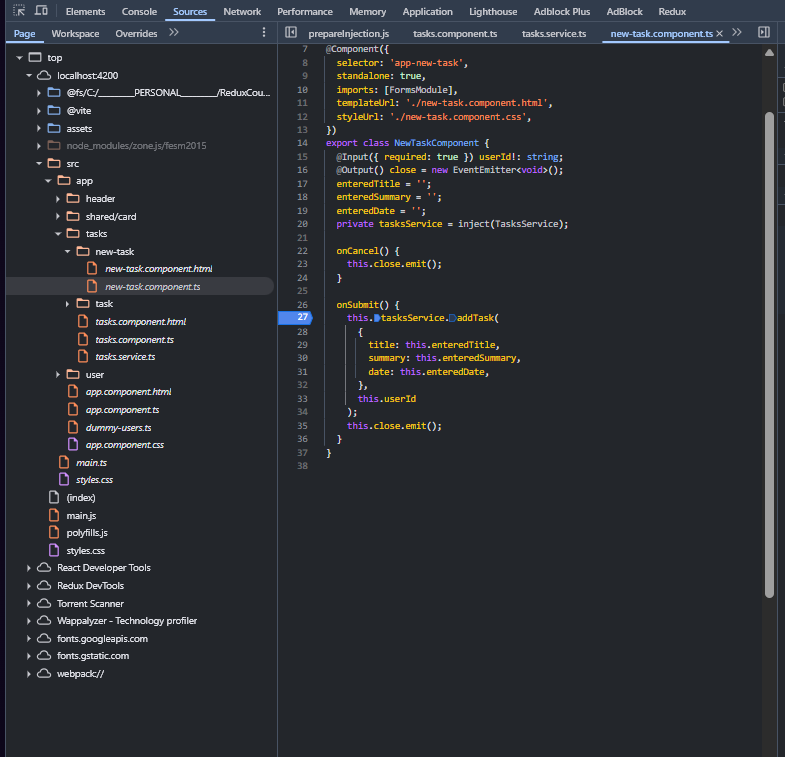
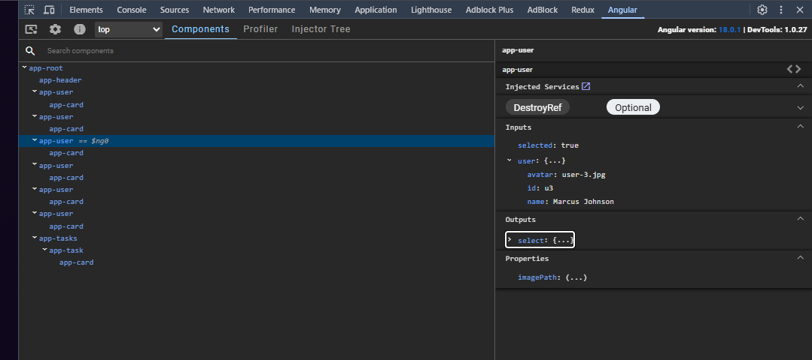

# Debugging in Angular

## Debugging process

## Angular DevTools

Angular DevTools is a Chrome extension that provides debugging and profiling capabilities for Angular applications. It allows developers to inspect the component tree, view change detection cycles, and analyze performance metrics.

