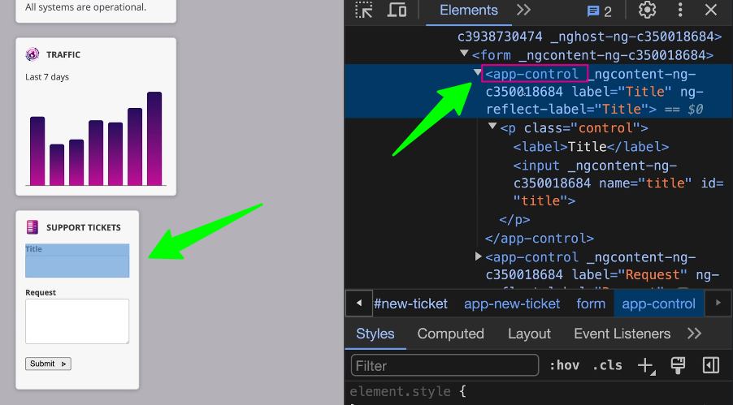

# Host Elements in Angular

## Introduction

Host elements in Angular are the DOM elements that host Angular components. They are the entry points for Angular applications and play a crucial role in how components are rendered and interact with the DOM. Understanding host elements is essential for building efficient and maintainable Angular applications.

## What are Host Elements?

Every Angular component has a host element, which is the DOM element that the component is attached to. This host element can be a simple HTML element or a more complex structure, depending on the component's design. Host elements are created when Angular compiles and renders components in the browser.



## Creating Host Elements

```typescript

import { Component } from '@angular/core';

@import { Component, OnInit } from '@angular/core';

@Component({
    selector: 'selector-name',  // It's a host element
    templateUrl: 'name.component.html'
})

export class NameComponent implements OnInit {
    constructor() { }
}
```

```css

:host {
    display: block;
    background-color: lightblue;
}

```
