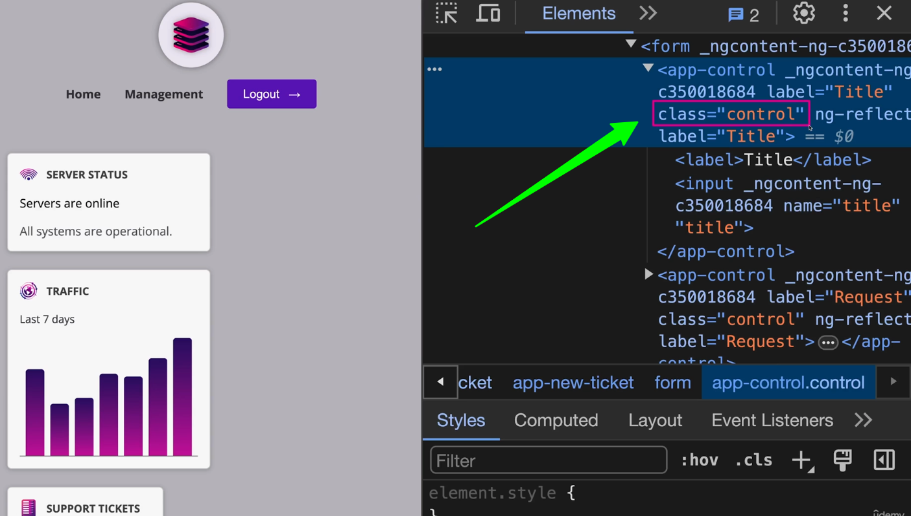

# Host Elements in Angular

## Introduction

Host elements in Angular are the DOM elements that host Angular components. They are the entry points for Angular applications and play a crucial role in how components are rendered and interact with the DOM. Understanding host elements is essential for building efficient and maintainable Angular applications.

## What are Host Elements?

Every Angular component has a host element, which is the DOM element that the component is attached to. This host element can be a simple HTML element or a more complex structure, depending on the component's design. Host elements are created when Angular compiles and renders components in the browser.


## Creating Host Elements

```typescript

import { Component } from '@angular/core';

@import { Component, OnInit } from '@angular/core';

@Component({
    selector: 'selector-name',  // It's a host element
    templateUrl: 'name.component.html'
})

export class NameComponent implements OnInit {
    constructor() { }
}
```

```css

:host {
    display: block;
    background-color: lightblue;
}
```

## configuration property : `host`



The `host` property in the component decorator allows you to define styles and attributes for the host element. This is useful for applying styles or behaviors directly to the host element without affecting other elements in the component's template.

```typescript

import { Component } from '@angular/core';

@Component ({
    selector: 'app-example',
    templateUrl: './example.component.html',
    hast: {
        class: 'control', // Add a class to the host element
        '[attr.aria-label]': 'ariaLabel', // Bind an attribute to the host element
        'onClick': 'onClick($event)', // Bind a click event to the host element
    }
    styleUrls: ['./example.component.css']
})
export class ExampleComponent {
    ariaLabel = 'Example component'; // Attribute value for the host element

    onClick(event: MouseEvent) {
        console.log('Host element clicked:', event); // Handle click events on the host element
    }
}
```

### @Decorator Host Binding (Old Way)

The `@HostBinding` decorator allows you to bind properties of the host element to component properties. This is useful for dynamically updating the host element's attributes or styles based on the component's state.

```typescript
import { Component, HostBinding } from '@angular/core';

@Component ({
    selector: 'app-example',
    templateUrl: './example.component.html',
    styleUrls: ['./example.component.css'],

    // host: {
    //     '[class.active]': 'isActive', // Bind the 'active' class to the host element
    //     '[attr.aria-label]': 'ariaLabel', // Bind an attribute to the host element
    // }
})
export class ExampleComponent {
    @HostBinding('class.active') isActive = false; // Bind the 'active' class to the host element
    @HostBinding('class') className = 'control'; // Bind a static class to the host element

    toggleActive() {
        this.isActive = !this.isActive; // Toggle the 'active' class on the host element
    }
}
```

### @HostListener (Old Way)

The `@HostListener` decorator allows you to listen for events on the host element and respond to them in your component. This is useful for handling user interactions or other events that occur on the host element.

```typescript
import { Component, HostListener } from '@angular/core';

@Component({
    selector: 'app-example',
    templateUrl: './example.component.html',
    styleUrls: ['./example.component.css']
})

export class ExampleComponent {
    @HostListener('click', ['$event']) onClick(event: MouseEvent) {
        console.log('Host element clicked:', event); // Handle click events on the host element
    }

    @HostListener('mouseenter') onMouseEnter() {
        console.log('Mouse entered the host element'); // Handle mouse enter events on the host element
    }

    @HostListener('mouseleave') onMouseLeave() {
        console.log('Mouse left the host element'); // Handle mouse leave events on the host element
    }
}
```
