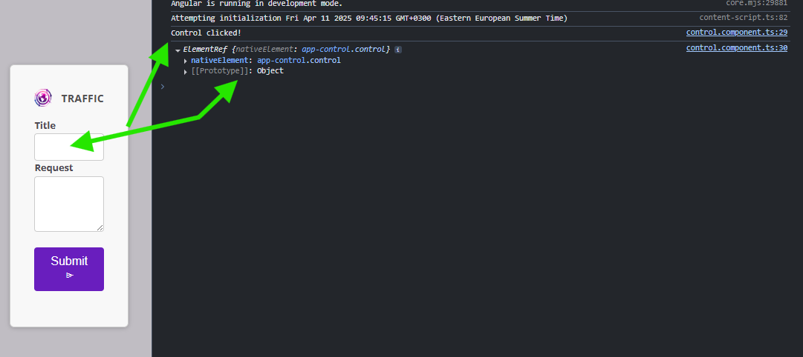

# Angular Services

## What are Services?

Services in Angular are singleton objects that encapsulate business logic, data access, and other functionalities that can be shared across components. They are typically used to perform tasks such as fetching data from APIs, managing state, and handling complex operations that are not directly related to the view.

## Dependency Injection

Dependency Injection (DI) is a design pattern used in Angular to manage the creation and sharing of services. It allows you to inject dependencies into components and other services, making your code more modular and testable.

### Example of Dependency Injection

```typescript
import { Injectable } from '@angular/core';

@Injectable({providedIn: 'root'})
export class ApiService {
  getData() {
    return 'Data from API';
  }
}

@Component({
  selector: 'app-example',
  template: `
    <div>{{ data }}</div>
  `,
})
export class ExampleComponent {
  data: string;

  constructor(private apiService: ApiService) {
    this.data = this.apiService.getData();
  }
}


export class ExampleComponent2 {
    private apiService: ApiService = inject(ApiService);
    data: string = this.apiService.getData();
}
```

### Injection of ElementRef

It's also possible to inject `ElementRef` into a service. This allows you to access the DOM element associated with the component or directive that is using the service.



```typescript
import { Injectable, ElementRef } from '@angular/core';

import { inject } from '@angular/core';
import { Component, ElementRef } from '@angular/core';

@Component({
  selector: 'app-example',
  template: `
    <div #myElement>My Element</div>
  `,
})
export class ExampleComponent {
  private el = inject(ElementRef); // Access to the Host Component

  onClick() {
    console.log(this.el); // Access the DOM element
  }
}
```
