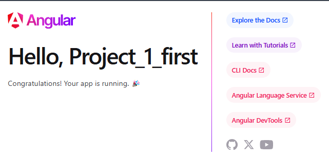

# Main Angular concepts

## The Angular CLI

The Angular CLI (Command Line Interface) is a powerful tool that helps developers create, manage, and build Angular applications. It provides a set of commands to automate common tasks, such as generating components, services, and modules, running tests, and building the application for production.

[link]<https://angular.dev/tools/cli>

### Installation

To install the Angular CLI, you need to have Node.js and npm (Node Package Manager) installed on your machine. Once you have them installed, you can use the following command to install the Angular CLI globally:

```bash
npm install -g @angular/cli
```

### Creating a new Angular application

To create a new Angular application, you can use the `ng new` command followed by the name of your application. For example:

```bash
ng new my-angular-app
```

## Start the development server

To start the development server and serve your application, navigate to the project directory and run the following command:

```bash
npm start
```



## Creating components

Components are the building blocks of an Angular application. You can create a new component using the `ng generate component` command followed by the name of the component. For example:

```bash
ng g c user
```

## Attributes Binding

Attributes binding in Angular allows you to bind data from your component to the attributes of HTML elements in your template. This is done using square brackets `[]` around the attribute name. For example, if you have a component property called `imageUrl`, you can bind it to the `src` attribute of an `` tag like this:

```html

```

## Not required variable `!`

Not required variable `!` is a TypeScript feature that allows you to tell the compiler that a variable will be initialized later, even if it is not initialized in the constructor. This is useful when you want to avoid using the `?` operator for optional properties.

For example, if you have a property called `name` that will be initialized later, you can declare it like this:

```typescript
export class UserComponent {
  name!: string; // Not required variable
}
```

## Required variable `?`

Required variable `?` is a TypeScript feature that allows you to define a property as optional. This means that the property may or may not be present in the object. You can use the `?` operator to indicate that a property is optional.

```typescript
export class UserComponent {
  name?: string; // Required variable
}
```

## variable $event

The `$event` variable in Angular is a special variable that represents the event object that is passed to the event handler when an event occurs. It contains information about the event, such as the target element, the type of event, and any additional data associated with the event.

```typescript
import { Component } from '@angular/core';

@Component({
  selector: 'app-user',
  template: `<button (click)="onClick($event)">Click me</button>`
})
export class UserComponent {
  onClick(event: Event) {
    console.log('Button clicked!', event);
  }
}
```
