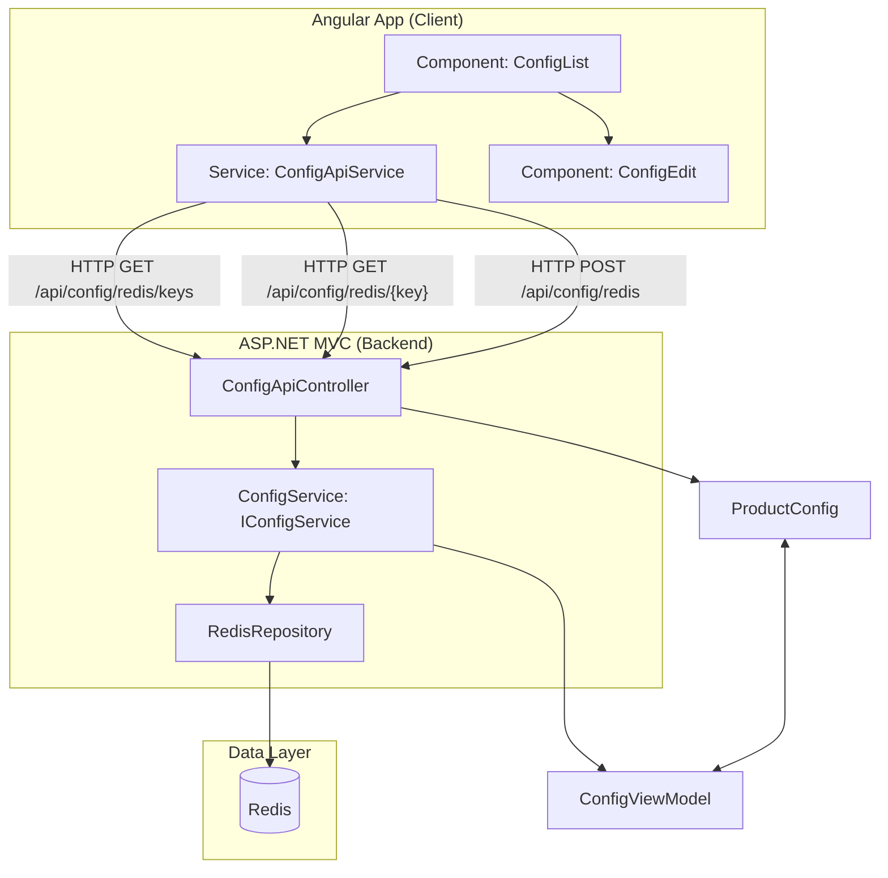

# Redis and AngularJS

## Architecture Take Redis data and show it in AngularJS

<!-- markdownlint-capture -->

[Controller] ⇄ [Service Layer] ⇄ [RedisRepository] ⇄ Redis
                         ⇅
                 [ViewModelBuilder]
                         ⇅
               [ProductConfig] ⇄ [ConfigViewModel]
