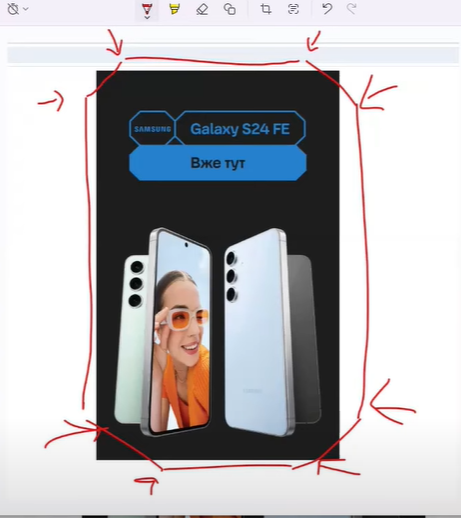
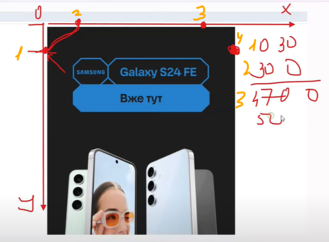

# Clip-path

Show specific part of the image:
    - Circle shape
    - Inset shape
    - Ellipse shape
    - URL shape
    - SVG shape
    - Border-radius shape
    - Inset shape

## Polygon shape

- Clip-path property is used to clip an element to a specific shape by defining a polygon.
- The polygon() function is used to define a clipping path.
- The polygon() function takes a list of points as its value.
- The points are defined by their x and y coordinates.
- The first and last points should be the same to close the shape.

{:height="40%" width="40%"}

```HTML

<div>
    
</div>

```

{:height="40%" width="40%"}

```css
div {
    width: 300px;
    height: 300px;
    overflow: hidden;
}

img {
    width: 100%;
    clip-path: polygon(
        0p 30px,     // 1
        30px 0p,     // 2
        470px 0p,    // 3
        500px 30px,  // 4
        500px 270px, // 5
        470px 300px, // 6
        30px 300px,  // 7
        0p 270px     // 8
    );
}
```
