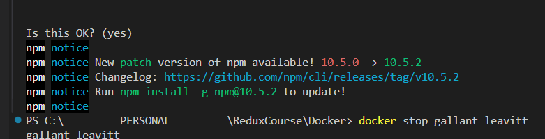

# Docker Images & Containers: The Core Building Blocks

[Docker Images & Containers](#docker-images--containers-the-core-building-blocks)
    [Docker Images VS Containers](#docker-images-vs-containers)
    [Run a Docker Images](#run-a-docker-images)
    [Create a Docker Image](#create-a-docker-image)
    [Build a Docker Image](#build-a-docker-image)
    [Image layers](#image-layers)
    [Managing Images and Containers](#managing-images-and-containers)
    [Entering interactive mode](#entering-interactive-mode)
    [Deleting Images and Containers](#deleting-images-and-containers)
    [Removing stopped containers automatically](#removing-stopped-containers-automatically)
    [Inspecting Images](#inspecting-images)
    [Copying files from a container and to a container](#copying-files-from-a-container-and-to-a-container)
    [Naming Images](#naming-images)

## Docker Images VS Containers


- **Docker Image**: a snapshot of a container
- **Docker Container**: a running instance of a Docker image

## Run a Docker Images


- node image contains the node Installation (environments, libraries, frameworks, and applications)

```bash
docker run node
```

- `docker ps` command to list all running containers
- `docker ps -a` command to list all containers (running and stopped)

```bash
docker ps -a
```

- `-it` flag to run the container in interactive mode

``` bash
docker run -it node // run the node image in interactive mode
```

## Create a Docker Image

- `FROM` keyword to specify the base image
- `FROM node` to use the node image as the base image
- `WORKDIR /app` to set the working directory in the container
- `COPY` keyword to copy the files from the host machine to the container
- `COPY . /app`  to copy all the files from the current directory to the `/app` directory in the container

- `RUN` keyword to run a command in the container
- `RUN npm install` to install the dependencies in the container
- `EXPOSE 80` keyword to expose a port in the container (port 80 in this case only for documentation)
- `CMD` keyword to specify the command to run when the container starts
- `CMD ["node", "server.js"]` to run the `server.js` file when the container starts
**`RUN node server.js ->> CMD ["node", "server.js"] ... Don't run the server in the Dockerfile`**

``` Dockerfile
FROM node

WORKDIR /app

COPY . /app

RUN npm install

EXPOSE 80

CMD ["node", "server.js"]
```

## Build a Docker Image

- `docker build` command to build a Docker image
- `.` to specify the current directory as the build context
- `run <image-id>` to run the Docker image
- `docker ps` command to list all running containers
- `docker stop <name>` to stop a running container
- `docker run -p` to publish a container's port to the host (with port should be accessible)


```bash
docker build .
docker run <image-id>
docker ps
docker stop <name>
docker run -p 3000:80 <image-id>
docker stop <name>
```

## Image layers

- docker cache data if the image is built before


- `cache` every layer will be and reused if the image is built again
- docker only rebuilds the layers that have changed

``` Dockerfile
FROM node

WORKDIR /app

COPY package.json /app

RUN npm install

COPY . /app

EXPOSE 80

CMD ["node", "server.js"]
```

## Managing Images and Containers



- `docker ps a` command to list all containers (running and stopped)
- `docker ps --help` command to get help on the `docker ps` command

- `docker start <container-name>` command to start a stopped container
**`docker start` running in the background, use `docker run` to run in the foreground**
**`docker run` has detached mode by default `-d` to run in the background**
- `docker run -p 8000:80 -d <image-id>` command to run a container in detached mode and publish a container's port to the host
- `docker attach <container-name>` command to attach to a running container again
- `docker logs <container-name>` command to view the logs of a container
- `docker logs --help` command to get help on the `docker logs` command
- `docker logs -f <container-name>` command to follow the logs of a container
- `docker start -a <container-name>` command to start a container in the foreground

```bash
docker ps --help
docker ps -a
docker start <container-name>
docker run -p 8000:80 -d <image-id>
docker attach <container-name>
docker logs <container-name>
docker logs --help
docker logs -f <container-name>
docker start -a <container-name>
```

## Entering interactive mode

```Dockerfile
FROM python

WORKDIR /app

COPY . /app

CMD ["python", "rng.py"]
```

- `docker run -it <container-id>` command to run a container in interactive mode
- `docker ps -a` command to list all containers (running and stopped)
- `docker start -a <image-name>` start a container with attached mode but only listen mode
- `docker start -a -i <image-name>` start a container with attached mode and input mode

```bash
docker build .
docker run --help
docker run -it <image-id>
docker ps -a

docker start -a  <image-name>

docker start -a -i <image-name>
```

## Deleting Images and Containers

- `docker container prune` command to remove all stopped containers

```bash
docker ps -a
docker stop <container-name>
docker rm <container-name> <container-name> <container-name>
docker container prune
```

- `docker images` command to list all images
- `docker image prune` command to remove all dangling images

```bash
docker images
docker rmi <image-id> <image-id> <image-id>
docker image prune
```

## Removing stopped containers automatically

- `--rm` flag to remove a container automatically when it stops
- `-d` flag to run a container in detached mode

```bash
docker run --help

docker run --rm <image-id>
docker images
docker run -p 3000:80 -d --rm <image-id>
docker stop interesting_aryabhata
docker ps
```

## Inspecting Images

- `docker inspect` command to inspect an image or container

```bash
docker images
docker inspect <image-id>
```

## Copying files from a container and to a container

- `docker cp` command to copy files from a container to the host


```bash
docker cp <from - folder-path>/ <container-name>:/< into - folder-name>
```

## Naming Images

```bash
docker run -p 3000:80 -d --rm --name MaksmPoskannyi <image-id>
docker ps
docker stop MaksmPoskannyi
```

## Tag Images


- `FROM node:14` to use the node image with the tag `14`
- `-t` flag to tag an image
- `docker build -t <image-name>:<tag> .` to build an image with a tag

```bash
docker build -t <image-name>:<tag> .
```
