# main information

[main information](#main-information)
   [What is Docker? and Why we need it?](#what-is-docker-and-why-we-need-it)
       [Why we need Docker?](#why-we-need-docker)
    [Virtual Machine VS Docker container](#virtual-machine-vs-docker-container)
    [Docker Setup](#docker-setup)
       [Docker Installation](#docker-installation)
    [Docker container](#docker-container)
       [Container VS Images](#container-vs-images)
       [Docker hub](#docker-hub)

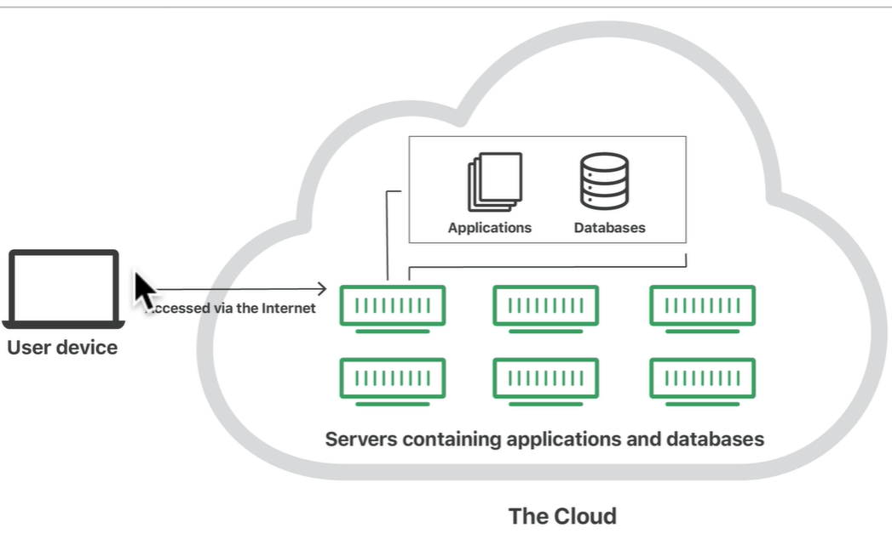

## What is Docker? and Why we need it?

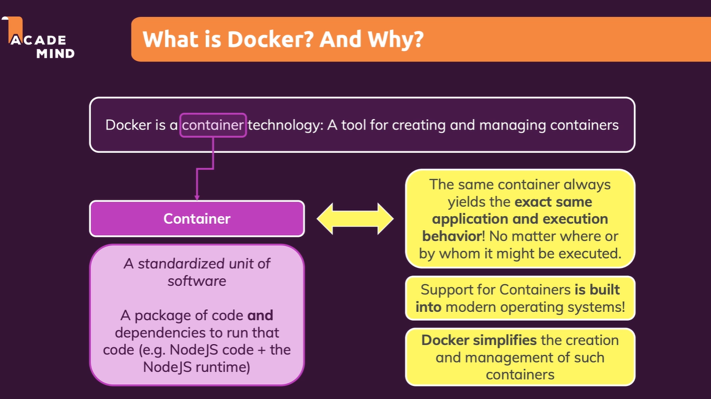

### Why we need Docker?

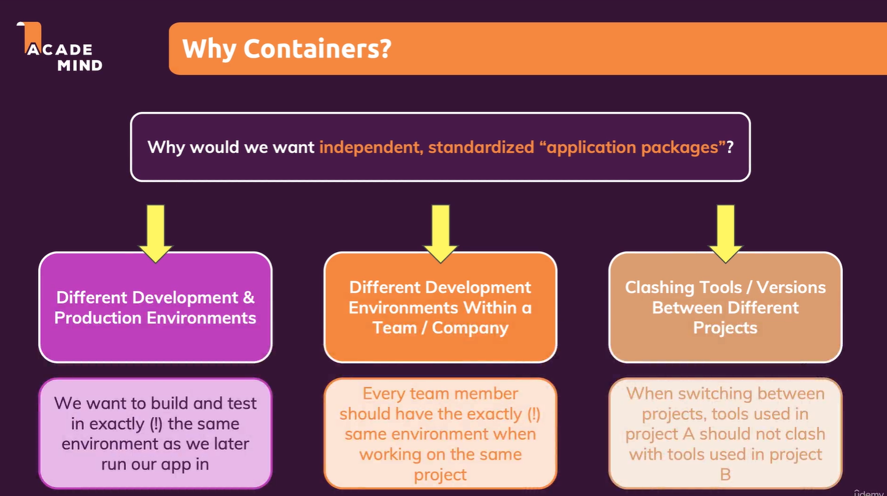

- **Different Development & Production Environments**
  - exact same environment for Development and Production
    
  - easy to share the environment with the team
    
  - easy switch between different projects
    

## Virtual Machine VS Docker container

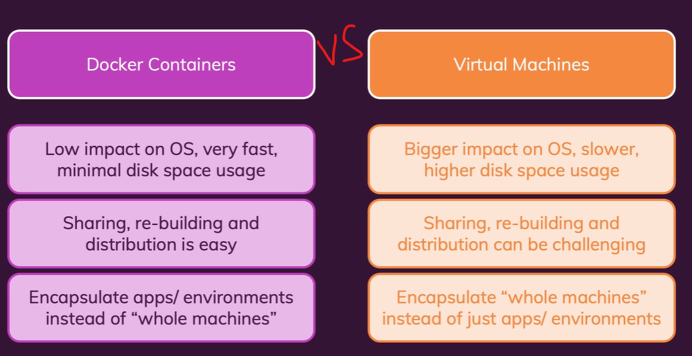

1. Virtual Machine:
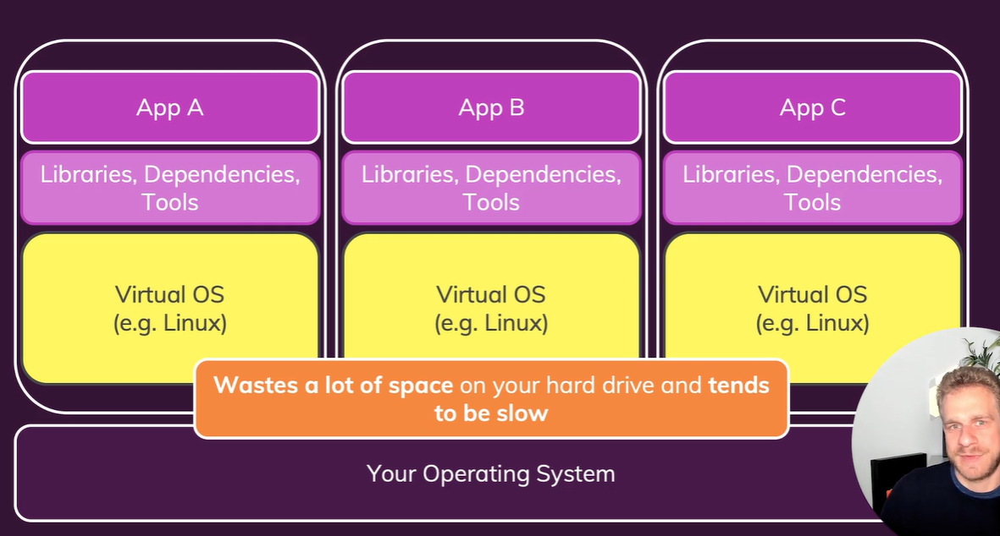
   - has own operation system (OS) and hardware (CPU, RAM, Storage)
   - can install libraries, frameworks, and applications
   - insulated and isolated from other VMs
   - a standalone machine -> big size -> slow to start -> high cost -> less efficient:
    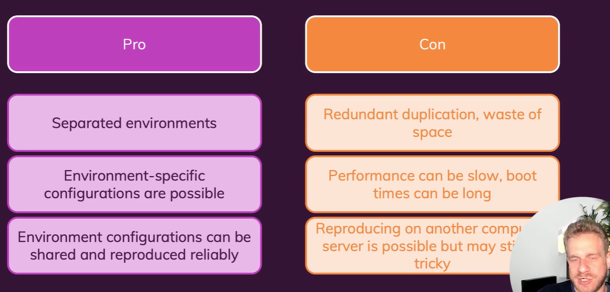

2. Container:
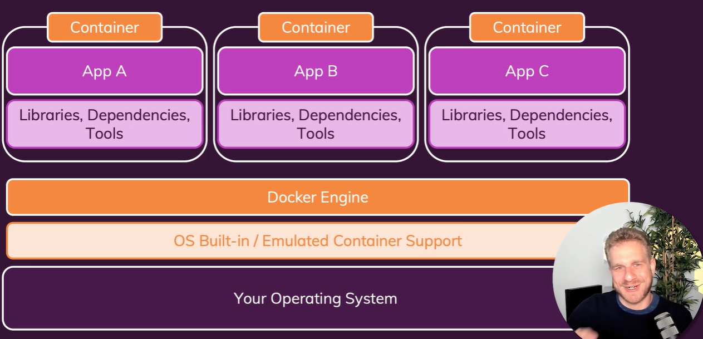
    - run a Docker engine (emulated Container support) on the host machine
    - no need run tone extra tools
    - can run multiple containers on the same host machine
    - lightweight -> fast to start -> low cost -> more efficient:
    - can configured containers and build images

## Docker Setup

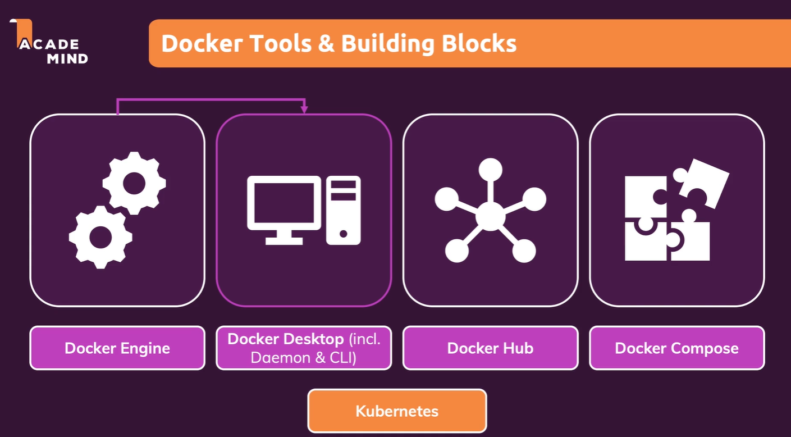

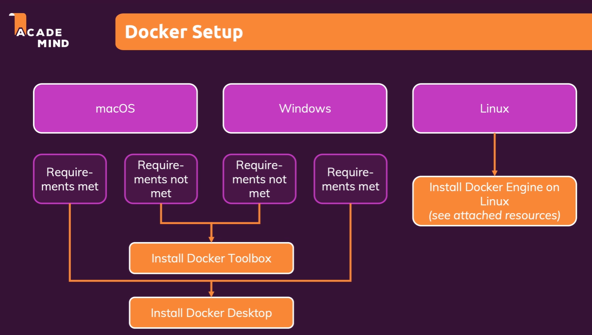

### Docker container

<https://www.docker.com/get-started/>

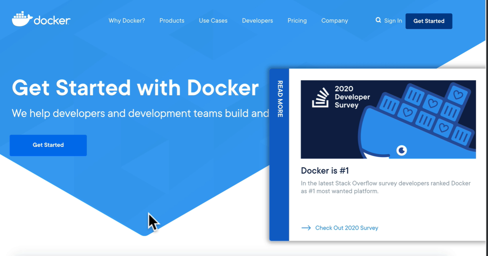

- build a Docker container
Docker container is a small boxes run anywhere on our desktop.
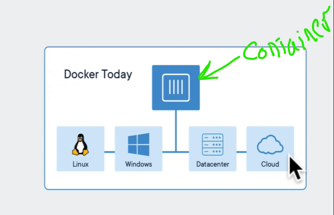
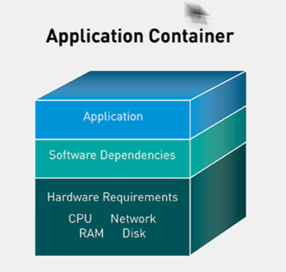

    **containers still completely isolated from each other and the host system**

Virtual Machine vs Docker container:

- Docker container is more lightweight than Virtual Machine
- Docker container is more portable than Virtual Machine
- Docker container is more efficient than Virtual Machine

- Virtual Machine is more secure than Docker container
- Virtual Machine is more stable than Docker container

Containers and Virtual Machines Using together in EC2 Container Service
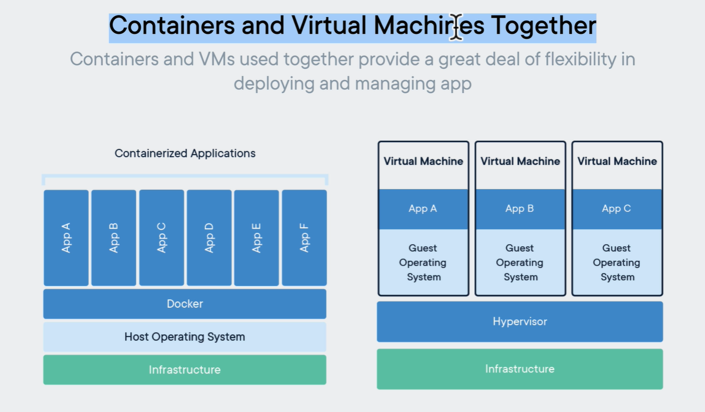

#### Container VS Images

- container contain your running application
- images collection all the files and dependencies needed to run a container

#### Docker hub

<https://www.docker.com/products/docker-hub/>

- docker hub is a repository of docker images
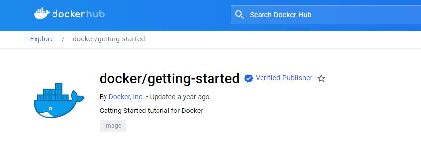
