# Working with data

[Working with data](#working-with-data)
    - [Data categories in Docker](#data-categories-in-docker)
    - [Analyzing the data](#analyzing-the-data)
    - [Volumes](#volumes)
        - [types of volumes](#types-of-volumes)
        - [Anonymous volumes](#anonymous-volumes)
        - [Named volumes](#named-volumes)
        - [Bind mounts](#bind-mounts)
        - [Combining volumes && Merging volumes](#combining-volumes--merging-volumes)
        - [Using nodemon](#using-nodemon)
        - [Read only volumes](#read-only-volumes)
        - [Manege volumes](#manege-volumes)
        - [Summary](#summary)

## Data categories in Docker

- Data in image unchangeable wen image was built
- Temporary data in container (deleted when container is deleted) (form, logs, etc.)
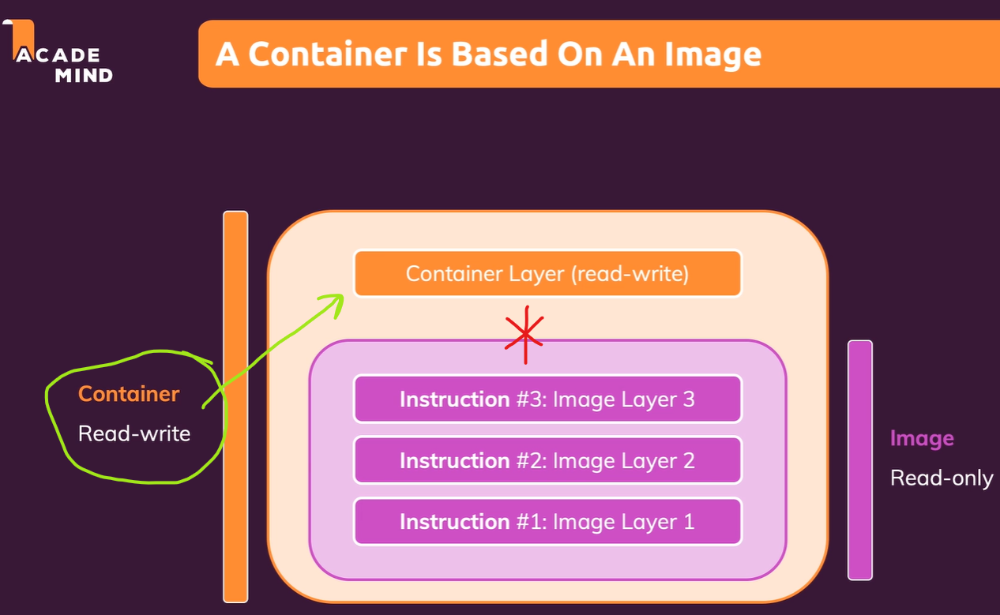
- Permanent data in container (data that should be saved when container is deleted)

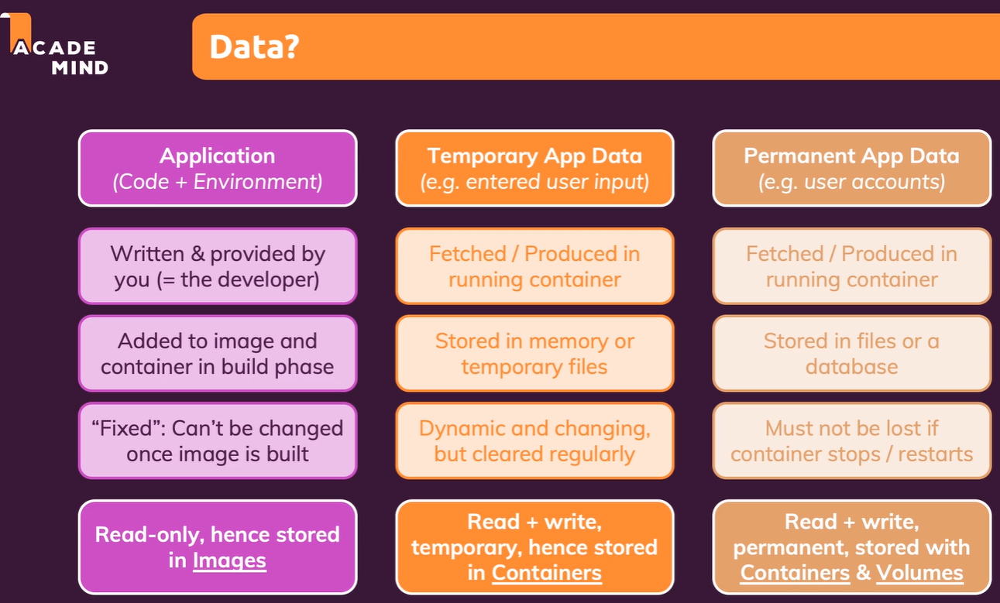

## Analyzing the data

- Data in container is stored in layers (read-only)
- Data in container is stored in volumes (read-write)
-

### Volumes

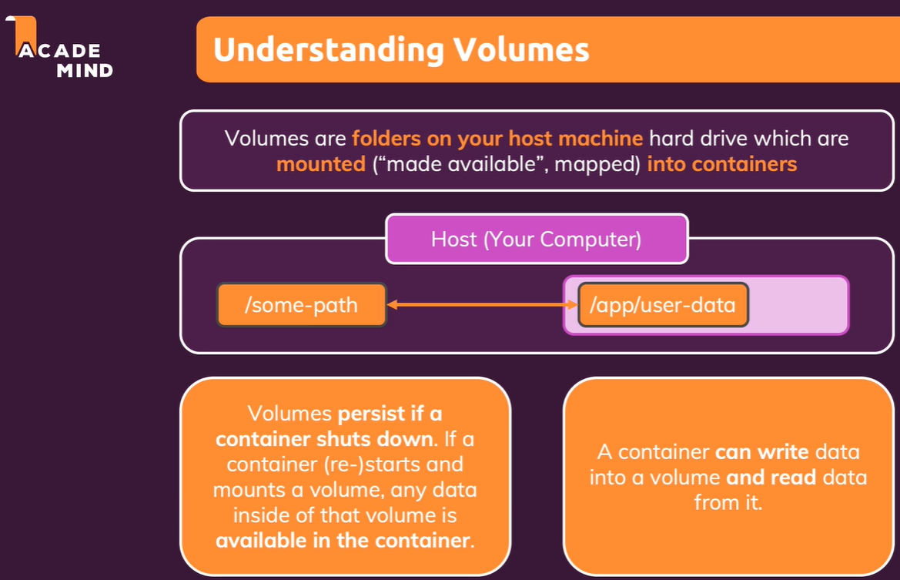

- Volumes are directories that are outside of the Union File System

#### types of volumes

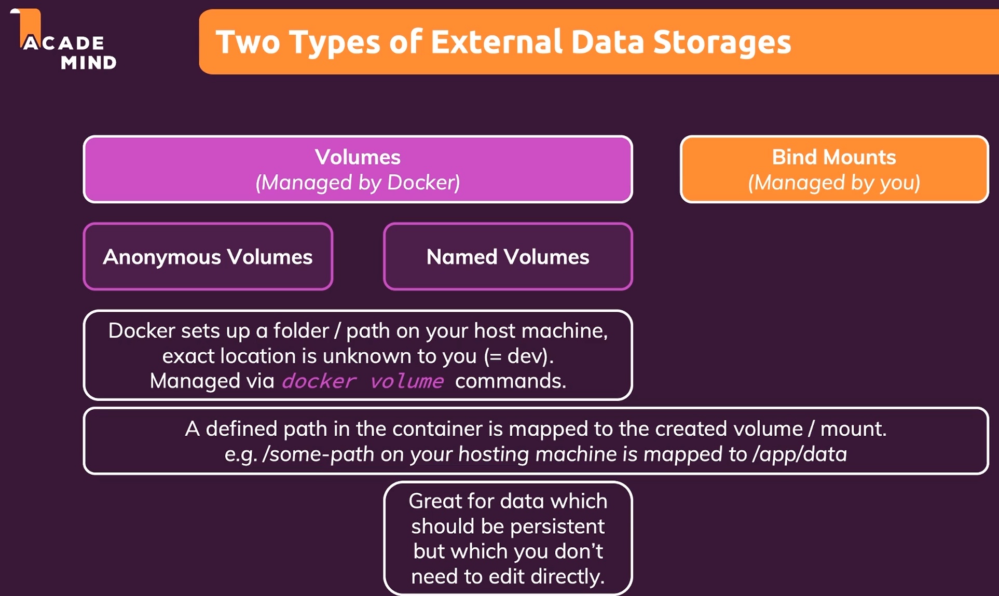

##### Anonymous volumes

```Dockerfile
# Create a Anonymous volume
VOLUME ["/data/feedback"]
```

- `docker volume ls` - list all volumes

```bash
docker volume --help
docker volume ls
```

Removing Anonymous Volumes:

```bash
docker volume rm VOL_NAME
# or
docker volume prune
```

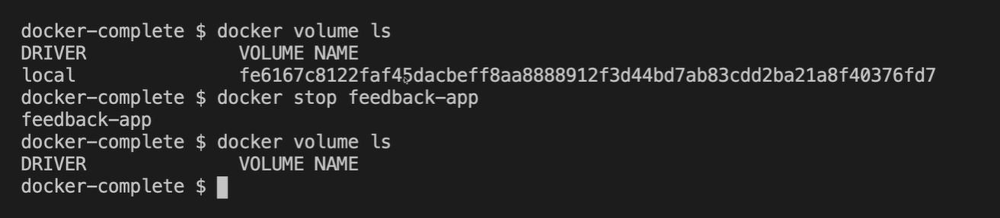

##### Named volumes

- named it's not attached to any container

- `docker rmi feedback-node:latest` - remove image
- `-v feedback:/app/feedback` - create a named volume (created folder in the root of the host machine)

```bash
docker rmi feedback-node:latest
docker build -t feedback-node:latest .
docker run -d -p 80:80 --rm --name feedback-app -v feedback:/app/feedback feedback-node:latest
docker stop feedback-app
docker volume ls
```

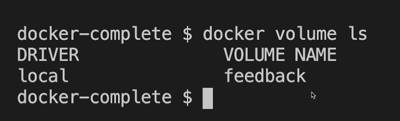

##### Bind mounts

[Mounting Docker volumes with Docker Toolbox for Windows]<https://headsigned.com/posts/mounting-docker-volumes-with-docker-toolbox-for-windows/>

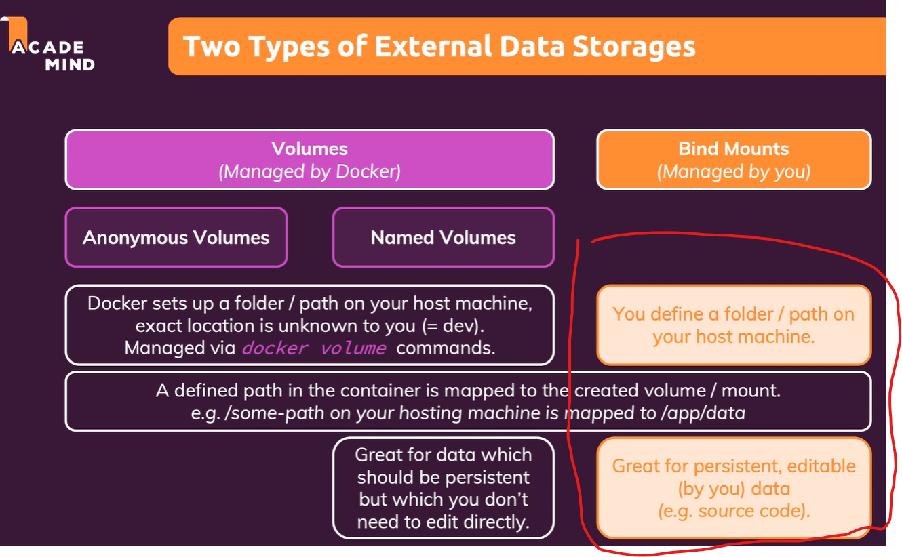

- we define folder where we want to mount the volume
- great for persist and edit data

- `v "C:\_________PERSONAL_________\ReduxCourse\Docker\Projects\5_data_volumes\server.js:/app"` - create a bind mount (mount the file from the host machine to the container)

```bash
docker stop feedback-app

docker run -d -p 80:80 --rm --name feedback-app -v feedback:/app/feedback -v "C:\_________PERSONAL_________\ReduxCourse\Docker\Projects\5_data_volumes\server.js:/app" feedback-node:latest
```

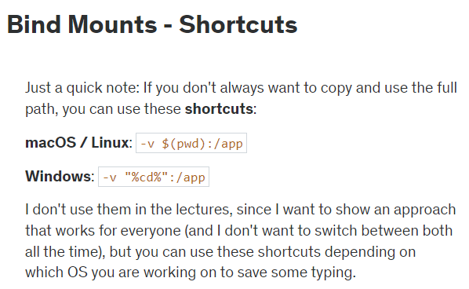

###### Combining volumes && Merging volumes

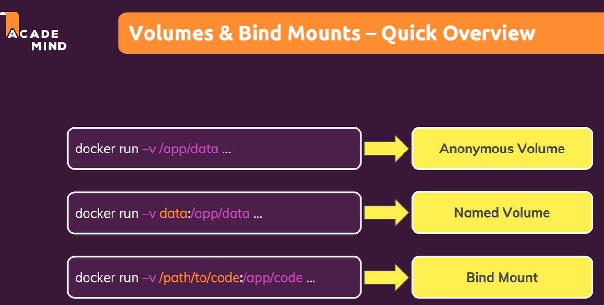

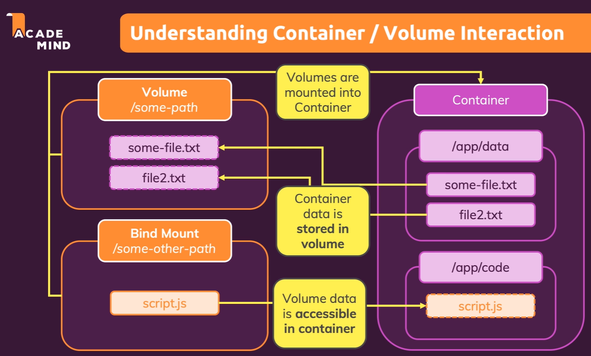

- `v "...relativePath:/app"` - create a volume for the app folder
- `v /app/node_modules` - create a volume for the node_modules folder

    **node_modules will survive the container deletion**

```bash
docker run -d -p 80:80 --rm --name feedback-app -v feedback:/app/feedback -v "...relativePath:/app" -v /app/node_modules feedback-node:latest
```

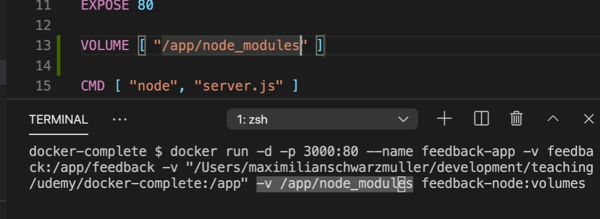

```bash
docker stop feedback-app
docker volume rm feedback

docker logs feedback-app
```

#### Using nodemon

- `nodemon` - automatically restart the server when the file changes

#### Read only volumes

- `-v "...relativePath:/app:ro"` - create a read-only volume
- `v /app/temp` -

```bash
docker run -d -p 80:80 --rm --name feedback-app -v feedback:/app/feedback -v "...relativePath:/app:ro" -v /app/node_modules feedback-node:latest
```

#### Manege volumes

- `docker volume --help` - list all commands
- `docker volume ls` - list all active volumes
- `docker volume create VOL_NAME` - create a volume
- `docker volume inspect VOL_NAME` - inspect a volume
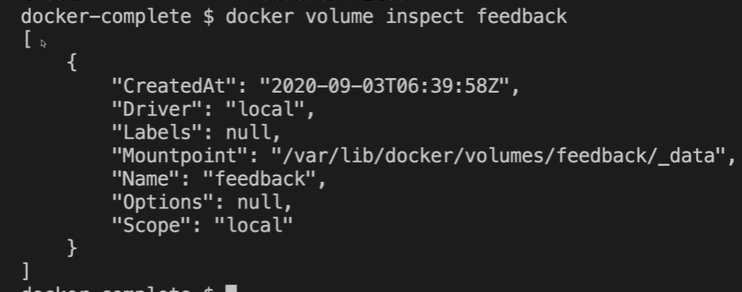
- `docker volume rm VOL_NAME` - remove a volume
- `docker volume prune` - remove all volumes

## Summary

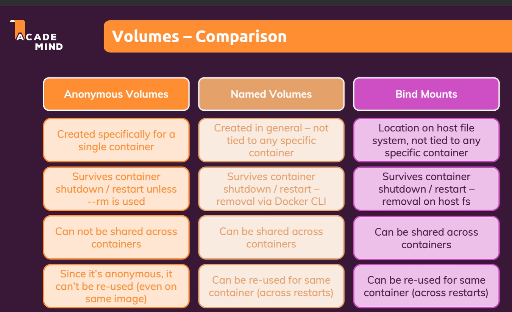
