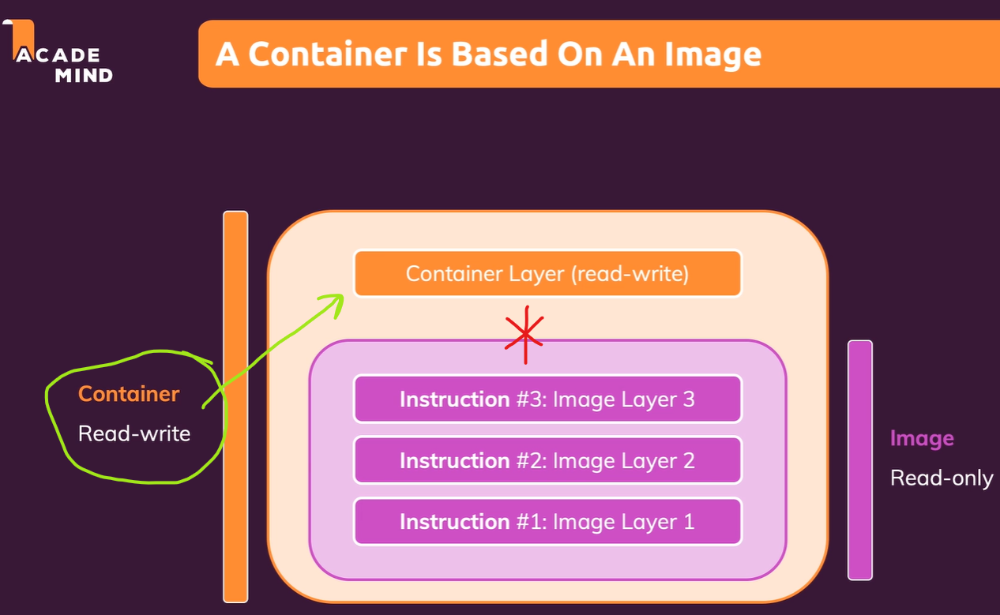
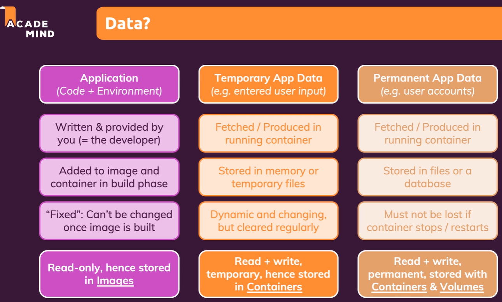
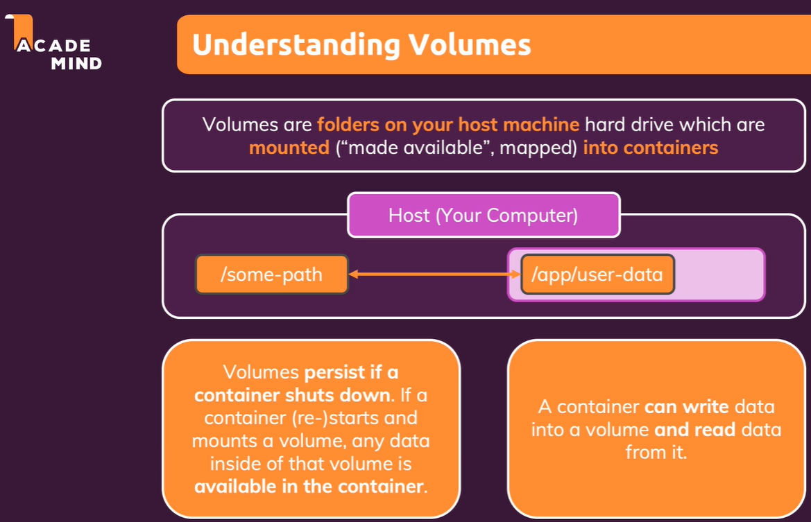

# Working with data

[Working with data](#working-with-data)

## Data categories in Docker

- Data in image unchangeable wen image was built
- Temporary data in container (deleted when container is deleted) (form, logs, etc.)

- Permanent data in container (data that should be saved when container is deleted)

## Analyzing the data

- Data in container is stored in layers (read-only)
- Data in container is stored in volumes (read-write)
-

### Volumes

- Volumes are directories that are outside of the Union File System

