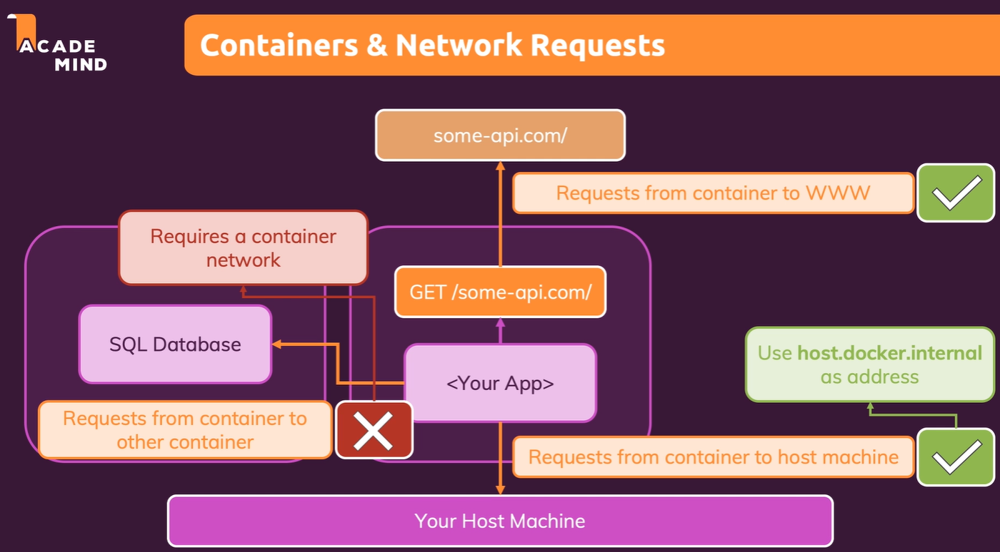
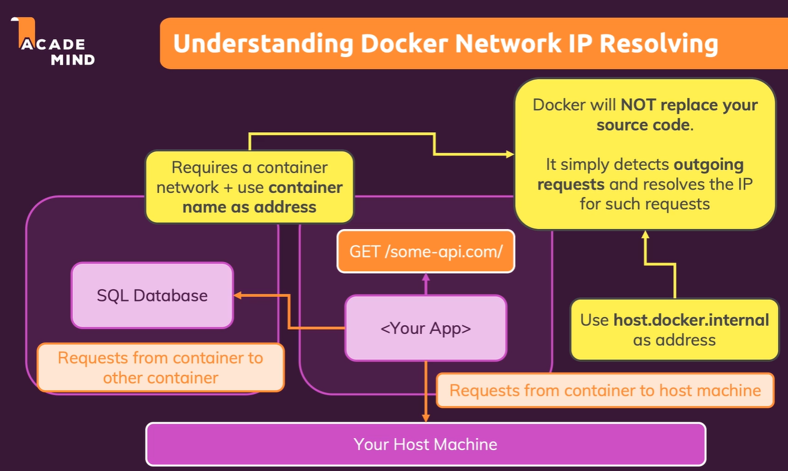

# Networking

[Networking](#networking)
    - [Introduction](#introduction)

## Introduction


## Container to WWW communication

- Containers can communicate with the outside world
- Containers can communicate with each other
- Containers can communicate with the host machine


### Creating a Container & communicate to the WEB

```bash
docker build -t favorites-node .
docker run --name favorites -d --rm -p 3000:3000 favorites-node
```


- `host.docker.internal` is a special DNS name which resolves to the internal IP address of the host machine.

```javascript
mongoose.connect(
    'mongodb://host.docker.internal:27017/swfavorites',
    { useNewUrlParser: true },
    (err) => {
        if (err) {
            console.log(err);
        } else {
            app.listen(3000);
        }
    }
);
```


### Container to Container communication


Created a new container for MongoDB

- `docker run mongo` will create a new container with the mongo image

```bash
docker run -d --name mongodb mongo
docker container inspect mongodb
docker stop mongodb
docker rm mongodb
docker build -t favorites-node .
docker run --name favorites -d --rm -p 3000:3000 favorites-node
```


- `docker container inspect mongodb` will give the IP address of the container

```javascript
mongoose.connect(
    'mongodb://172.17.0.2:27017/swfavorites',
    { useNewUrlParser: true },
    (err) => {
        if (err) {
            console.log(err);
        } else {
            app.listen(3000);
        }
    }
);
```

## Docker Networks


- Docker creates a default network for each container
- Containers can communicate with each other using the default network
- Containers can communicate with the host machine using the default network

- `docker network create favorites-net` will create a new network

```bash
docker container prune
docker network --help
docker network create favorites-net
docker run -d --name mongodb --network favorites-net mongo
```


```javascript
mongoose.connect(
    'mongodb://mongodb:27017/swfavorites', // mongodb is the name of the container
    { useNewUrlParser: true },
    (err) => {
        if (err) {
            console.log(err);
        } else {
            app.listen(3000);
        }
    }
);
```

- `docker run --name favorites -d --rm  --network favorites-net -p 3000:3000 favorites-node` will create a new container with the favorites-node image

```bash
docker run --name favorites -d --rm  --network favorites-net -p 3000:3000 favorites-node
```



- **If we have a container to container connection, we don't need a publish port**

### Docker resolves IP address



**[⬆ back to top](#networking)**
