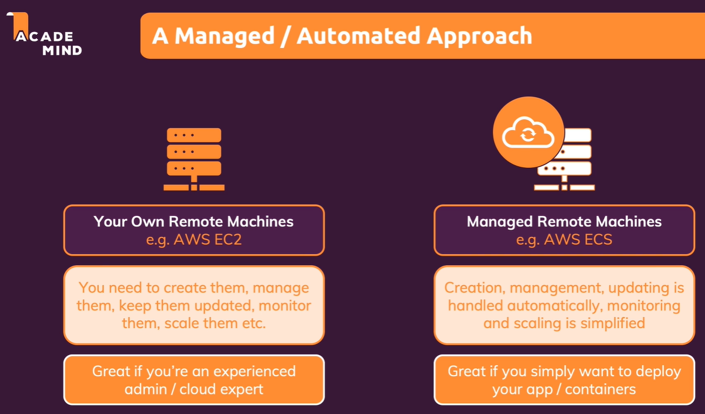
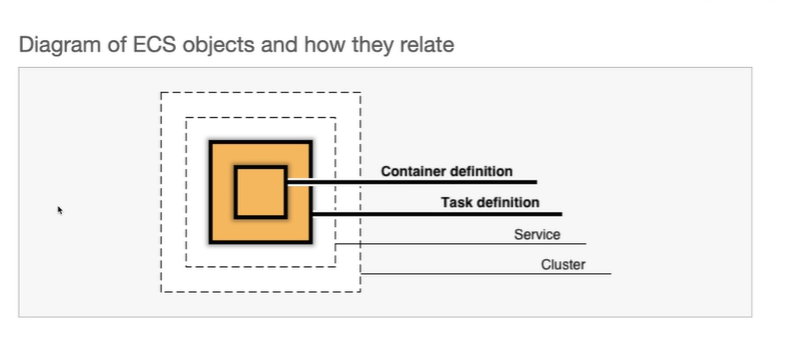

# Build multi-container applications

[Build multi-container applications](#build-multi-container-applications)
    - [Introduction](#introduction)

## Introduction


## Setup (Schema of the project)



## Dockerizing a MongoDB Service

- `-p 27017:27017` - Expose the MongoDB port to the host machine

```bash
docker run -name mongodb --rm -d -p 27017:27017 mongo
docker logs mongodb
```



## Dockerizing a Node.js application

```bash
docker build -t goals-node .
docker run --name goals-backend --rm -d -p 80:80 goals-node
```

- `host.docker.internal` - This is a special DNS name which Docker sets up to allow communication between containers and the host machine.

```javascript
mongoose.connect(
    'mongodb://host.docker.internal:27017/course-goals', // <<<<
    {
        useNewUrlParser: true,
        useUnifiedTopology: true,
    },
    (err) => {
        if (err) {
            console.error('FAILED TO CONNECT TO MONGODB');
            console.error(err);
        } else {
            console.log('CONNECTED TO MONGODB');
            app.listen(80);
        }
    }
);
```

## Dockerizing a React application

- `Dockerfile` for the React application

```Dockerfile
FROM node

WORKDIR /app

COPY package.json .

RUN npm install

COPY . .

EXPOSE 3000

CMD ["npm", "start"]
```

- `-it` - Interactive mode (needed for the React app to run in the foreground)

```bash
docker build -t goals-react .

docker run --name goals-frontend --rm -d -p 3000:3000 -it goals-react
```

## Added Docker Networks

- `docker network create goals-net` - Create a new network
- `--network goals-net` - Connect the container to the network

```bash
docker network ls
docker network create goals-net

docker run --name mongodb --rm -d --network goals-net mongo
```

```javascript
mongoose.connect(
    'mongodb://mongodb:27017/course-goals', // <<<<
    {
        useNewUrlParser: true,
        useUnifiedTopology: true,
    },
    (err) => {
        if (err) {
            console.error('FAILED TO CONNECT TO MONGODB');
            console.error(err);
        } else {
            console.log('CONNECTED TO MONGODB');
            app.listen(80);
        }
    }
);
```

```bash
docker build -t goals-node .
docker run --name goals-backend --rm -d --network goals-net -p 80:80 goals-node
```

```bash
docker build -t goals-react .
docker run --name goals-frontend --rm -d -p 3000:3000 goals-react
```

**[⬆ back to top](#introduction)**
