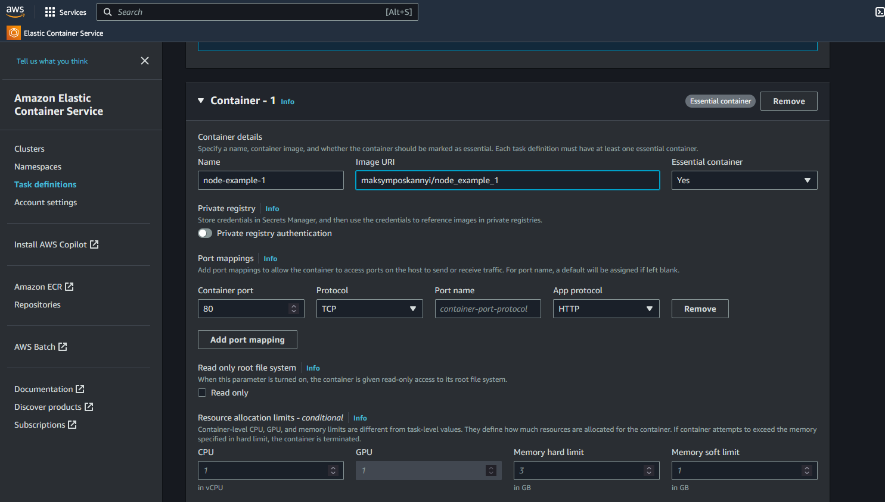

# Docker compose

[Docker compose](#docker-compose)
    [Introduction](#introduction)

## Introduction


## Creating a docker-compose file

1. Not create network for the services
    - docker-compose automatically creates a network for the services
    - but you can create a network manually
2.



- `version` : version of the docker-compose file
- `services` : list of services that we want to run
- `image` : image that we want to run (mongo, redis, etc ...)
- `volumes` : volumes that we want to mount to the container
- `env_file` : file that contains the environment variables

```yaml
version: "3.8"
services:
    mongodb:
        image: 'mongo'
        volumes:
            - data:/data/db
        # environment:
        #     # - MONGO_INITDB_ROOT_USERNAME=root
        #     MONGO_INITDB_ROOT_USERNAME: root
        #     MONGO_INITDB_ROOT_PASSWORD: example

        env_file:
            - ./env/mongo.env

    backend:
    frontend:
volumes:
    data:
```

```env
MONGO_INITDB_ROOT_USERNAME=root
MONGO_INITDB_ROOT_PASSWORD=example
```

## Running the docker-compose file

- `docker-compose up` : run the services (attach mode)
- `docker-compose up -d` : run the services (detach mode)
- `docker-compose down` : stop the services (delete the containers, but not the images)

```bash
docker image prune
docker-compose up -d
docker-compose down
```
