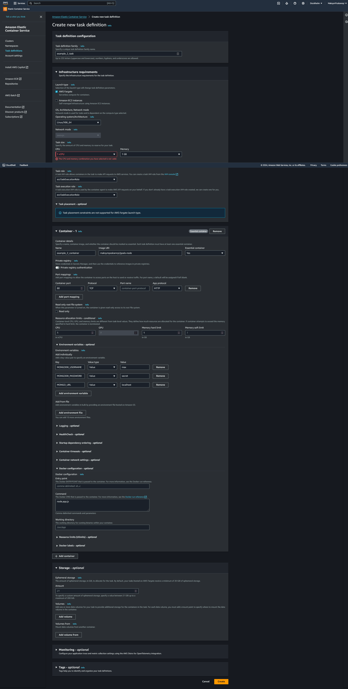
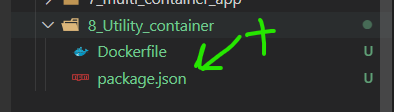

# Utility containers

[Utility containers](#utility-containers)
    - [Introduction](#introduction)

## Introduction


**Why do we need utility containers?**

- No need to install the tools on the host machine ( Node.js globlally, Python, etc ...)

```bash
docker run -it -d node
```



- `docker exec` : run a command in a running container
- `docker exec -it <container_name> <command>` : run a command in a running container in interactive mode

```bash
docker exec -it gallant_leavitt npm init
```


## Building a utility container

- Create a Dockerfile
- Build the image
- Run the container

```Dockerfile
FROM node:14-alpine

WORKDIR /app
```

- `docker run -it -v <host_path>:<container_path> <image_name> <command>` : run a command in a container with a volume
   For miror files between container and host

```bash
docker build -t node-util .
docker run -it -v C:\_________PERSONAL_________\ReduxCourse\Docker\Projects\8_Utility_container:/app node-util npm init
```



- `ENTRYPOINT` : specify the default command to run when the container starts

```Dockerfile
ENTRYPOINT ["npm"]
```

```bash
docker build -t mynpm .

docker run -it -v C:\_________PERSONAL_________\ReduxCourse\Docker\Projects\8_Utility_container:/app mynpm init
docker run -it -v C:\_________PERSONAL_________\ReduxCourse\Docker\Projects\8_Utility_container:/app mynpm install
docker run -it -v C:\_________PERSONAL_________\ReduxCourse\Docker\Projects\8_Utility_container:/app mynpm install express --save
```


```docker-compose.yaml
version: 3.8
services:
  npm:
    build: ./
    stdin_open: true
    tty: true
    volumes:
      - ./:/app
```

- `docker-compose run` : run the services
- `docker-compose run --rm <service_name> <command>` :  after the command is executed, the container is removed

```bash
    docker-compose run --rm npm init
```
