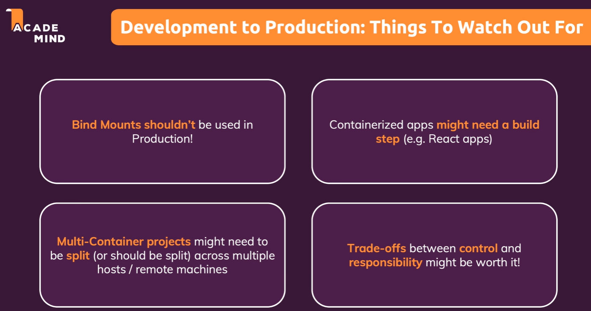
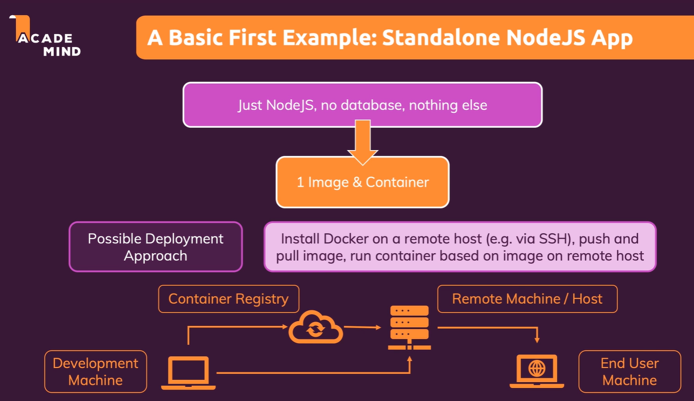
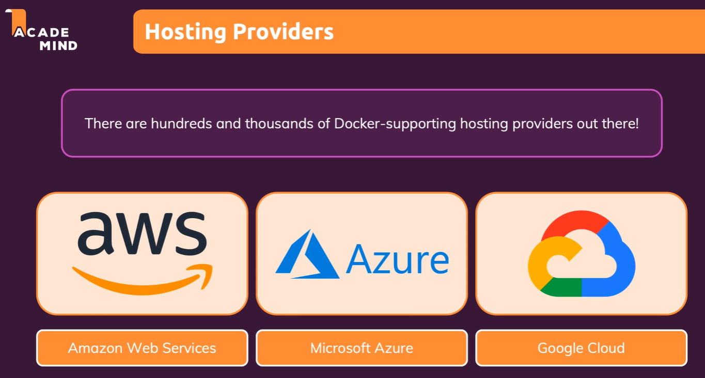
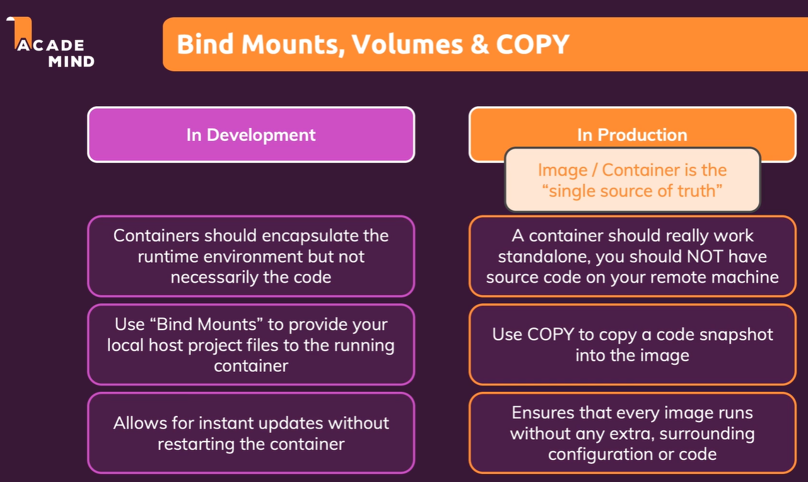
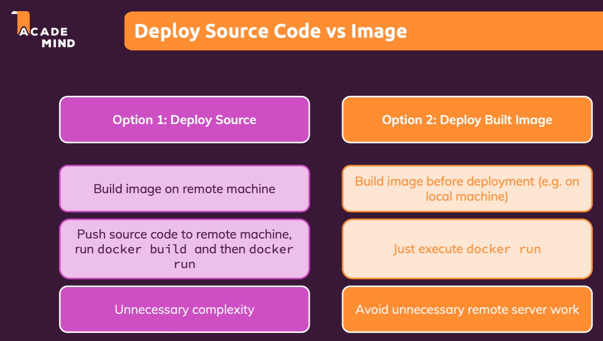
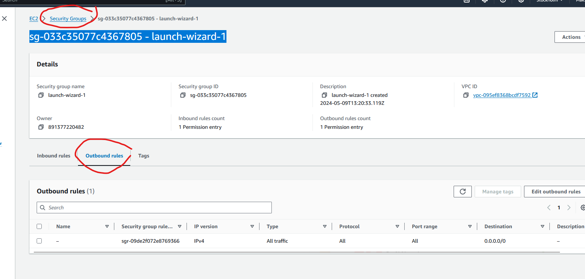
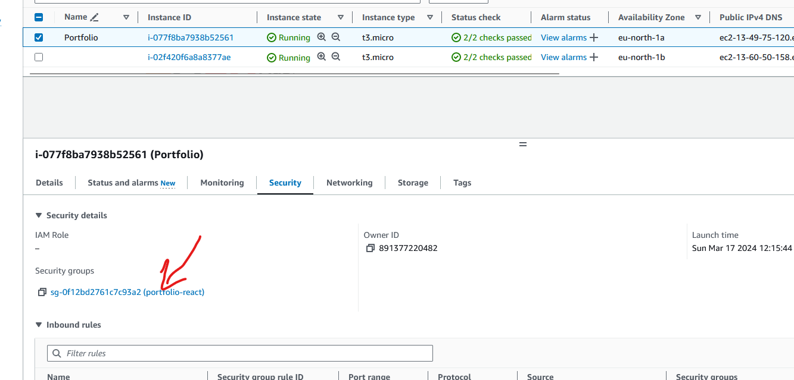
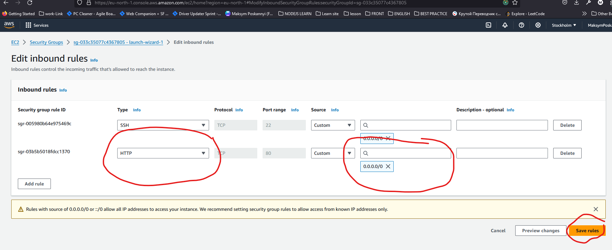
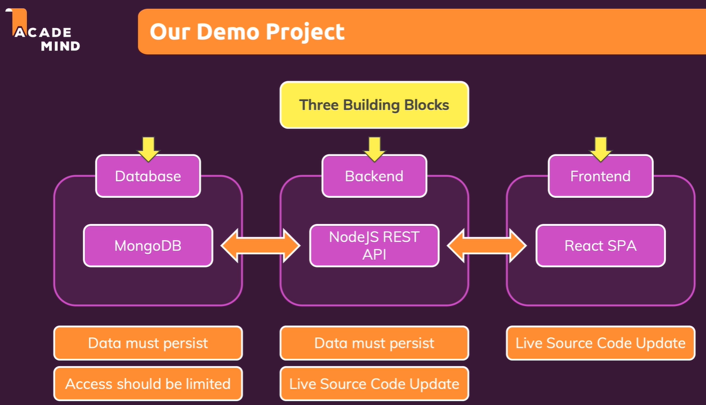

# Deploying

[Deploying](#deploying)
    - [Introduction](#introduction)
    - [From development to production](#from-development-to-production)
    - [Bind mounts in production](#bind-mounts-in-production)
    - [Pushing our local image to the cloud](#pushing-our-local-image-to-the-cloud)
    - [Allow the container to access the internet](#allow-the-container-to-access-the-internet)
    - [Managing and updating containers in production](#managing-and-updating-containers-in-production)
    - [Using AWS ECS third-party services to deploy containers in the cloud](#using-aws-ecs-third-party-services-to-deploy-containers-in-the-cloud)

## Introduction

## From development to production





1) shouldn't be use bind mounts in production

## Bind mounts in production



## Pushing our local image to the cloud



1) build the image locally
2) push the image to the cloud
3) deploy source or deploy built image
4) pull the image from the cloud
5) run the image

```bash
docker login
docker build -t node_example_1 .
docker tag node_example_1:latest maksymposkannyi/node_example_1:tagname
docker images
docker push maksymposkannyi/node_example_1:tagname
```

```bash Putty
docker run -d --rm -p 80:80 maksymposkannyi/node_example_1:tagname
docker ps
```

## Allow the container to access the internet







## Managing and updating containers in production

```bash
docker build -t node_example_1 .
docker push maksymposkannyi/node_example_1:tagname
```

```bash Putty
docker ps

docker stop <container_name>
docker pull maksymposkannyi/node_example_1:tagname
```

## Using AWS ECS third-party services to deploy containers in the cloud




## Using Elastic container services


1. created container
   
2. one task it's one remote machine with docker
   

## Deploying multi container applications

1. create a cluster
2. create a task (№144)

3. create a mongo task container
