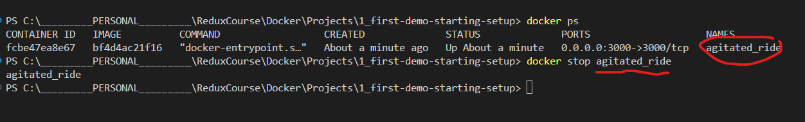

# Init project

## build the image

- `docker build .` to build the image

```bash
docker build .
```

- `-p` to map the port 3000 of the container to the port 3000 of the host
- `3000:3000` is the port mapping
- `<image_id>` is the id of the image

```bash
docker run -p 3000:3000 bf4d4ac21f1624f328569fb2f42d90b3e7e5445dff4027c49a4cf88b14916093
```

- `ps` to list the running containers


```bash
docker ps
docker stop agitated_ride
```
