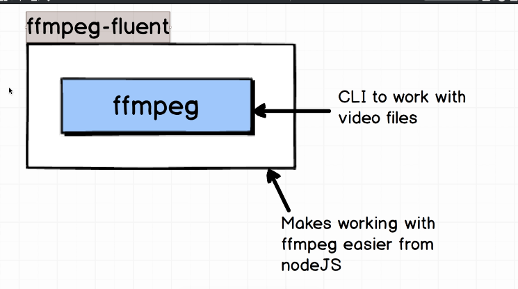

# FFMPEG-fluent command line tool for video manipulation



FFMPEG is a command line tool for video manipulation. It can be used to convert videos from one format to another, extract audio from video files, and perform various other video editing tasks.

## Installation NPM

```bash
npm install fluent-ffmpeg
```

## Read video metadata

```javascript


