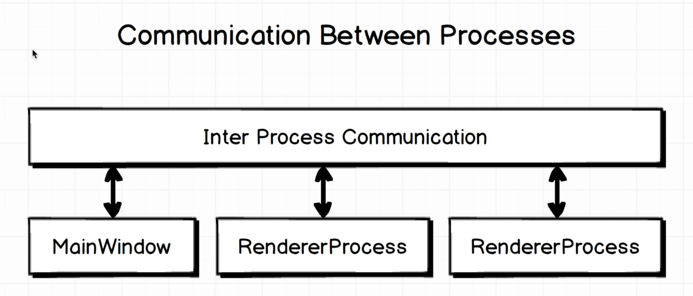
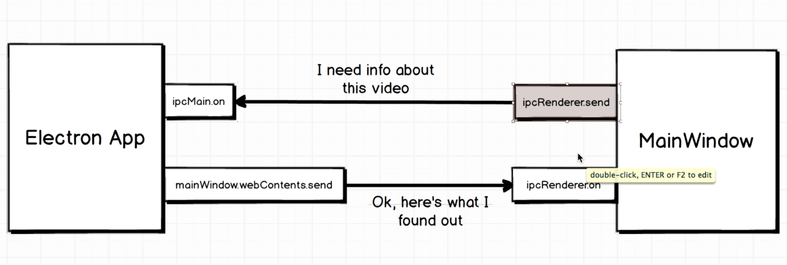

# Inter-Process Communication (IPC)

Communication between Main Process and Renderer Process is done through IPC.



- The main process and renderer process can communicate with each other through IPC (Inter-Process Communication).
- The IPC module provides a channel for sending synchronous and asynchronous messages between the main process and renderer processes.

## IPC Communication (Electron app to Main Window)



- In the main process, you can use the `ipcMain` module to listen for messages from the renderer process.
- The `ipcMain` module is an event emitter that listens for messages from the renderer process.

```javascript
const {ipcRenderer} = require('electron')

ipcRenderer.send('video:submit', path)
```

```javascript
const { ipcMain } = require('electron')


ipcMain.on("video:submit", (event, path) => {
   mainWindow.webContents.send('video:submit', path)
})
```
