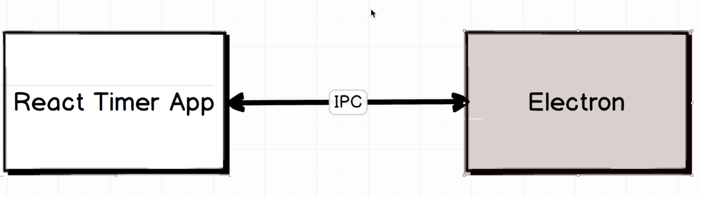

# React in a electron app

## IPC communication between React and Electron



### React

```jsx
import { ipcRenderer } from 'electron';


updateTime = () => {
    ipcRenderer.send('updateTime', 'ping');
}
```

### Electron

```javascript

ipcMain.on('updateTime', (event, arg) => {
    console.log(arg); // prints "ping"
    event.reply('updateTime', 'pong');
});
```

### Issue with backgroundThrottling

- When the app is in background, the timer stops. To fix this, we need to disable backgroundThrottling in the BrowserWindow.

```javascript

mainWindow = new BrowserWindow({
    width: 800,
    height: 600,
    webPreferences: {
        backgroundThrottling: false
    }
});
```
