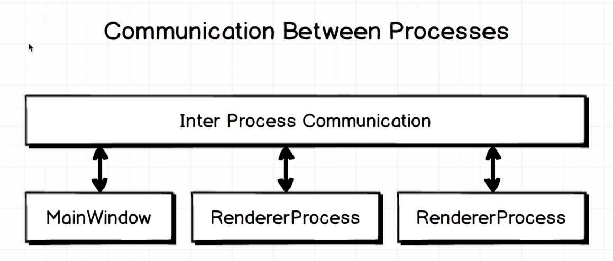

# Electron Main Information

## Main Process

### Browser Process (Main Process)

- The main process is responsible for creating web pages.
- It manages all web pages and their corresponding renderer processes.

#### Child Process (Renderer Process)

- The renderer process is responsible for running the web page.
- Each web page runs in its renderer process.

#### Inter-Process Communication (IPC)

Communication between Main Process and Renderer Process is done through IPC.

- The main process and renderer process can communicate with each other through IPC (Inter-Process Communication).
- The IPC module provides a channel for sending synchronous and asynchronous messages between the main process and renderer processes.
