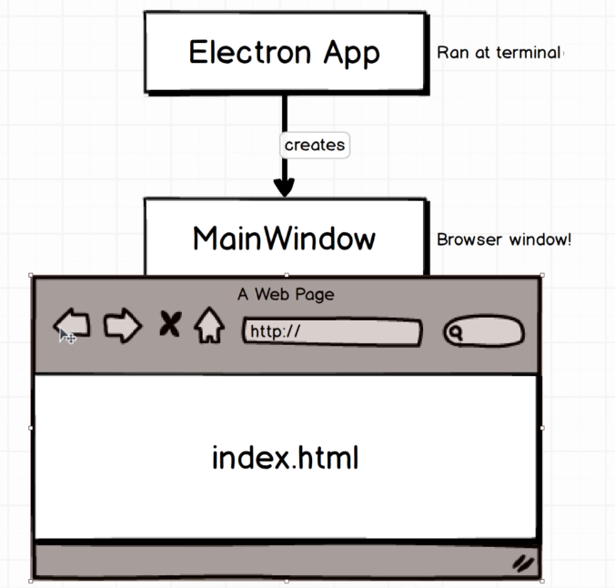

# Electron Main Information

## Main Process

### Browser Process (Main Process)

- The main process is responsible for creating web pages.
- It manages all web pages and their corresponding renderer processes.

#### Child Process (Renderer Process)

- The renderer process is responsible for running the web page.
- Each web page runs in its renderer process.

#### Inter-Process Communication (IPC)

## Work Process

- Run at terminal: `npm start`
- The main process creates a web page and manages the renderer process.
- The renderer process runs the web page.

## Lifetime Process

- Electron app lifetime process:
  - Start
  - Ready
  - Window All Closed
  - Quit

## Require Statement in Browser Process

- `require` is used to import modules in Node.js.
- `import` is used to import modules in ES6.

