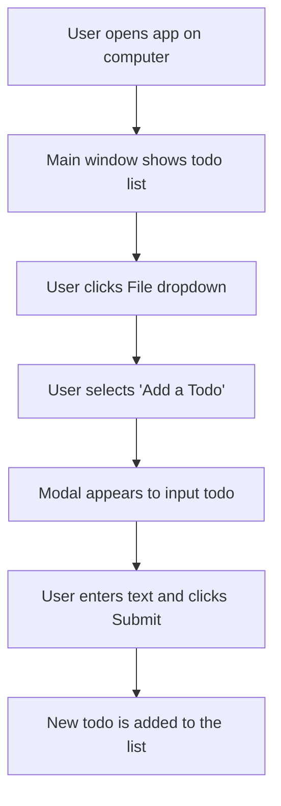

# Project 2: Todos

```mermaid
flowchart TD
    A[User opens app on computer] --> B[Main window shows todo list]
    B --> C[User clicks File dropdown]
    C --> D[User selects 'Add a Todo']
    D --> E[Modal appears to input todo]
    E --> F[User enters text and clicks Submit]
    F --> G[New todo is added to the list]
```
