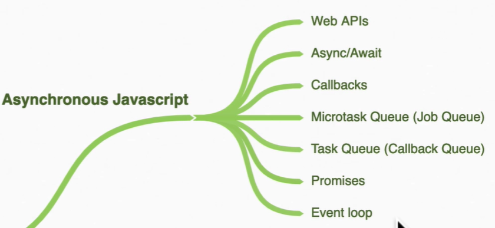
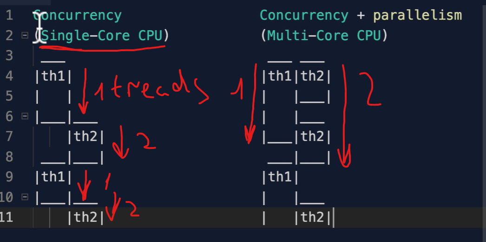

# Fundamentals  async concepts of JavaScript

- [Fundamentals  async concepts of JavaScript](#fundamentals--async-concepts-of-javascript)
  - [Introduction](#introduction)
  - [Promises](#promises)
  - [For await loop](#for-await-loop)
  - [Job Queue](#job-queue)
  - [Parallel Sequence and Race](#parallel-sequence-and-race)
  - [ES2020 allSettled](#es2020-allsettled)
    - [Compare Promise.all and Promise.allSettled](#compare-promiseall-and-promiseallsettled)
  - [Treads, Congruency and Parallelism](#treads-congruency-and-parallelism)
    - [Workers threads in node.js](#workers-threads-in-nodejs)
    - [Web Workers](#web-workers)
    - [Run a worker threads in a parallel + concurrency by Node.js](#run-a-worker-threads-in-a-parallel--concurrency-by-nodejs)

## Introduction



## Promises

1. Return => A promise is an object that may produce a single value some time in the future:
    - either a resolved value, or a reason that it's not resolved (e.g., a network error occurred).
2. States:
    - Pending
    - Fulfilled
    - Rejected

```javascript
const promise = new Promise((resolve, reject) => {
    if (true) {
        resolve('Stuff worked');
    } else {
        reject('Error, it broke');
    }
});

promise.then((data) => {
    console.log(data);
}).catch((error) => {
    console.log(error);
});
// Stuff worked
```

```javascript
promise
    .then(result => result + '!')
    .then(result2 => result2 + '?')
    .catch(() => console.log('error'))
    .then(result3 => {
        console.log(result3 + '!');
    });
    .finally(() => console.log('finally'));
//* Stuff worked!?!
```

```javascript
const promise2 = new Promise((resolve, reject) => {
    setTimeout(resolve, 100, 'HIII');
});

const promise3 = new Promise((resolve, reject) => {
    setTimeout(resolve, 1000, 'POOKIE');
});

const promise4 = new Promise((resolve, reject) => {
    setTimeout(resolve, 3000, 'Is it me you are looking for?');
});

Promise.all([promise2, promise3, promise4])
    .then(values => {
        console.log(values);
    });
```

```javascript
try {
    const getData = async function () {
    const [users, posts, albums] = await Promise.all(urls.map(url =>
        fetch(url).then(resp => resp.json()
    ));
    console.log(users);
    console.log(posts);
    console.log(albums);
 }
} catch (error) {
    console.log('oops', error);
}
```

## For await loop

```javascript
const getData = async function () {
    const arrayOfPromises = urls.map(url => fetch(url));
    for await (let request of arrayOfPromises) {
        const data = await request.json();
        console.log(data);
    }
}
```

## Job Queue


**Promise** => native way to run asynchronous code.

1. Job Queue run first before the Callback Queue.
2.

```javascript
// 3 Callback Queue - Task Queue
setTimeout(() => {
    console.log(1);
}, 1000);

// 2 Job Queue - Microtask Queue
Promise.resolve('hi').then((data) => console.log('2'));

// 3 This synchronous code runs first
console.log(3);
```

## Parallel Sequence and Race

- parallel => run all promises at the same time
- sequence => run promises in sequence
- race => run the promise that finishes first

```javascript

const promisify = (item, delay) =>
    new Promise((resolve) =>
        setTimeout(() => resolve(item), delay)
        );

const a = () => promisify('a', 100);
const b = () => promisify('b', 5000);
const c = () => promisify('c', 3000);

// Parallel

async function parallel() {
    const promises = [a(), b(), c()];
    const [output1, output2, output3] = await Promise.all(promises);
    return `parallel is done: ${output1} ${output2} ${output3}`;
}

parallel().then(console.log);
//log: parallel is done: a b c

// Sequence

async function sequence() {
    const output1 = await a();
    const output2 = await b();
    const output3 = await c();
    return `sequence is done: ${output1} ${output2} ${output3}`;
}

// Race
async function race(){
    const promises = [a(), b(), c()];
    const output = await Promise.race(promises);
    return `race is done: ${output}`;
}

race().then(console.log)
//log: 'a'

parallel().then(console.log);
sequence().then(console.log);
race().then(console.log);
//log: race is done: a
//log: parallel is done: a b c
//log: sequence is done: a b c
```

## ES2020 allSettled

- returns an array of all the promises whether they are resolved or rejected.
- useful when you want to run all promises regardless of whether they are resolved or rejected.

```javascript

const promise1 = new Promise((resolve, reject) => setTimeout(resolve, 2000));
const promise2 = new Promise((resolve, reject) => setTimeout(reject, 2000));

Promise.allSettled([promise1, promise2])
    .then(data => console.log(data))
    .catch(e => console.log('something failed', e));

//log [{status: 'fulfilled', value: undefined}, {status: 'rejected', reason: undefined}]
```

### Compare Promise.all and Promise.allSettled

- Promise.all => return a promise that resolves when all of the promises in the iterable argument have resolved
- Promise.allSettled => return a promise that resolves after all of the given promises have either resolved or rejected, with an array of objects that each describes the outcome of each promise.

**Even though one of the promises is rejected, the Promise.allSettled will still resolve and return an array of objects that describe the outcome of each promise.**

## Treads, Congruency and Parallelism

- **Thread** => a single sequence stream of instructions that can be managed independently by an operating system scheduler.
- **Congruency** => the ability to run two or more programs concurrently.
- **Parallelism** => the ability to run two or more programs simultaneously.

When we open a browser, we have a single thread that runs all the JavaScript code.

### Workers threads in node.js

- **Worker threads** => a way to run JavaScript code in parallel.


### Web Workers



- **Web Workers** => a simple means for web content to run scripts in background threads.

1. don't have access to the DOM and window object.
2. Cant use setTimeout or setInterval and other methods.
3. communicate with the main thread using a messaging system.
4. run in a separate global context that is different from the main thread.

- `new Worker('worker.js')` => create a new worker thread.
- `worker.js` => the file that runs in the background.

- `worker.postMessage('Hello')` => send a message to the worker thread.
- `addEventListener('message', (message) => {console.log(message.data)})` => listen for messages from the worker thread.

``` javascript
const worker = new Worker('worker.js');

worker.postMessage('Hello');

addEventListener('message', (message) => {
    console.log(message.data);
});
```

### Run a worker threads in a parallel + concurrency by Node.js

``` javascript

const {spawn} = require('child_process');

spawn('git', ['stuff'])
```
