# Fundamentals concepts of JavaScript

- [Fundamentals concepts of JavaScript](#fundamentals-concepts-of-javascript)
  - [Introduction](#introduction)
    - [EcmaScript Engines](#ecmascript-engines)
  - [JavaScript Engine](#javascript-engine)
    - [Inside the Engine](#inside-the-engine)
    - [Interpreter and Compiler =\> JIT Compiler](#interpreter-and-compiler--jit-compiler)
  - [Call Stack + Memory Heap](#call-stack--memory-heap)
    - [Memory Heap](#memory-heap)
    - [Call Stack](#call-stack)
      - [Example 1](#example-1)
      - [Example2](#example2)
    - [Stack Overflow](#stack-overflow)
      - [Garbage Collection](#garbage-collection)
      - [Memory Leaks](#memory-leaks)
    - [Optimized Code](#optimized-code)
      - [Inline Caching](#inline-caching)
      - [Hidden Classes](#hidden-classes)
  - [Single Threaded](#single-threaded)
  - [Different JavaScript Engine and JavaScript Runtime](#different-javascript-engine-and-javascript-runtime)
    - [Back to top](#back-to-top)

## Introduction

JavaScript is a single-threaded, non-blocking, asynchronous, concurrent language

### EcmaScript Engines

1. This engines has a lot of different variants:
   - V8 - Chrome and Opera (C++)
   - SpiderMonkey - Firefox
   - Chakra - Edge
   - JavaScriptCore - Safari
   - Nashorn - Java 8
   - ...

## JavaScript Engine

Brendan Eich created JavaScript in 1995, and it was first implemented in the Netscape Navigator browser. The first JavaScript engine was created by Brendan Eich in 1995 for the Netscape Navigator browser. The engine was called SpiderMonkey, and it was written in C++.

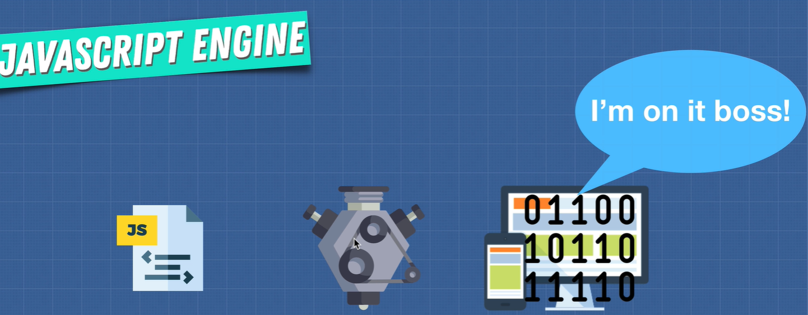{height="40%" width="40%"}

### Inside the Engine

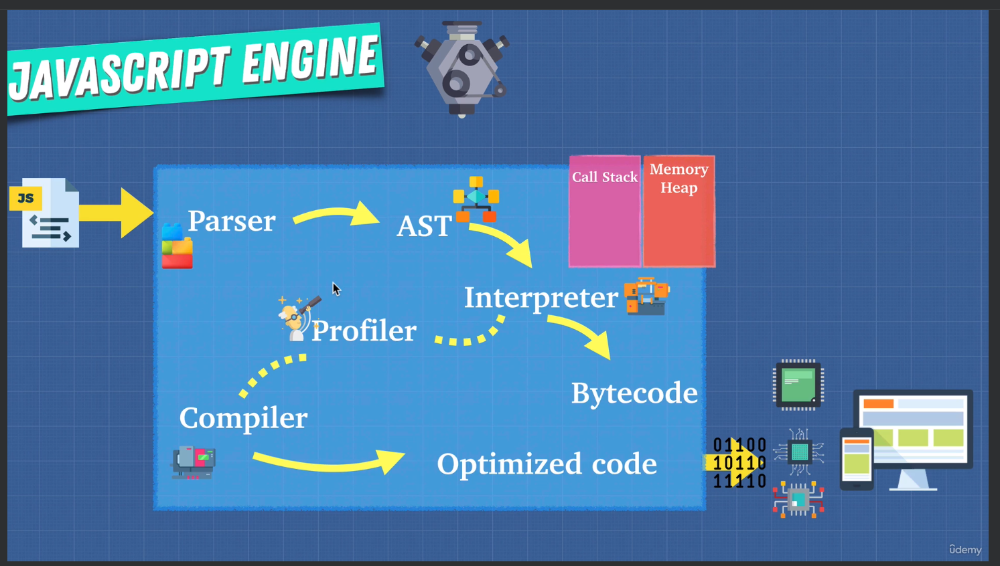{height="40%" width="40%"}

1. Lexical Analyzes/Tokenizing (Parser)
2. AST (Abstract Syntax Tree) [link](https://astexplorer.net/) -> it's a tree representation of the code
3. Interpreter -> ignition -> (Bytecode)
4. Profiler (Monitor) -> TurboFan -> (Optimized Code)
5. Compiler -> JIT Compiler -> (Machine Code)

### Interpreter and Compiler => JIT Compiler

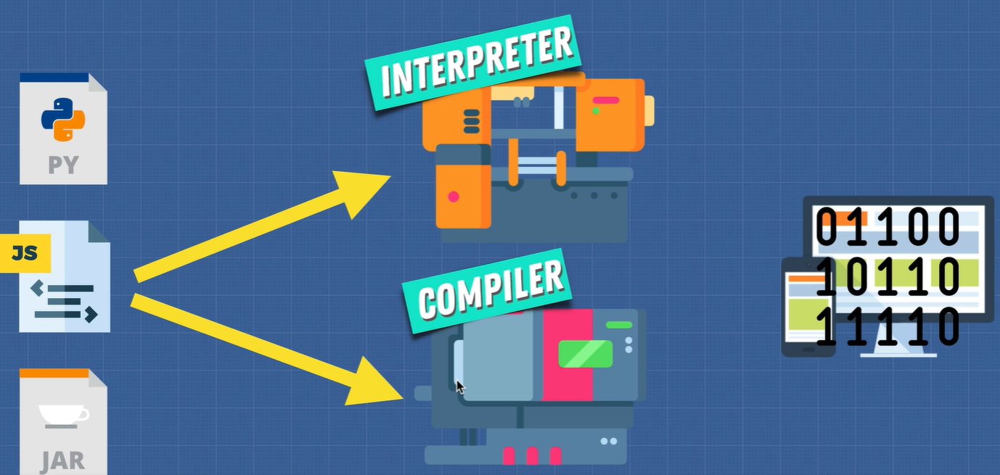{height="40%" width="40%"}

1. Interpreter: Reads the code line by line and runs it
   - It can run the code immediately
   - But it's slow
2. Compiler: Translates the code into machine code and runs it
   - It can optimize the code
   - But it takes some time before the code is executed
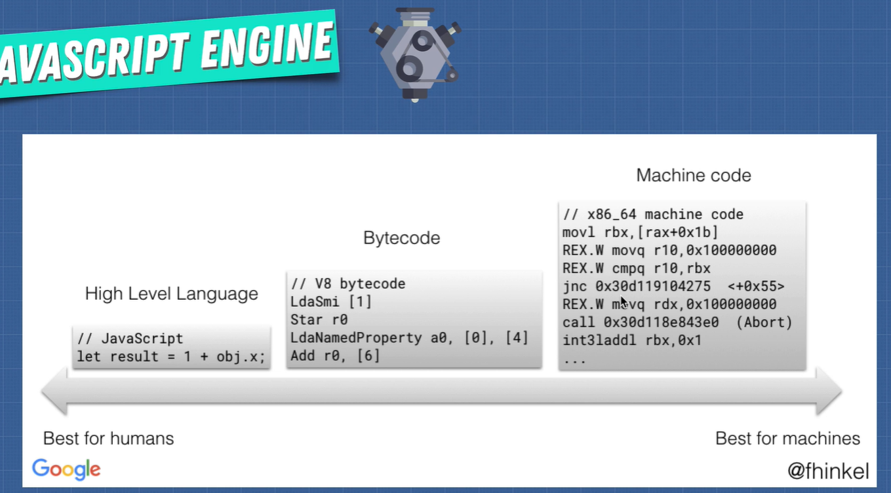{height="40%" width="40%"}

3. JIT Compiler: A mix of both
   - Interpreter: Runs the code immediately
   - Profiler: Monitors the code
   - Compiler: Optimizes the code that is run frequently
   - It's the most used method today
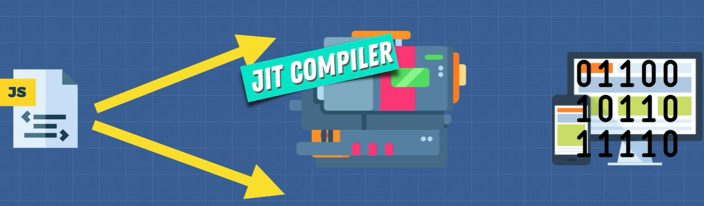{height="40%" width="40%"}
с

## Call Stack + Memory Heap

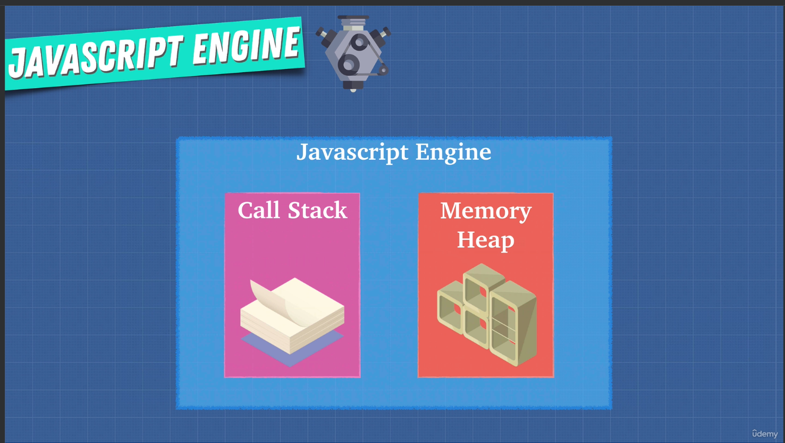{height="40%" width="40%"}

- Call Stack: keeps track of the functions that are being run (where in the program we are)
- Memory Heap: stores the variables and sets up memory space for the variables and functions (where the memory is stored)

### Memory Heap

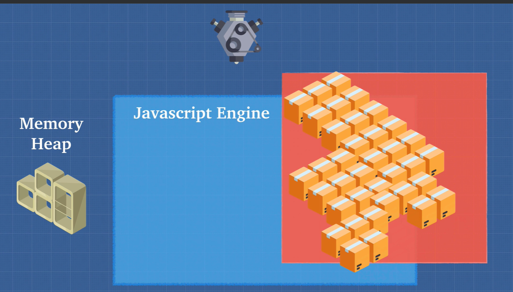{height="40%" width="40%"}

```javascript

// Memory Leak - Global Variable
const number = 610; // allocate memory for number
const string = 'some text'; // allocate memory for a string
const human = { // allocate memory for an object... and its values
  first: 'John',
  last: 'Doe'
};
```

### Call Stack

1. The Call Stack is a data structure that uses the Last In, First Out (LIFO) principle to store and manage function invocation (call)
2. When a function is invoked (called), the function is pushed to the top of the call stack
3. When the function returns, the function is popped from the call stack

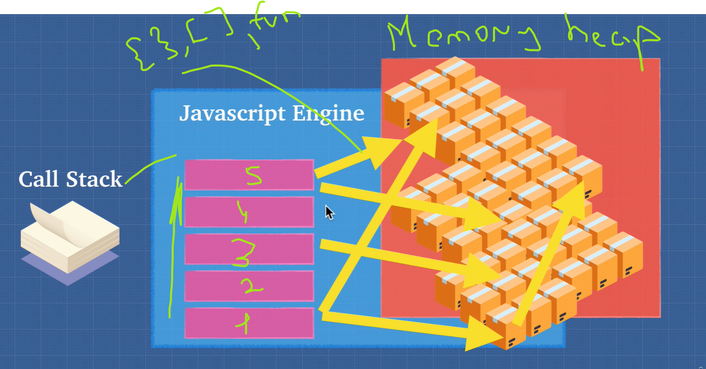{height="40%" width="40%"}

#### Example 1

```javascript

// Call Stack
console.log('1');
// 1. reed 2. put in the stack 3. remove from the stack
console.log('2');
// 1. reed 2. put in the stack 3. remove from the stack
console.log('3');
// 1. reed 2. put in the stack 3. remove from the stack
```

#### Example2

```javascript

// Call Stack
// 7. empty stack
// 6. one() run and remove from the stack
// 5. two() run and remove from the stack
// 4. console.log('4') run and remove from the stack
// 3. console.log('4') put in the stack
// 2. two() put in the stack
// 1. one() put in the stack
const one = () => {
  const two = () => {
    console.log('4');
  }
  two();
}

```

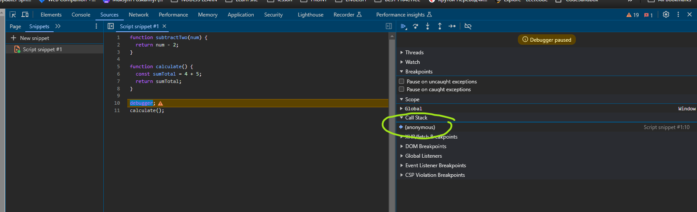{height="40%" width="40%"}

```javascript
function subtractTwo(num) {
  return num - 2;
}

function calculate() {
  const sumTotal = 4 + 5;
  return sumTotal;
}

calculate();
```

### Stack Overflow

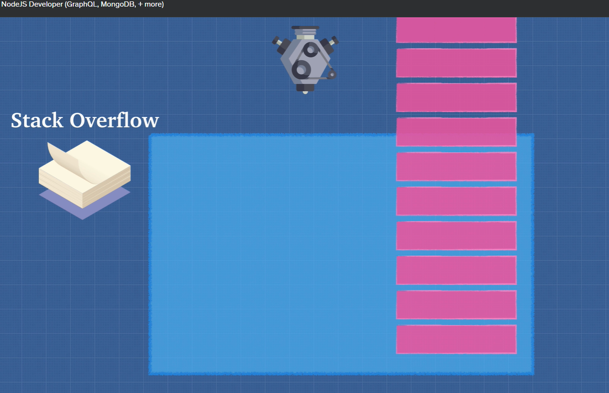{height="40%" width="40%"}

```javascript
function inception() {
  inception();
}
```

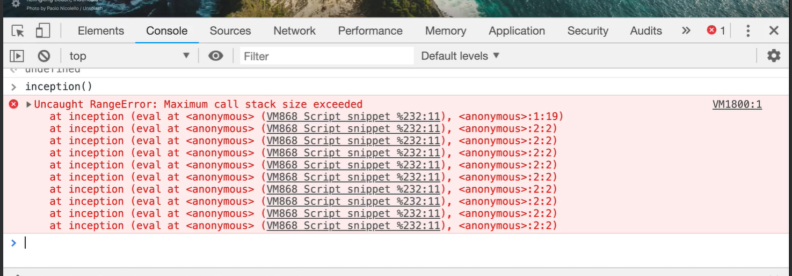{height="40%" width="40%"}

#### Garbage Collection

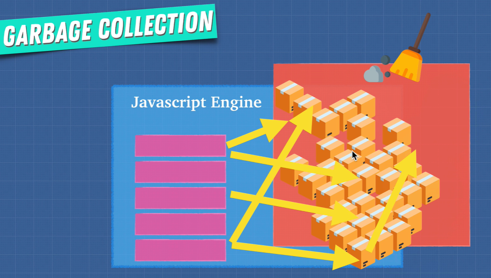{height="40%" width="40%"}

- When we don't need a variable anymore, the garbage collector will remove it from the memory heap
- It's a process that runs automatically in the background

Algorithm: Mark and Sweep

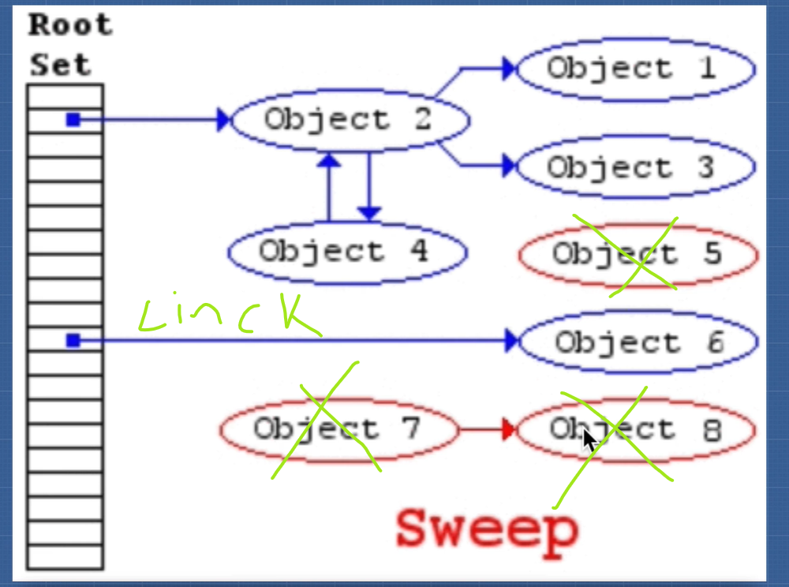{height="40%" width="40%"}

- Mark: The garbage collector will mark the variables that are still being used
- Sweep: The garbage collector will remove the variables that are not being used

#### Memory Leaks

- Memory Leaks are pieces of memory that the application have used in the past, but are not being used anymore

``` javascript
// Global variable
var a = 1;
var b = 1;
var c = 1;

// Event listener
var element = document.getElementById('button');
element.addEventListener('click', onClick);

// setInterval
setInterval(() => {
  // referencing objects...
}, 1000);
```

### Optimized Code

#### Inline Caching

```javascript
function findUser(user) {
  return `Found ${user.firstName} ${user.lastName}`;
}

const userData = {
  firstName: 'Johnson',
  lastName: 'Junior'
};

findUser(userData);
```

#### Hidden Classes

```javascript
function Animal(x, y) {
  this.x = x;
  this.y = y;
}

const obj1 = new Animal(1, 2);
const obj2 = new Animal(3, 4);

obj1.a = 30;
obj1.b = 100;
```

## Single Threaded

{height="40%" width="40%"}

[Link Runtime javascript Viewer](http://latentflip.com/loupe/?code=ZnVuY3Rpb24gcHJpbnRIZWxsbygpIHsNCiAgICBjb25zb2xlLmxvZygnSGVsbG8gZnJvbSBiYXonKTsNCn0NCg0KZnVuY3Rpb24gYmF6KCkgew0KICAgIHNldFRpbWVvdXQocHJpbnRIZWxsbywgMzAwMCk7DQp9DQoNCmZ1bmN0aW9uIGJhcigpIHsNCiAgICBiYXooKTsNCn0NCg0KZnVuY3Rpb24gZm9vKCkgew0KICAgIGJhcigpOw0KfQ0KDQpmb28oKTs%3D!!!PGJ1dHRvbj5DbGljayBtZSE8L2J1dHRvbj4%3D)

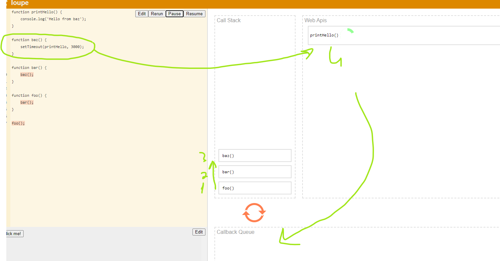{height="40%" width="40%"}

- one set of instructions set executed at a time
- JavaScript is single-threaded

{height="40%" width="40%"}

``` javascript
console.log('1');

setTimeout(() => {
    console.log("2");
}, 1000);

console.log('3');
```

## Different JavaScript Engine and JavaScript Runtime

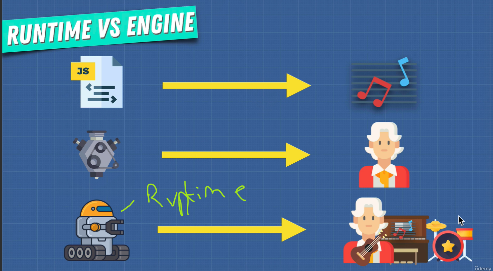{height="40%" width="40%"}

- node js it's a JavaScript runtime

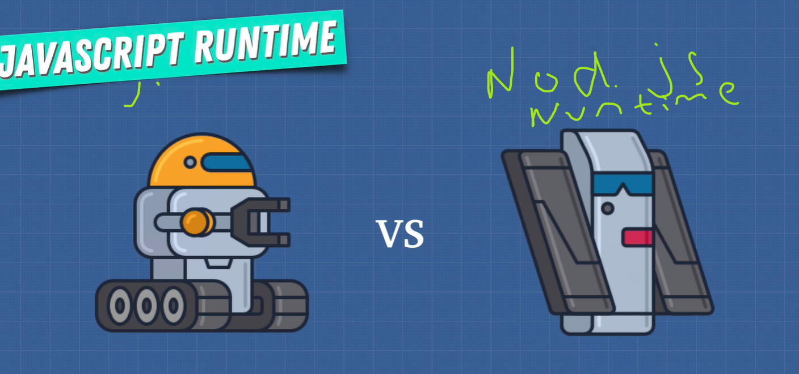{height="40%" width="40%"}

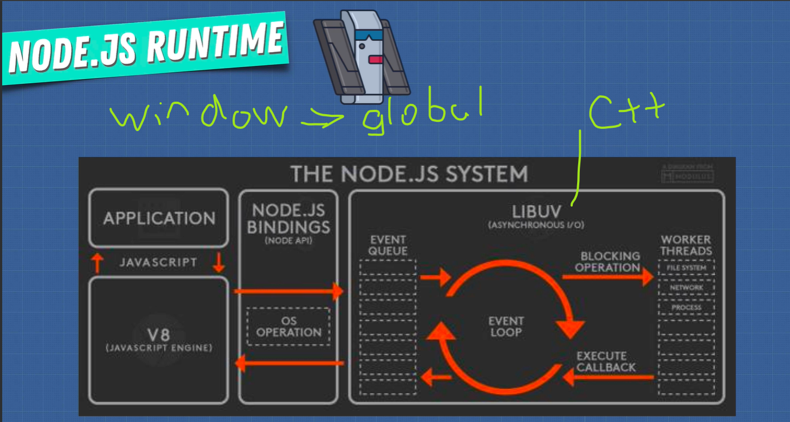{height="40%" width="40%"}

### [Back to top](#fundamentals-concepts-of-javascript)
