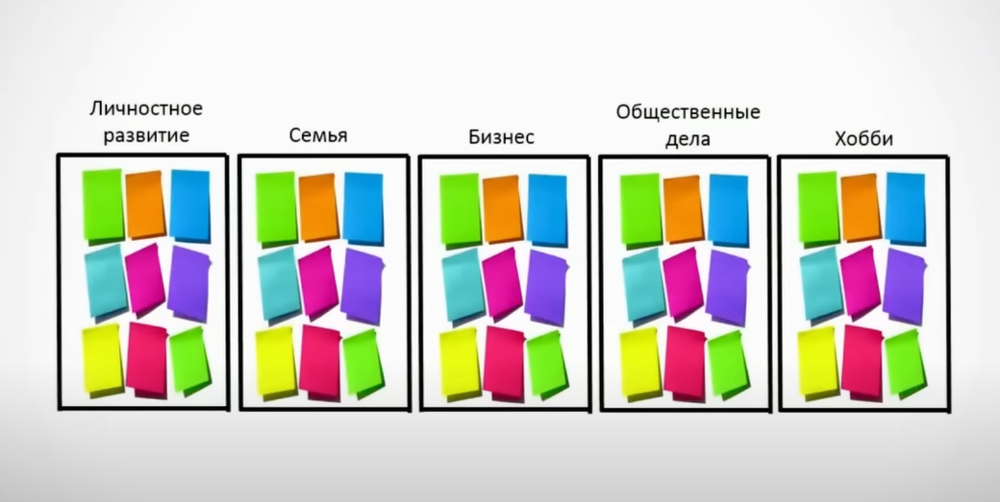

# Main Info Kaizen

## Базовые вопросы

## Мысли о планировании

1. Успешный человек счастливый человек
2. Успех это только действие
3. Ты должен быть уверен как слон
4. Умный должен выбрать способ планирования который исключает сомнение
5. Людей не беспокоит сколько дел вы делали а Только беспокоит сколько дел вы **закончили**
   
6. Кайдзен это принцип постоянного самосовершенствования.
   
7. в голове есть суп (Кайдзен дает ясность формулировок)
   
   
8. все что есть в голове перенести на доску (выгрузить на доску)
9. каждой мысли дать одну карточку
   
10. то что есть в голове но нет на бумаге - вы никогда не осуществите
11. то что вы не видите вы не контролируете

### Материализация мыслей

1. перенос мыслей на бумагу (пока в голове будет пусто)
2. разделить на хочу и должен (что бы понять вы живете своей жизнью или марионетка)

**Ответить на вопрос Кто я и для чего я живу?**
Если вы не сформулировали свое хочу вы будете всегда выполнять чужое хочу.

Представьте 100 литров жидкости ! Потом делите хочу должен. Потом делите на три емкости в зависимости от цели.

Лишнее выкидем в корзину чужое хочу (просто не выкидывать анализировать что бы в будущем не попадаться)

1. занятость человека чем определяется:
   1. отсутствие фильтрова или они засорились
2. избегайте сомнительного (все должно быть четко и ясно)
3. беспокойтесь Только о своем счастье!
4. система настроено на то как больше освободить времени а не как больше сделать дел.
   

### Принцип работы воли

1. воля питается энергией (если вы загнали себя задачами с посаженной батареей)
2. Энергия питает волю (воля без энергии равно нулю)
3. энергия приходит Только тогда когда вы живете счастливой жизнью (в которой есть безделии, чем больше вы наполняете свою жизнь любимыми делами)
4. если вы делаете проект который приближает вас к мечет вы только приобретаете силы (ваша эффективность повышается).
5. у меня есть мечты цели и каждый день приближает меня к мечте. (когда ты выполняешь свое хочу а не чужое)

### Миссия в вашей жизни

    **процесс планирования Этот фильтр надо делать каждый год**

#### Цели в вашей жизни

1. Посмотреть структуру ваших всех хотелок и мыслей в голове
2. Не упустить не одну из этих пяти вещей
3. Этот фильтр дает ощущение полноты жизни что вы делаете все так (убивает все ваши сомнения)
4. Этот фильтр который успокаивает советь и убивает все сомнения

   **счастье это свобода**

   1. физическая (передвижение по стране)
   2. юридическая свобода (передвижение по миру)
   3. финансовая свобода ( есть свобод физическая юридическая а денег нет)

      **Счастье достигается когда у тебя финансовая свобода**

Строим звезду из 5 разделений

Польза обществу тоже надо делать что бы быть счастливым (даже в пеламиде Маслоу есть)

1. Не принуждать

## Канбан доска

1. 5 столбцов с прошлой доски должны быть пустыми
2. Раскидаете по годам 24, 25 по месяцам
3. создать доску на следующий месяца
4. Кайдзен 15 минут в день
5. есть слона кусками
6. в конце месяца перенести все карточки сделанные в колонку сделано в 2024 год (ощущение контроля жизни то что было сделано за месяц)

### Принцип при создании карточки

1. Это делает меня счастливее ? -> это семья хобби или бизнес ? -> в этом году реально сделать ? в каком месяце ?
2. все зависит от контекста в нужное время в нужном месте в нужном количестве

В конце месяца:

1. анализировать что нужно подтянуть в следующий

### Присваивание карточками цвета

1. Семья зеленым, личностное развитие голубым ....
2. В конце месяца готовые карточки переносим в годовую доску сделано

   _Планирование на неделю в другой доске_

### Рутинные дела

1. браниваем сразу время утро с 6 до 11
2. Столько час на гигиену столько спать нужно запланировать только остаток
3. Делать отдельную доску для сложный проектов Сегодня общий столбец

### Основные этапы дня

1. через привычки
2. отметил привычки да нет
3. основные дела 80%
4. сложные проекты (сайты встречи)

   _Карточка это зеркало всех ваших мыслей_

Если нужно делать каждый день нужно возвращать карточку в нужно сделать

Планер дня отдельная шутка
