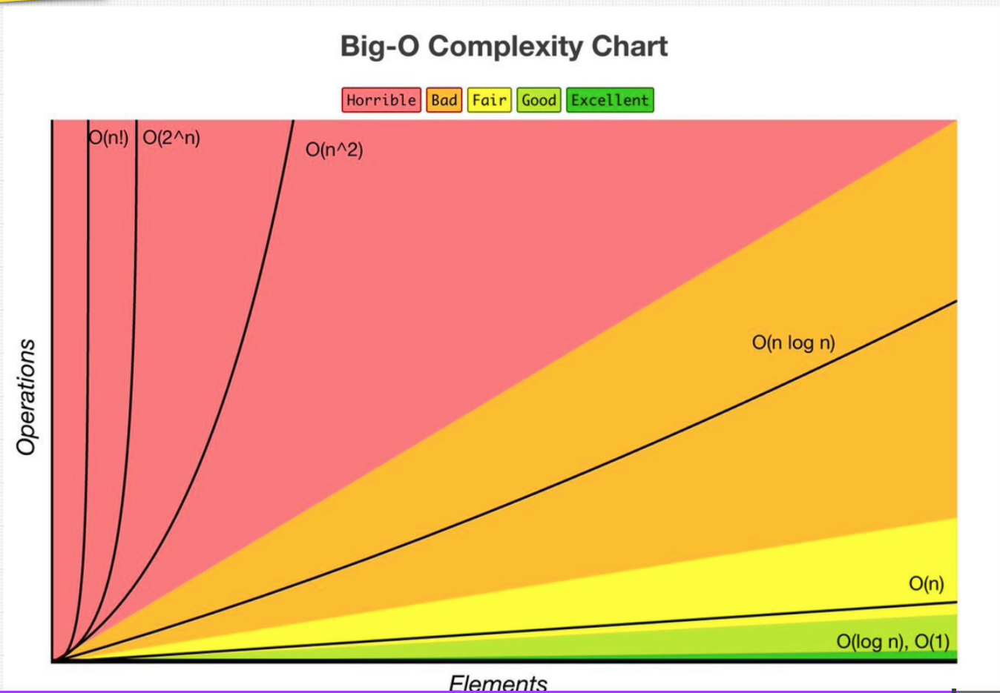
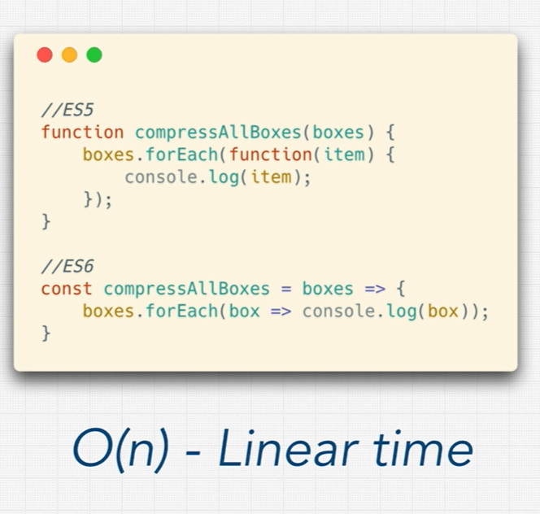
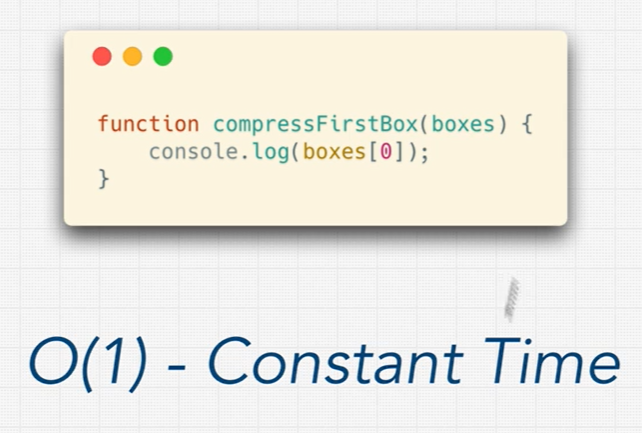

# Links

[Zero to Mastery Big O Cheat Sheet](https://zerotomastery.io/cheatsheets/big-o-cheat-sheet/?utm_source=udemy&utm_medium=coursecontent) - A comprehensive cheat sheet for Big O notation provided by Zero to Mastery.

[Big O Cheat Sheet](https://www.bigocheatsheet.com/) - Another detailed cheat sheet for Big O notation, covering various complexities and their explanations.

## Digram of the Algorithm Efficiency



## Big O Notation

- **O(n)**: Linear Time (Good) loops through all the elements
{ width=300 height=300 }

- **O(1)**: Constant Time (Best) no loops or recursion
{ width=300 height=300 }

## Rule book

1. Rule 1: Worst Case

    ```javascript
        const nemo = ['nemo'];
        const everyone = ['dory', 'bruce', 'marlin', 'nemo', 'gill', 'bloat', 'nigel', 'squirt', 'darla', 'hank'];
        const large = new Array(100000).fill('nemo');
        function findNemo(array) {
            for (let i = 0; i < array.length; i++) {
                if (array[i] === 'nemo') {
                    console.log('Found Nemo!');
                    break; // Stop the loop
                }
            }
        }
    ```

2. Rule 2 **O(n)**: Remove Constants
No matter how big the input is, the number of operations will always be the same.

    ```javascript
        function printFirstItemThenFirstHalfThenSayHi100Times(items) {
            console.log(items[0]); // O(1)

            var middleIndex = Math.floor(items.length / 2); // O(1)
            var index = 0; // O(1)

            while (index < middleIndex) { // O(n/2)
                console.log(items[index]);
                index++;
            }

            for (var i = 0; i < 100; i++) { // O(100)
                console.log('hi');
            }
        }

        // O(1 + 1 + 1 + n/2 + 100) => O(n)
    ```

3. Rule 3 **O(a + b)**: Different terms for inputs

   ```javascript
        function compressBoxesTwice(boxes, boxes2) {
            boxes.forEach(function(boxes) {
                console.log(boxes);
            });

            boxes2.forEach(function(boxes) {
                console.log(boxes);
            });
        }

        // O(a + b) || 0(boxes + boxes2)
   ```

    ```javascript
    const boxes = ["a", "b", "c", "d", "e"];

    function logAllPairsOfArray(array) {
        for (let i = 0; i < array.length; i++) {
            for (let j = 0; j < array.length; j++) {
                console.log(array[i], array[j]);
            }
        }
    }

    logAllPairsOfArray(boxes); // O(n * n) => O(n^2)
    ```

4. Rule 4  **O(n^2)**: Drop Non-Dominant terms

    ```javascript

    function printAllNumbersThenAllPairSums(numbers) {
        console.log('these are the numbers:');
        numbers.forEach(function(number) {
            console.log(number);
        });

        console.log('and these are their sums:');
        numbers.forEach(function(firstNumber) {
            numbers.forEach(function(secondNumber) {
                console.log(firstNumber + secondNumber);
            });
        });
    }

    printAllNumbersThenAllPairSums([1, 2, 3, 4, 5])

    // O(n + n^2) => O(n^2)
    // O(n) + O(n^2) => O(n^2) // Drop the non-dominant term
    // O(n^2 + 3n + 100 + 1000) => O(n^2) // Drop the non-dominant term
    ```
