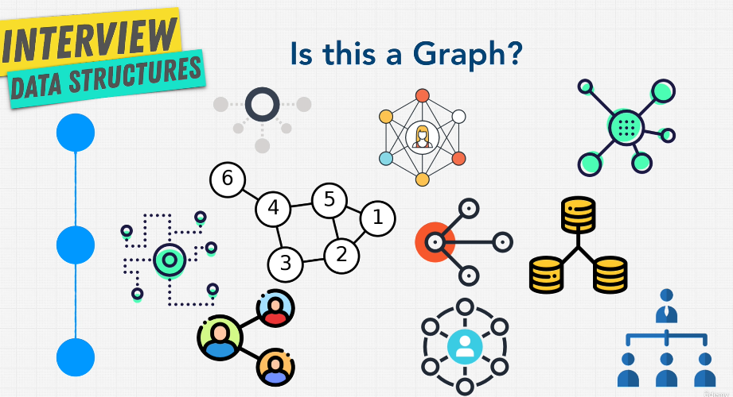
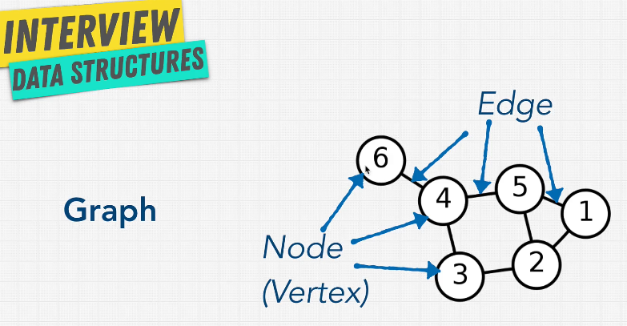
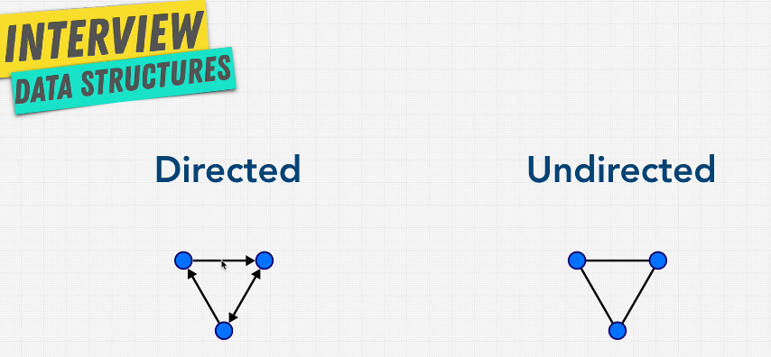
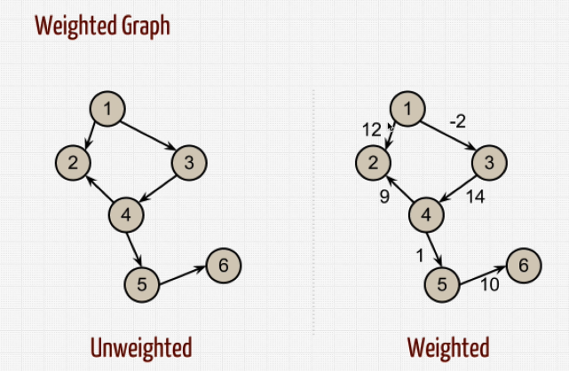
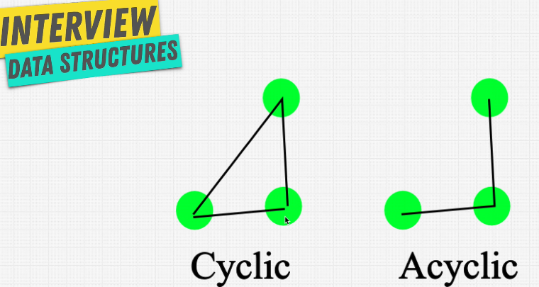
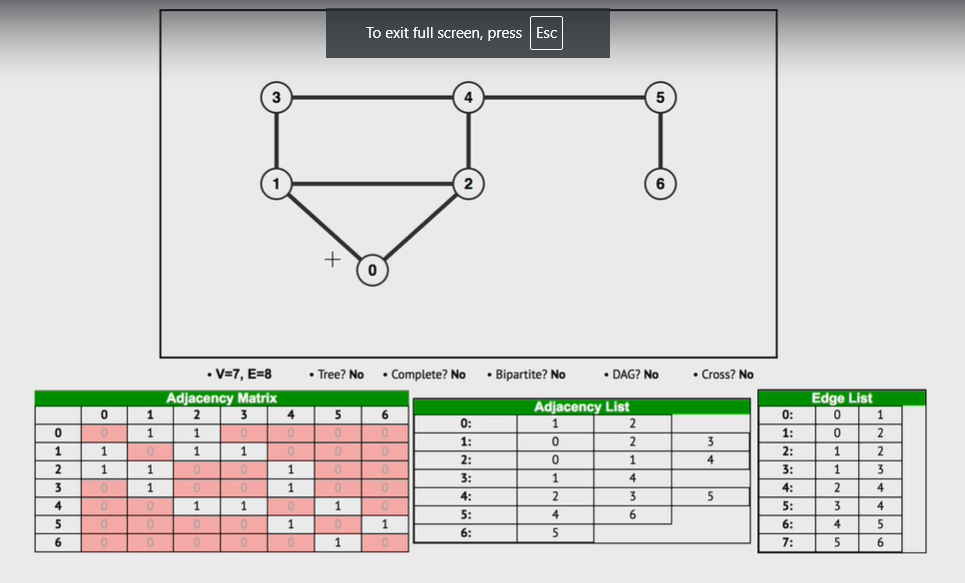

# Data Structure Graph

## Why Graphs?



- Graphs are extremely useful for modeling relationships between data
- Graphs are used in:
  - Social Networks
  - Mapping / GPS
  - Routing Algorithms
  - Visual Hierarchy
  - File System Optimizations
  - Recommendation Engines
  - etc.

## Graph Algorithm

- Graphs are made up of nodes and connections
- Nodes are sometimes called vertices
- Connections are sometimes called edges

## Types of Graphs

- **Directed Graphs**: Edges have direction
- **Undirected Graphs**: Edges do not have direction
- **Weighted Graphs**: Edges have values associated with them
- **Unweighted Graphs**: Edges do not have values associated with them
- **Cyclic Graphs**: Graphs that have cycles
- **Acyclic Graphs**: Graphs that do not have cycles

## Graph Traverse

- **Breadth First Search (BFS)**: Explore all neighbors before moving on to the next level of neighbors
- **Depth First Search (DFS)**: Go as deep as possible down one path before backtracking

### Where Traverse is Used in real life?

- Facebook: BFS to find friends
- LinkedIn: DFS to recommend jobs
- Google: BFS to find nearest restaurant
- Amazon: DFS to recommend products
- Netflix: DFS to recommend movies
- Uber: BFS to find nearest driver
- Airbnb: DFS to recommend places
- etc.

{width=50%}

## Poc and Cons of Graphs

Pros:
    - Relationships
    - Flexibility

Cons:
    - Complex
    - Hard to Debug
    - Hard to Understand
    - Hard to Implement
    - Hard to Optimize

## Directed vs Undirected Graphs

| Undirected Graph | Directed Graph |
| ---------------- | -------------- |
| **Example**: Facebook (Friendship is mutual) | **Example**: Twitter (Following is not mutual) |
| **Example**: Road Network (Traffic can go both ways) | **Example**: One-way Street (Traffic can go only one way) |

{width=50%}

## Weighted Graphs and Unweighted Graphs

| Weighted Graph | Unweighted Graph |
| -------------- | ---------------- |
| **Example**: Flight Paths (Cost of flying between cities) | **Example**: Social Network (Just connections) |
| **Example**: Maps (Distance between cities) | **Example**: Family Tree (Just connections) |
| **Example**: Internet (Latency between servers) | **Example**: Web Crawler (Just connections) |

{width=50%}

## Cyclic vs Acyclic Graphs

- **Cyclic Graphs**: Graphs that have cycles
- **Acyclic Graphs**: Graphs that do not have cycles
- **Cycle**: A cycle is a path that starts and ends at the same node

{width=50%}

## Graph Representation

- **Adjacency List**: A list that stores the connections of each node
- **Adjacency Matrix**: A matrix that stores the connections between nodes
- **Edge List**: A list that shows the connections between nodes

```javascript
// Adjacency Matrix
[
  [0, 1, 0, 0],
  [0, 0, 1, 0],
  [0, 0, 0, 1],
  [1, 0, 0, 0]
]

// Adjacency List
[
  [1],
  [2],
  [3],
  [0]
]

// Edge List
[
  [0, 1],
  [1, 2],
  [2, 3],
  [3, 0]
]
```

## Own Graph Implementation

{width=90%}

```javascript
class Graph {
  constructor() {
    this.numberOfNodes = 0;
    this.adjacentList = {};
  }

  addVertex(node) {
    this.adjacentList[node] = [];
    this.numberOfNodes++;
  }

  addEdge(node1, node2) {
    // Undirected Graph
    this.adjacentList[node1].push(node2);
    this.adjacentList[node2].push(node1);
  }

  showConnections() {
    const allNodes = Object.keys(this.adjacentList);
    for (let node of allNodes) {
      let nodeConnections = this.adjacentList[node];
      let connections = "";
      let vertex;
      for (vertex of nodeConnections) {
        connections += vertex + " ";
      }
      console.log(node + "-->" + connections);
    }
  }
}
```
