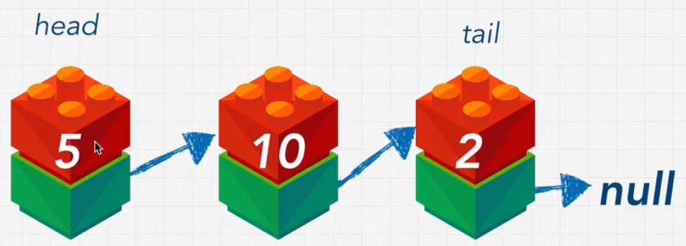
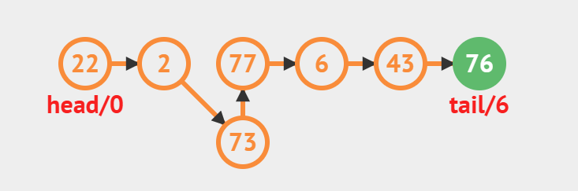
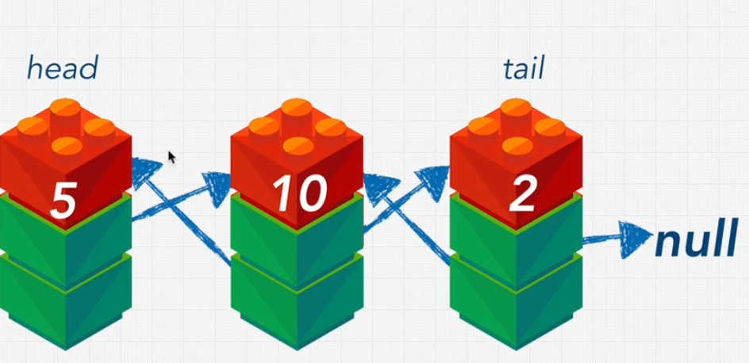

# Data Structure Linked Lists

[link how it's works](https://visualgo.net/en/list)

## Introduction

- A data structure that consists of nodes
- Each node has a value and a reference to the next node in the sequence
- First node is called the `head`
- Last node is called the `tail`
- Last node's reference is `null`

## Linked Lists vs Arrays

| Linked Lists | Arrays |
| ------------- | ------       |
| No indexes    | Indexed      |
| Connected via nodes with a `next` pointer | Contiguous block of memory |
| Slow lookups  | Fast lookups |
| Slow inserts  | Slow inserts |
| Slow deletes  | Slow deletes |
| No fixed size | Fixed size   |

## Bog O Notation

| Operation | Linked Lists    | Doubly LinkedList | Arrays |
| --------- | ------------    | ------------      | ------ |
| Prepend   | O(1)            | O(1)              | O(n)   |
| Append    | O(1)            | O(1)              | O(1)   |
| Lookup    | O(n)            | O(n)              | O(1)   |
| Insert    | O(1) worst O(n) | O(n)              | O(n)   |
| Delete    | O(1) worst O(n) | O(n)              | O(n)   |

## Singly Linked Lists

{width=50%, height=50%}

Start with the head node and follow the next pointers until you reach the end

apples --> grapes --> pears

```javascript
const basket = ['apples', 'grapes', 'pears'];

// apples
// 8947 --> grapes
//          8742 --> pears
//                    372 --> null
```



## Doubly Linked Lists

| Doubly Linked Lists | Singly Linked Lists |
| ------------------- | ------------------- |
| Each node has a reference to the next and previous node | Each node has a reference to the next node |
| Can be traversed in both directions | Can only be traversed in one direction |
| Can be done in O(1) time | Can be done in O(n) time |
| More memory | Less memory |
| More complex | Less complex |

{width=50%, height=50%}

### Own Single Linked List Implementation in JS

```javascript
let myLinkedList = {
    head: {
        value: 10,
        next: {
            value: 5,
            next: {
                value: 16,
                next: null
            }
        }
    }
}

class Node {
    constructor(value) {
        this.value = value;
        this.next = null;
    }
}

class LinkedList {
    constructor(value) {
        this.head = {
            value: value,
            next: null
        }
        this.tail = this.head;
        this.length = 1;

        this.tail = this.head;
        this.length = 1;
    }

    append (value) {
        const newNode = new Node(value);
        this.tail.next = newNode;
        this.tail = newNode;
        this.length++;
        return this;
    }

    prepend(value) {
        const newNode = new Node(value);
        newNode.next = this.head;
        this.head = newNode;
        this.length++;
        return this;
    }

    insert(index, value) {
        if (index >= this.length) {
            return this.append(value);
        }

        const newNode = new Node(value);
        const leader = this.traverseToIndex(index - 1);
        const holdingPointer = leader.next;
        leader.next = newNode;
        newNode.next = holdingPointer;
        this.length++;
        return this.printList();
    }

    traverseToIndex(index) {
        let counter = 0;
        let currentNode = this.head;
        while (counter !== index) {
            currentNode = currentNode.next;
            counter++;
        }
        return currentNode;
    }

    reverse() {
        if (!this.head.next) {
            return this.head;
        }

        let first = this.head;
        this.tail = this.head;
        let second = first.next;

        while (second) {
            const temp = second.next;
            second.next = first;
            first = second;
            second = temp;
        }

        this.head.next = null;
        this.head = first;
        return this.printList();
    }

    remove(index) {
        const leader = this.traverseToIndex(index - 1);
        const unwantedNode = leader.next;
        leader.next = unwantedNode.next;
        this.length--;
        return this.printList();
    }

    printList() {
        const array = [];
        let currentNode = this.head;
        while (currentNode !== null) {
            array.push(currentNode.value);
            currentNode = currentNode.next;
        }
        return array;
    }
}

const myLinkedList = new LinkedList(10);
myLinkedList.append(5); // 10 --> 5
myLinkedList.append(16); // 10 --> 5 --> 16
myLinkedList.prepend(1); // 1 --> 10 --> 5 --> 16
myLinkedList.insert(2, 99); // 1 --> 10 --> 99 --> 5 --> 16
myLinkedList.printList(); // [1, 10, 99, 5, 16]
myLinkedList.remove(2); // 1 --> 10 --> 5 --> 16
```

### Own Double Linked List Implementation in JS

```javascript
let myLinkedList = {
    head: {
        value: 10,
        next: {
            value: 5,
            next: {
                value: 16,
                next: null
            }
        }
    }
}

class Node {
    constructor(value) {
        this.value = value;
        this.next = null;
        this.prev = null;
    }
}

class DoubleLinkedList {
    constructor(value) {
        this.head = {
            value: value,
            next: null,
            prev: null
        }
        this.tail = this.head;
        this.length = 1;

        this.tail = this.head;
        this.length = 1;
    }

    append (value) {
        const newNode = new Node(value);
        newNode.prev = this.tail;
        this.tail.next = newNode;
        this.tail = newNode;
        this.length++;
        return this;
    }

    prepend(value) {
        const newNode = new Node(value);
        newNode.next = this.head;
        this.head.prev = newNode;
        this.head = newNode;
        this.length++;
        return this;
    }

    insert(index, value) {
        if (index >= this.length) {
            return this.append(value);
        }

        const newNode = new Node(value);
        const leader = this.traverseToIndex(index - 1);
        const follower = leader.next;
        leader.next = leader;
        newNode.next = follower;
        follower.prev = newNode;
        this.length++;
        return this.printList();
    }

    traverseToIndex(index) {
        let counter = 0;
        let currentNode = this.head;
        while (counter !== index) {
            currentNode = currentNode.next;
            counter++;
        }
        return currentNode;
    }

    remove(index) {
        const leader = this.traverseToIndex(index - 1);
        const unwantedNode = leader.next;
        leader.next = unwantedNode.next;
        this.length--;
        return this.printList();
    }

    printList() {
        const array = [];
        let currentNode = this.head;
        while (currentNode !== null) {
            array.push(currentNode.value);
            currentNode = currentNode.next;
        }
        return array;
    }
}

const myLinkedList = new DoubleLinkedList(10);
myLinkedList.append(5); // 10 --> 5
myLinkedList.append(16); // 10 --> 5 --> 16
myLinkedList.prepend(1); // 1 --> 10 --> 5 --> 16

```
