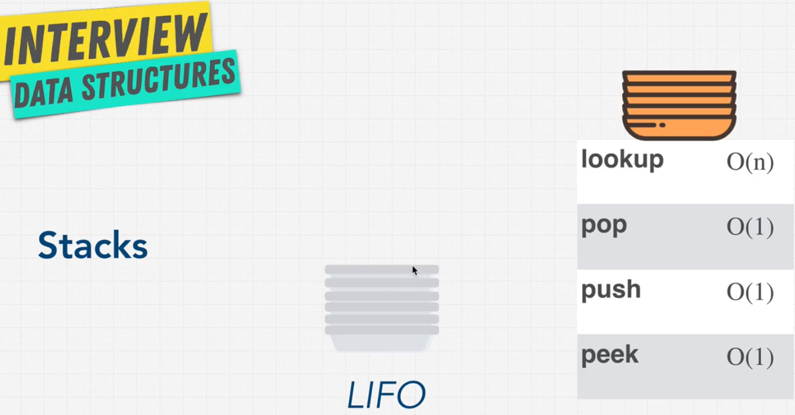
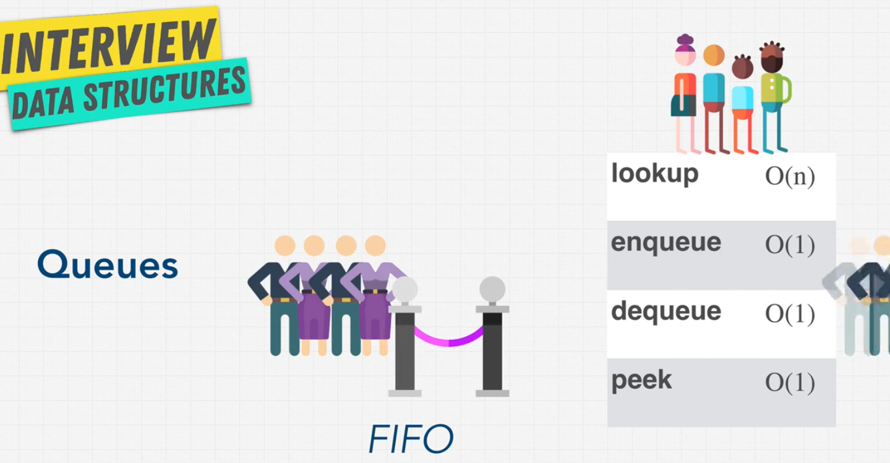

# Data Structures Stacks & Queues

- Stacks and Queues linear data structures

## Stacks Last In First Out (LIFO)

- Stacks are like a stack of plates
- Last item added to the stack is the first item to be removed



- Stacks are used in:
  - Managing function invocations
  - Undo / Redo
  - Routing (the history object) is treated like a stack

## Queues First In First Out (FIFO)

- Queues are like a line at a movie theater
- First item added to the queue is the first item to be removed
- Queues are used in:
  - Background tasks
  - Uploading resources
  - Printing / Task processing



## Array Vs Stack and Queue

| Operation | Array | Stack | Queue |
| --------- | ----- | ----- | ----- |
| Lookup    | O(1)  | O(n)  | O(n)  |
| Push      | O(n)  | O(1)  | O(1)  |
| Pop       | O(n)  | O(1)  | O(1)  |
| Shift     | O(n)  | O(n)  | O(1)  |
| Unshift   | O(n)  | O(n)  | O(n)  |

## Stack Implementation

```javascript
// Browser history stack
// google.com
// udemy.com
// youtube.com

youtube; // pop
udemy; // pop
google; // pop

// Why not use an array?
// We can use an array but we want to restrict the operations to push and pop only

// Why not use Linked List?
// We can use a linked list but it's an overkill for this problem

// Why not use a Queue?
// because we want to remove the last item added to the stack

class Node {
  constructor(value) {
    this.value = value;
    this.next = null;
  }
}

class StackLinkedList {
  constructor() {
    this.top = null;
    this.bottom = null;
    this.length = 0;
  }

  peek() {
    return this.top;
  }

  push(value) {
    const newNode = new Node(value);
    if (this.length === 0) {
      this.top = newNode;
      this.bottom = newNode;
    } else {
      const holdingPointer = this.top;
      this.top = newNode;
      this.top.next = holdingPointer;
    }
    this.length++;
    return this;
  }

  pop() {
    if (!this.top) {
      return null;
    }
    if (this.top === this.bottom) {
      this.bottom = null;
    }
    const holdingPointer = this.top;
    this.top = this.top.next;
    this.length--;
    return this;
  }
}

const myStack = new Stack();
myStack.push('google');
myStack.push('udemy');
myStack.push('youtube');
myStack.pop();


class StackArray {
    constructor() {
        this.array = [];
    }

    peek() {
        return this.array[this.array.length - 1];
    }

    push(value) {
        this.array.push(value);
        return this;
    }

    pop() {
        this.array.pop();
        return this;
    }
}

const myStack = new StackArray();
myStack.push('google');
myStack.push('udemy');
myStack.push('youtube');
```

## Queue Implementation

```javascript
class Node {
  constructor(value) {
    this.value = value;
    this.next = null;
  }
}

class Queue {
  constructor() {
    this.first = null;
    this.last = null;
    this.length = 0;
  }

  peek() {
    return this.first;
  }

  enqueue(value) {
    const newNode = new Node(value);
    if (this.length === 0) {
      this.first = newNode;
      this.last = newNode;
    } else {
      this.last.next = newNode;
      this.last = newNode;
    }
    this.length++;
    return this;
  }

  dequeue() {
    if (!this.first) {
      return null;
    }
    if (this.first === this.last) {
      this.last = null;
    }
    const holdingPointer = this.first;
    this.first = this.first.next;
    this.length--;
    return this;
  }
}

const myQueue = new Queue();
myQueue.enqueue('Joy');
myQueue.enqueue('Matt');
myQueue.enqueue('Pavel');
myQueue.peek();
myQueue.dequeue();
myQueue.dequeue();
myQueue.dequeue();
```

## Queue Using Stack

```javascript
class QueueUsingStack {
  constructor() {
    this.first = [];
    this.last = [];
  }

  enqueue(value) {
    const length = this.first.length;
    for (let i = 0; i < length; i++) {
      this.last.push(this.first.pop());
    }
    this.last.push(value);
    return this;
  }

  dequeue() {
    const length = this.last.length;
    for (let i = 0; i < length; i++) {
      this.first.push(this.last.pop());
    }
    this.first.pop();
    return this;
  }

  peek() {
    if (this.last.length > 0) {
      return this.last[0];
    }
    return this.first[this.first.length - 1];
  }
}

const myQueue = new QueueUsingStack();
myQueue.enqueue('Joy');
myQueue.enqueue('Matt');
myQueue.enqueue('Pavel');
myQueue.peek();
myQueue.dequeue();
myQueue.dequeue();

```
