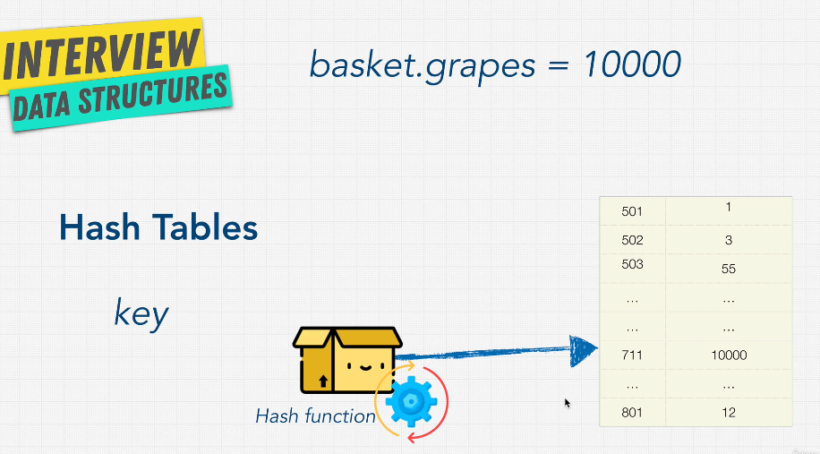
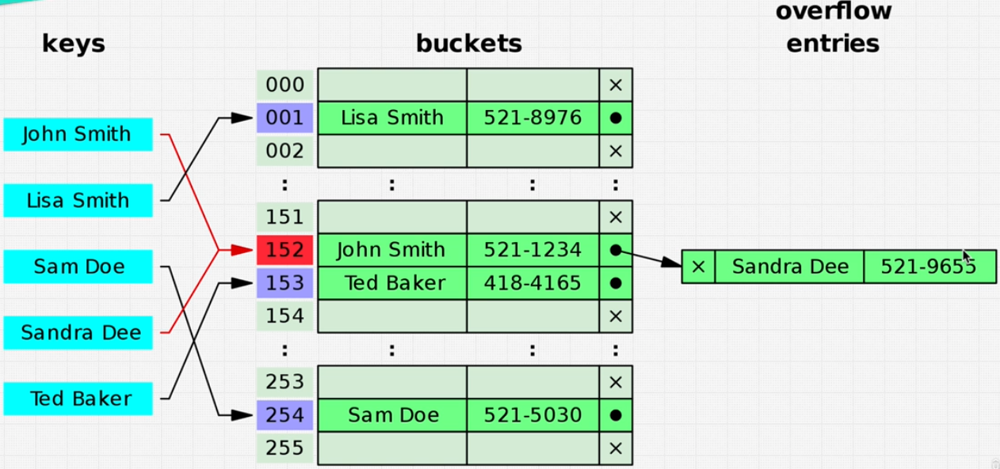
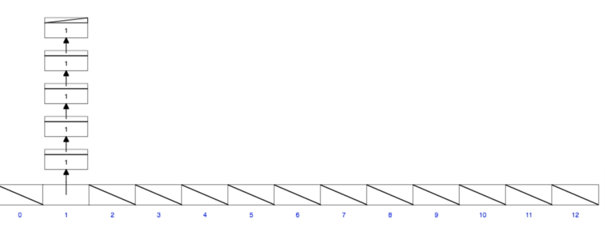

# Data Structure Hash Tables

- In JavaScript, objects function as hash tables
- Java has Maps
- Python has dictionaries
- Ruby has hash tables

## Hash Tables VS Arrays

| Hash Tables          | Arrays              |
| -------------------- | ------------------- |
| keys are not ordered | keys are ordered    |
| keys are unique      | keys are not unique |
| O(1) lookup          | O(1) lookup         |
| O(1) insert          | O(n) insert         |
| O(1) delete          | O(n) delete         |

## Hash Tables

- key-value pairs
- keys are unique
- keys are hashed to store in memory



## JS Objects are Hash Tables

```javascript
let user =
{
    age: 54,
    name: 'Kylie',
    magic: true,
    scream: function() {
        console.log('ahhhhhhhhh');
    }
}

user.age // O(1)
user.spell = 'abra kadabra'; // O(1)
```

### Hash function

[MD5 Hash Generator](https://www.miraclesalad.com/webtools/md5.php)

- takes a key and returns an index
- ideally, the hash function should return a unique index for each key

## Collisions

- two keys can have the same hash
- two keys can have the same index


[Example of Hash Creation](https://www.cs.usfca.edu/~galles/visualization/OpenHash.html)


Big O of Hash Tables is O(1) but in the worst case scenario it can be O(n)

## Hash Table Implementation in JS (ES6)

### SET VS MAP

| Set             | Map                    |
| --------------- | ---------------------- |
| stores keys     | stores key-value pairs |
| keys are unique | keys are unique        |
| O(1) lookup     | O(1) lookup            |
| O(1) insert     | O(1) insert            |
| O(1) delete     | O(1) delete            |

```javascript
const a = new Map(); // O(1)
const b = new Set(); // O(1)
```

### CREATED OWN HASH TABLE

```javascript
class  HashTable {
    constructor(size) {
        this.data = new Array(size);
    }

    _hash(key) { // O(1)
        let hash = 0;
        for (let i = 0; i < key.length; i++) {
            hash = (hash + key.charCodeAt(i) * i) % this.data.length;
        }
        return hash;
    }

    set(key, value) { // O(1)
        let address = this._hash(key);
        if (!this.data[address]) {
            this.data[address] = [];
        }
        this.data[address].push([key, value]);
    }

    get(key) { // O(1)
        let address = this._hash(key);
        const currentBucket = this.data[address];
        if (currentBucket) {
            for (let i = 0; i < currentBucket.length; i++) {
                if (currentBucket[i][0] === key) {
                    return currentBucket[i][1];
                }
            }
        }
    }

    keys() {
    if (!this.data.length) {
      return undefined;
    }
    let result = [];
    // loop through all the elements
    for (let i = 0; i < this.data.length; i++) {
        // if it's not an empty memory cell
        if (this.data[i] && this.data[i].length) {
          // but also loop through all the potential collisions
          if (this.data.length > 1) {
            for (let j = 0; j < this.data[i].length; j++) {
              result.push(this.data[i][j][0])
            }
          } else {
            result.push(this.data[i][0]);
          }
        }
    }
    return result;
  }
}

const myHashTable = new HashTable(50);
myHashTable.set('grapes', 10000);
myHashTable.get('grapes');
```
