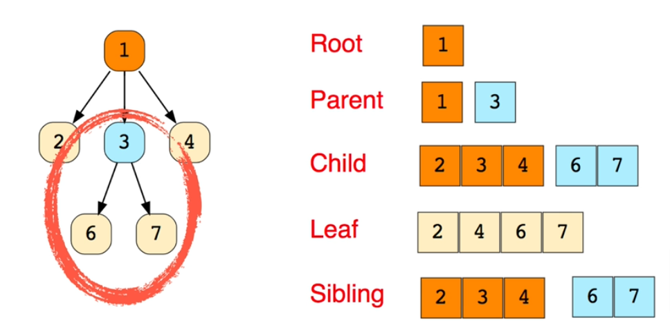
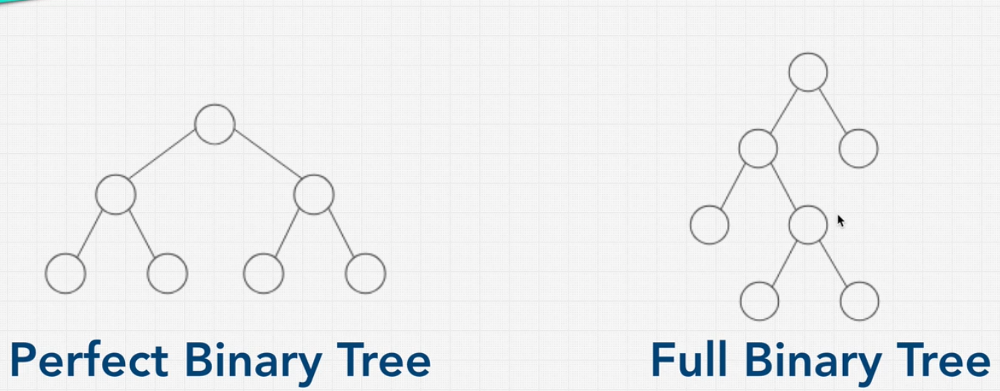

# Data Structure Trees

- Trees are a data structure that consists of nodes in a parent/child relationship
- Trees are non-linear, unlike arrays, linked lists, stacks, and queues
- Trees are used to store hierarchical data

## Where Trees are Used

- HTML DOM
- Network Routing
- Abstract Syntax Trees
- Artificial Intelligence
- Folders in Operating Systems
- Computer File Systems
- JSON
- React's Virtual DOM
- Redux State Management Library
- Binary Search Trees

## Main concepts

{width=80% height=80%}

### Trees Terminology

- **Root**: The top node in a tree
- **Parent**: The converse notion of a child
- **Child**: A node directly connected to another node when moving away from the Root
- **Leaf**: A node with no children
- **Siblings**: A group of nodes with the same parent

## Binary Trees

- Each node can have a  two children
- Each child can only have one parent

### Binary Example

{width=80% height=80%}

#### Perfect Binary Tree

- Every level of the tree is fully filled;
- All leaf nodes are at the same level;
- Bottom level is filled from left to right;
- Each parent has two children nodes;
- Each last level has +1 nodes than the previous level.

#### Full Binary Tree

- Every node has 0 or 2 children
- No nodes have only one child

``` javascript

function BinaryTreeNode(value) {
  this.value = value;
  this.left = null;
  this.right = null;
}
```

### Big O of Binary Trees O(log n)

.png>){width=70% height=70%}

### Level Treas

``` plaintext
Level 0: 2^0 = 1 node
Level 1: 2^1 = 2 nodes
Level 2: 2^2 = 4 nodes
Level 3: 2^3 = 8 nodes

# of nodes = 2^h - 1
log nodes = steps

log 100 = 2
10^2 = 100
```

### Dived and Conquer

- **Divide**: Break the problem down into smaller chunks
- **Conquer**: Solve the smaller chunks
