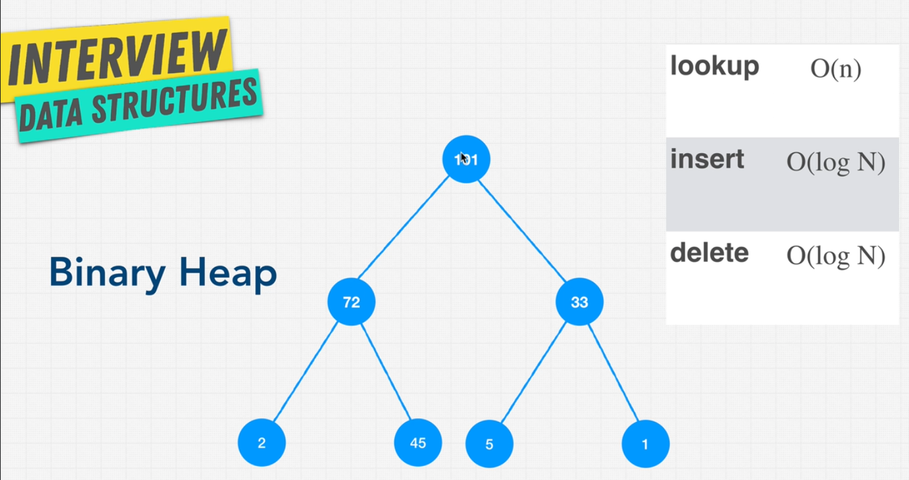

# Data Structure Binary Heap Treas

## What is a Binary Heap?

- Binary Heap is a type of binary tree with two additional constraints:
  - Shape property
  - Heap property

- **Shape Property**: Binary Heap is a complete binary tree. This means that all levels of the tree are fully filled except possibly for the last level, which is filled from left to right.
- **Heap Property**: In a max heap, for any given node C, if P is a parent node of C, then the key (the value) of P is greater than or equal to the key of C. In a min heap, the key of P is less than or equal to the key of C.

## Where Binary Heap Trees are Used

- **Priority Queues**: Binary Heaps are used to implement priority queues.
- **Graph Algorithms**: Binary Heaps are used in graph algorithms like Dijkstra's Shortest Path and Prim's Minimum Spanning Tree.
- **Order Statistics**: Binary Heaps are used to implement efficient priority queues and sorting algorithms like Heap Sort.
- **Job Scheduling**: Binary Heaps are used to implement job scheduling algorithms.
- **Data Compression**: Binary Heaps are used in Huffman Codes.
- **Operating Systems**: Binary Heaps are used in memory management.
- **Bandwidth Management**: Binary Heaps are used in QoS (Quality of Service) management.
- **Networking**: Binary Heaps are used in routing algorithms.

## Binary Heap algorithms

{width=70% height=70%}

- **Max Heap**: The key at the root must be the maximum key of all keys present in the heap.
- **Min Heap**: The key at the root must be the minimum key of all keys present in the heap.

## Pros and Cons

- **Pros**:
  - Better than O(n)
  - Priority
  - Flexible Size
  - Fast Insertion

- **Cons**:
  - Slow Lookup
  - Slow deletion
