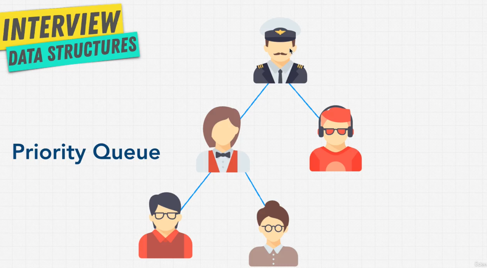

# Data Structure Trees Priority Queue

## What is a Priority Queue?

- A priority queue is a data structure where each element has a priority.
- Elements with a higher priority are served before elements with a lower priority.
- Priority queues are typically implemented with heaps, but can be implemented with other data structures like an unordered array or a sorted array.

## Priority Queue algorithms

{width=70% height=70%}
