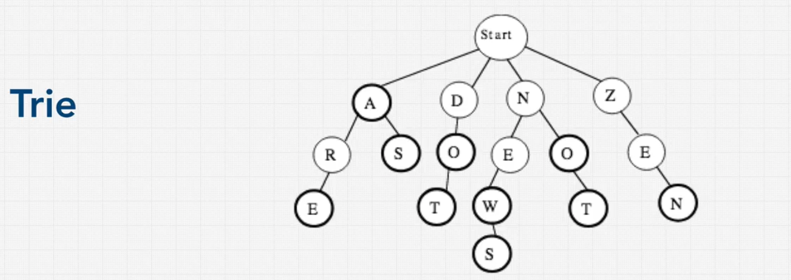

# Data Structure Trees Trie

## What is a Trie?

- Trie is a tree-like data structure that stores a dynamic set of strings.
- Tries are used to store strings that can be visualized like a tree.
- Tries are used to store strings that can be searched quickly.

## Where Tries are Used

- **Auto-Complete**: Tries are used to implement auto-complete features in search engines.
- **Spell Checkers**: Tries are used to implement spell checkers.
- **IP Routing**: Tries are used to implement IP routing tables in routers.
- **Prefix Matching**: Tries are used to implement prefix matching in networking.
- **T9 Predictive Text**: Tries are used to implement T9 predictive text on old mobile phones.
- **Solr and Elastic Search**: Tries are used to implement search engines like Solr and Elastic Search.
- **Symbol Tables**: Tries are used to implement symbol tables in compilers.

## Trie algorithms

{width=90% height=90%}
