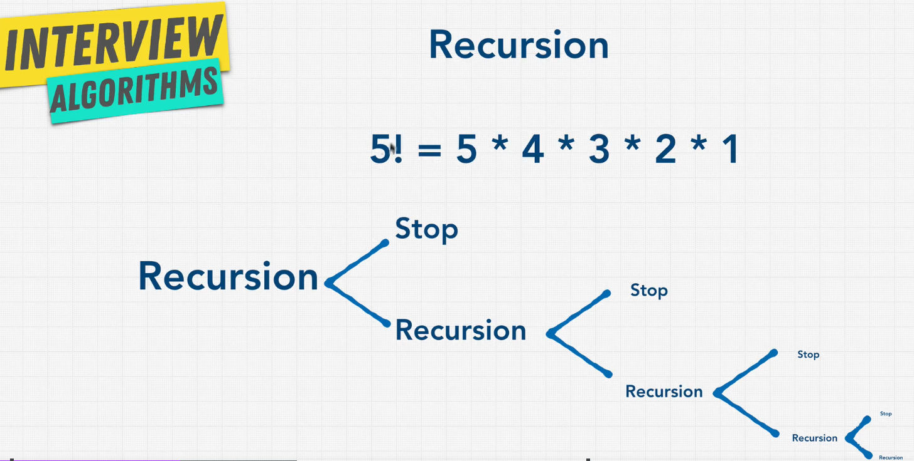
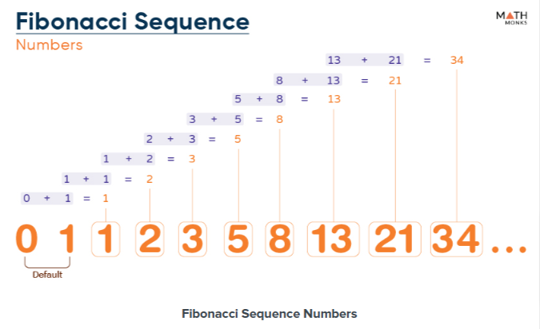

# Recursion Algorithm

## What is Recursion?

Recursion is a method where the solution to a problem depends on solutions to smaller instances of the same problem.

- Recursion it's define as a function that calls itself.

## Recursion for File System

- Recursion is a great way to traverse a file system.

```powershell
ls

ls -R
```

## Where Recursion is used?

- Recursion is used in many algorithms, such as:
  - Binary Search
  - Merge Sort
  - Quick Sort
  - Tree Traversal
  - Graph Traversal
  - Dynamic Programming
  - Backtracking

## When to use Recursion?

1. For sorting algorithms, such as merge sort and quick sort.
2. For tree traversal algorithms, such as in-order, pre-order, and post-order.
3. For graph traversal algorithms, such as depth-first search and breadth-first search.

## Stack Overflow

- Recursion can lead to stack overflow if the depth of the recursion is too high.
- To avoid stack overflow, we can use tail recursion.

## Recursion Base example

```javascript
let counter = 0;

function inception() {
  console.log(counter);
  if (counter > 3) {
    return 'done!';
  }
  counter++;
  return inception(); //! Always need to return the function
}

```

## BASE RULES OF RECURSION

1. Identify the base case

    ```javascript
        if (counter > 3) {
        return 'done!';
        }
    ```

2. Identify the recursive case

    ```javascript
        counter++;
        return inception();
    ```

3. Get closer and closer and return when needed. Usually you have 2 returns.

    ```javascript
        return inception();
    ```

## Recursion Factorial Example

{width=50%}

- Factorial is the product of an integer and all the integers below it.
- Factorial is notated with an exclamation mark.

```notated
    - 5! = 5 * 4 * 3 * 2 * 1  = 120
    - 4! = 4 * 3 * 2 * 1 = 24
    - 3! = 3 * 2 * 1  = 6
    - 2! = 2 * 1 = 2
    - 1! = 1 = 1
```

```javascript
function findFactorialRecursive(number) { //! O(n)
  if (number === 2) { //! Stop condition
    return 2;
  }
  return number * findFactorialRecursive(number - 1); //! Recursive call
}

findFactorialRecursive(5); //! 120
```

```javascript
function findFactorialIterative(number) { //! O(n)
  let answer = 1;
  if (number === 2) {
    answer = 2;
  }
  for (let i = 2; i <= number; i++) {
    answer = answer * i;
  }
  return answer;
}

findFactorialIterative(5); //! 120
```

## Recursion Fibonacci Example

{width=50%}

- Fibonacci is a sequence of numbers in which each number is the sum of the two preceding ones, usually starting with 0 and 1.

```notated
    - 0, 1, 1, 2, 3, 5, 8, 13, 21, 34, 55, 89, 144, ...
```

```javascript
function fibonacciRecursive(n) { //! O(2^n) - Exponential time
    if (n < 2) { //! Stop condition
        return n;
    }
    return fibonacciRecursive(n - 1) + fibonacciRecursive(n - 2); //! Recursive call
}
```

```javascript
function fibonacciIterative(n) { //! O(n)
    let arr = [0, 1];
    for (let i = 2; i <= n; i++) {
        arr.push(arr[i - 2] + arr[i - 1]);
    }
    return arr[n];
}
```

## Recursion VS Iterative

| Recursion | Iterative |
|-----------|-----------|
| Easier to read and understand | Harder to read and understand |
| Easier to implement | Harder to implement |
| Easier to test | Harder to test |
| Uses more memory | Uses less memory |
| Slower | Faster |
