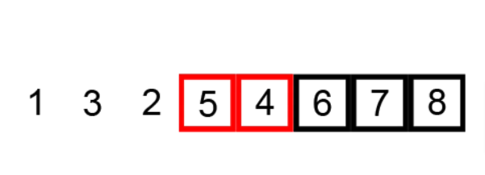

# Algorithms Sorting Bubble

## Main concepts and definitions

### 1. What is Bubble Sort?

Bubble Sort is a simple sorting algorithm that **repeatedly steps through the list**, compares adjacent elements, and **swaps them if they are in the wrong order**. The pass through the list is repeated until no swaps are needed, which indicates that the list is sorted.

{width=50%}

### 2. Why is Bubble Sort important?

Bubble Sort is a simple sorting algorithm that is **easy to understand** and **implement**. It is **useful for small datasets** or when the list is almost sorted.

## Time and Space Complexity

### Time Complexity

| Complexity | Best Case | Average Case | Worst Case |
|------------|-----------|--------------|------------|
| Time       | O(n)      | O(n^2)       | O(n^2)     |

Bubble Sort has a **time complexity of O(n^2)** in the worst case, where n is the number of elements in the list. This is because the algorithm **compares each element with every other element** in the list, resulting in n * (n-1) / 2 comparisons in the worst case.

### Space Complexity

| Complexity | Worst Case |
|------------|------------|
| Space      | O(1)       |

Bubble Sort has a **space complexity of O(1)** because it **only requires a constant amount of extra space**.

## Implementation in JavaScript

Here is an example of Bubble Sort implemented in JavaScript:

```javascript

const numbers = [5, 3, 8, 4, 2];

function bubbleSort(arr) {
    let len = arr.length;
    for (let i = 0; i < len; i++) {
        for (let j = 0; j < len - i - 1; j++) {
            if (arr[j] > arr[j + 1]) {
                let temp = arr[j];
                arr[j] = arr[j + 1];
                arr[j + 1] = temp;
            }
        }
    }
    return arr;
}
```
