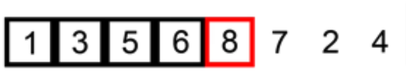

# Algorithm Sorting Insertion

## Main concepts and definitions

### 1. What is Insertion Sort?

Insertion Sort is a simple sorting algorithm that **builds the final sorted list one item at a time**. It **selects an element** from the unsorted part and **inserts it into its correct position** in the sorted part. This process is repeated until the entire list is sorted.

{width=50%}

1. Black items are sorted.
2. White items are unsorted.
3. Red item is the current item being inserted.

### 2. Why is Insertion Sort important?

Insertion Sort is a simple sorting algorithm that is **easy to understand** and **implement**. It is **useful for small datasets** or when the list is almost sorted.

## Time and Space Complexity

### Time Complexity

| Complexity | Best Case | Average Case | Worst Case |
|------------|-----------|--------------|------------|
| Time       | O(n)      | O(n^2)       | O(n^2)     |

Insertion Sort has a **time complexity of O(n^2)** in the worst case, where n is the number of elements in the list. This is because the algorithm **compares each element with every other element** in the list, resulting in n * (n-1) / 2 comparisons in the worst case.

### Space Complexity

| Complexity | Worst Case |
|------------|------------|
| Space      | O(1)       |

Insertion Sort has a **space complexity of O(1)** because it **only requires a constant amount of extra space**.

## Implementation in JavaScript

Here is an example of Insertion Sort implemented in JavaScript:

```javascript

const numbers = [5, 3, 8, 4, 2];

function insertionSort(arr) {
    let len = arr.length;
    for (let i = 1; i < len; i++) {
        let key = arr[i];
        let j = i - 1;
        while (j >= 0 && arr[j] > key) {
            arr[j + 1] = arr[j];
            j = j - 1;
        }
        arr[j + 1] = key;
    }
    return arr;
}

insertionSort(numbers) // [2, 3, 4, 5, 8] O(n^2)
```
