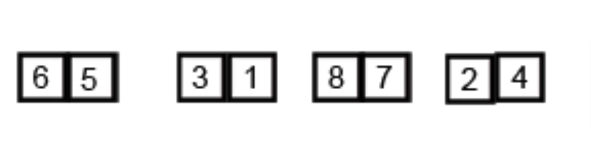

# Algorithm Sorting Merge

## Main concepts and definitions

### 1. What is Merge Sort?

Merge Sort is a **divide-and-conquer** algorithm that **divides the input array into two halves**, recursively sorts the two halves, and then **merges the sorted halves**. It is a **stable sorting algorithm** that is **efficient** and **general-purpose**.



### 2. Why is Merge Sort important?

Merge Sort is an important sorting algorithm because it has a **time complexity of O(n log n)**, which is **optimal** for comparison-based sorting algorithms. It is also **stable**, meaning that it **preserves the relative order of equal elements** in the sorted list.

## Time and Space Complexity

### Time Complexity

| Complexity | Best Case | Average Case | Worst Case |
|------------|-----------|--------------|------------|
| Time       | O(n log n)| O(n log n)   | O(n log n) |

Merge Sort has a **time complexity of O(n log n)** in all cases, where n is the number of elements in the list. This is because the algorithm **divides the list into two halves** at each level of recursion, resulting in a **log n** factor, and then **merges the two halves** in linear time.

### Space Complexity

| Complexity | Worst Case |
|------------|------------|
| Space      | O(n)       |

Merge Sort has a **space complexity of O(n)** because it **requires additional space** to store the two halves of the list during the merge step. This additional space is proportional to the size of the input list.

## Implementation in JavaScript

Here is an example of Merge Sort implemented in JavaScript:

```javascript

const numbers = [5, 3, 8, 4, 2];

function mergeSort(arr) {
    if (arr.length <= 1) {
        return arr;
    }

    const mid = Math.floor(arr.length / 2);
    const left = arr.slice(0, mid);
    const right = arr.slice(mid);

    return merge(mergeSort(left), mergeSort(right));
}


function merge(left, right) {
    let result = [];
    let leftIndex = 0;
    let rightIndex = 0;

    while (leftIndex < left.length && rightIndex < right.length) {
        if (left[leftIndex] < right[rightIndex]) {
            result.push(left[leftIndex]);
            leftIndex++;
        } else {
            result.push(right[rightIndex]);
            rightIndex++;
        }
    }

    return result.concat(left.slice(leftIndex)).concat(right.slice(rightIndex));
}

mergeSort(numbers) // [2, 3, 4, 5, 8] O(n log n)
```
