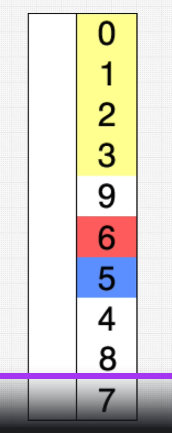

# Algorithms Sorting Selection

## Main concepts and definitions

### 1. What is Selection Sort?

Selection Sort is a simple sorting algorithm that **divides the input list into two parts**: the **sorted part** at the beginning and the **unsorted part** at the end. The algorithm **selects the smallest element** from the unsorted part and **swaps it with the first element** in the unsorted part. This process is repeated until the entire list is sorted.

{width=50%, height=300}

1. Yellow items are sorted.
2. White items are unsorted.
3. Red item is the smallest item in the unsorted part.
4. Blue it is the current item being compared.

### 2. Why is Selection Sort important?

Selection Sort is a simple sorting algorithm that is **easy to understand** and **implement**. It is **useful for small datasets** or when the list is almost sorted.

## Time and Space Complexity

### Time Complexity

| Complexity | Best Case | Average Case | Worst Case |
|------------|-----------|--------------|------------|
| Time       | O(n^2)    | O(n^2)       | O(n^2)     |

Selection Sort has a **time complexity of O(n^2)** in the worst case, where n is the number of elements in the list. This is because the algorithm **repeatedly finds the minimum element** in the unsorted part and **swaps it with the first element** in the unsorted part, resulting in n * (n-1) / 2 comparisons in the worst case.

### Space Complexity

| Complexity | Worst Case |
|------------|------------|
| Space      | O(1)       |

Selection Sort has a **space complexity of O(1)** because it **only requires a constant amount of extra space**.

## Implementation in JavaScript

Here is an example of Selection Sort implemented in JavaScript:

```javascript

const numbers = [5, 3, 8, 4, 2];

function selectionSort(arr) {
    let len = arr.length;
    for (let i = 0; i < len; i++) {
        let min = i;
        for (let j = i + 1; j < len; j++) {
            if (arr[j] < arr[min]) {
                min = j;
            }
        }
        if (min !== i) {
            let temp = arr[i];
            arr[i] = arr[min];
            arr[min] = temp;
        }
    }
    return arr;
}

selectionSort(numbers); // [2, 3, 4, 5, 8] O(n^2)
```
