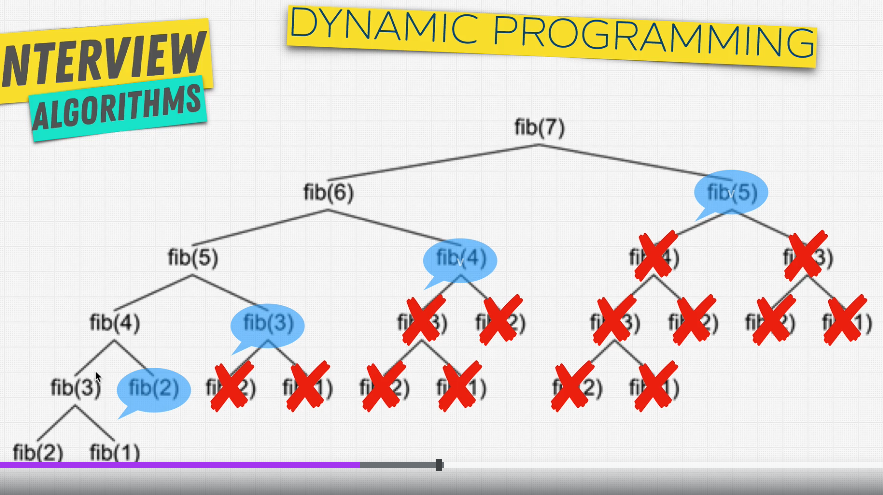

# Dynamic Programming Main

## What is Dynamic Programming?

- It's a method for solving a complex problem by breaking it down into simpler subproblems.
- Using cashing to store the results of the subproblems so that you don't have to recompute them.

## When to use Dynamic Programming?

- When a problem can be broken down into simpler subproblems.
- When you are given a recursive solution that has repeated calls for the same inputs.
- When you can store the results of the subproblems to avoid recomputation.

## When to use in real life?

- Fibonacci numbers
- Shortest path in a graph
- React components rendering
- Longest common subsequence

## Types of Dynamic Programming

1. **Memoization (Top-down):** It's a technique of storing the results of expensive function calls and returning the cached result when the same inputs occur again.

## Memoization

- It's a technique of storing the results of expensive function calls and returning the cached result when the same inputs occur again.
- It's a top-down approach.
- It's a recursive approach.

### Memoization Example 1

```javascript
function addTo80(n) {
  console.log("Long time...");
  return n + 80;
}

function memoizedAddTo80(n) {
  let cache = {}; // Memoization cache object to store the results of the subproblems to avoid recomputation.
  return function (n) {
    if (n in cache) {
      return cache[n];
    } else {
      console.log("Long time...");
      cache[n] = n + 80;
      return cache[n];
    }
  };
}

const memoized = memoizedAddTo80();
console.log(memoized(5)); // Long time... 85
console.log(memoized(5)); // 85
```

### Memoization Example 2 (Fibonacci)




#### Fibonacci (Exponential Time Complexity) (O(2^n) - Exponential time complexity)

```javascript
function fibonacci(n) { // O(2^n) - Exponential time complexity - Bad performance
  if (n < 2) {
    return n;
  }
  return fibonacci(n - 1) + fibonacci(n - 2);
}

fibonacci(6); // 8
```

#### Fibonacci (Memoization) (O(n) - Linear time complexity)

```javascript
function fibonacci( ) {
    let cache = {}; // Memoization cache object to store the results of the subproblems to avoid recomputation.
    return function fib(n) {
        if (n in cache) {
            return cache[n];
        } else {
            if (n < 2) {
                return n;
            } else {
                cache[n] = fib(n - 1) + fib(n - 2);
                return cache[n];
            }
        }
    };
}

const fib = fibonacci();
fib(6); // 8
```

### Memoization Example 3 ( Fibonacci - Iterative Approach)

```javascript
function fibonacci(n) {
  let fib = [0, 1];
  for (let i = 2; i <= n; i++) {
    fib[i] = fib[i - 1] + fib[i - 2];
  }
  return fib[n];
}

```

## Interview Questions: Dynamic Programming Links

[House Robber](https://leetcode.com/problems/house-robber/)
[Climbing Stairs](https://leetcode.com/problems/climbing-stairs/)
[Best Time to Buy and Sell Stock](https://leetcode.com/problems/best-time-to-buy-and-sell-stock/description/)
