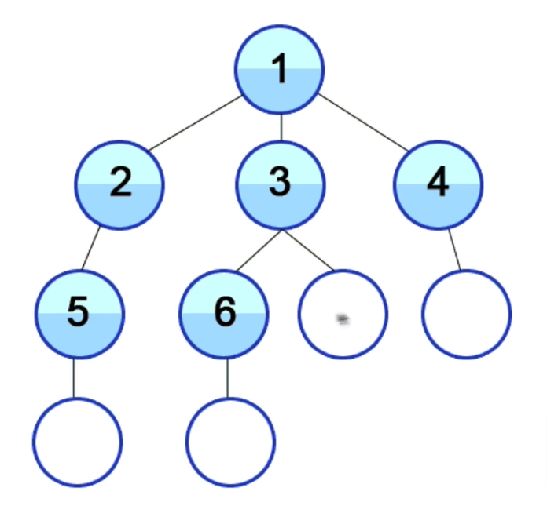
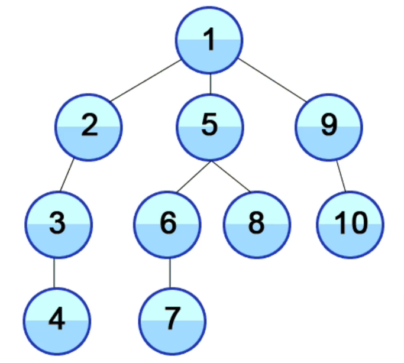

# Searching Algorithms: BFS + DFS

## How BFS and DFS work

- **BFS** and **DFS** are two fundamental algorithms for searching through data structures.
- They are used to traverse **graphs** and **trees**, and can be used to solve a variety of problems.
- They are both used to search for **nodes** in a graph or tree, but they do so in different ways.

## BFS vs DFS

| **BFS** | **DFS** |
| --- | --- |
| **Breadth First Search** | **Depth First Search** |
| Uses a **queue** | Uses a **stack** |
| Explores all **neighbors** before moving on to the next level of neighbors | Goes as deep as possible down one path before **backtracking** |
| **Shortest path** | Not necessarily the shortest path |
| More **memory** | Less memory |

## Breadth First Search (BFS)

{width=50%}

- Going left to right, level by level

- **BFS** is a graph traversal algorithm that starts at a node and explores all of its neighbors at the present depth prior to moving on to the nodes at the next depth level.
- It uses a **queue** to keep track of the nodes to visit next.
- **BFS** is used to find the **shortest path** between two nodes in an unweighted graph.

## Depth First Search (DFS)

{width=50%}

- Going as deep as possible down one path before backtracking
- **DFS** is a graph traversal algorithm that starts at a node and explores as far as possible along each branch before backtracking.
- It uses a **stack** to keep track of the nodes to visit next.

## EXAMPLES

BFS and DFS can be used to solve a variety of problems. Here are some examples:

1. **BFS** If you know a solution is not far from the root of the tree

2. **BFS** (DFS will take long) If the tree is very deep and solutions are rare

3. **DFS** (BFS will need to much memory) If the tree is very wide

4. **DFS** If solutions are frequent but located deep in the tree

5. **DFS** Determining whether a path exists between two nodes:

6. **DFS** Finding the shortest path
