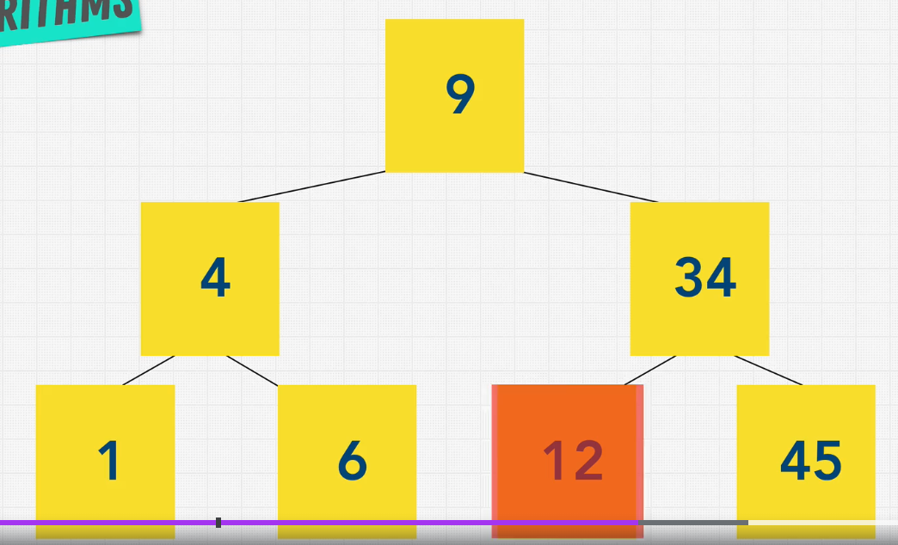

# Binary Search

## What is Binary Search?

Binary Search is a **divide and conquer** algorithm that **searches for a target value** in a **sorted array**. It **compares the target value** to the **middle element** of the array and **reduces the search space** by half based on the comparison. This process is repeated until the target value is found or the search space is empty.

{width=50%}

## Why is Binary Search important?

Binary Search is an important search algorithm because it has a **time complexity of O(log n)**, which is **optimal** for searching algorithms. It is **efficient** and **general-purpose**, making it suitable for a wide range of applications.

## Time and Space Complexity

### Time Complexity

| Complexity | Best Case | Average Case | Worst Case |
|------------|-----------|--------------|------------|
| Time       | O(1)      | O(log n)     | O(log n)   |

Binary Search has a **time complexity of O(log n)** in all cases, where n is the number of elements in the list. This is because the algorithm **divides the search space in half** at each step, resulting in a **log n** factor.

### Space Complexity

| Complexity | Worst Case |
|------------|------------|
| Space      | O(1)       |

Binary Search has a **space complexity of O(1)** because it **only requires a constant amount of extra space**.

## Implementation in JavaScript

Here is an example of Binary Search implemented in JavaScript:

```javascript

const numbers = [2, 4, 6, 8, 10, 12, 14, 16, 18, 20];

function binarySearch(arr, target) {
    let left = 0;
    let right = arr.length - 1;

    while (left <= right) {
        let mid = Math.floor((left + right) / 2);

        if (arr[mid] === target) {
            return mid;
        } else if (arr[mid] < target) {
            left = mid + 1;
        } else {
            right = mid - 1;
        }
    }

    return -1;
}

binarySearch(numbers, 10) // 4

```
