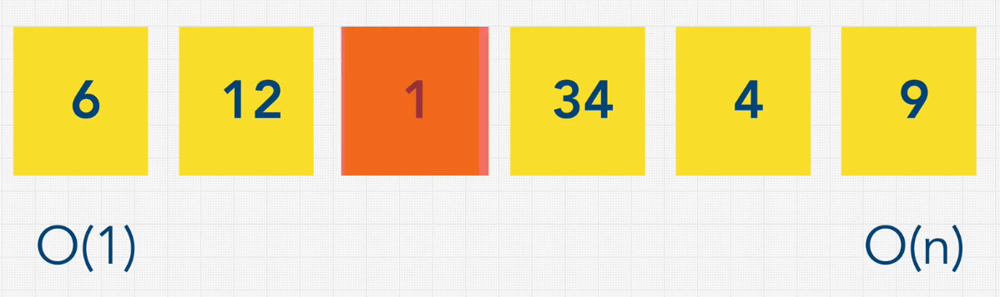

# Linear Search

## What is Linear Search?

Linear Search is a simple search algorithm that **iterates through each element** in a list to find the target value. It **compares each element** with the target value until a match is found or the list is exhausted.

{width=40%}

## Why is Linear Search important?

Linear Search is an important search algorithm because it is **simple** and **easy to implement**. It is **useful for small datasets** or when the list is **unsorted**.

## Time and Space Complexity

### Time Complexity

| Complexity | Best Case | Average Case | Worst Case |
|------------|-----------|--------------|------------|
| Time       | O(1)      | O(n)         | O(n)       |

Linear Search has a **time complexity of O(n)** in the worst case, where n is the number of elements in the list. This is because the algorithm **iterates through each element** in the list to find the target value.

### Space Complexity

| Complexity | Worst Case |
|------------|------------|
| Space      | O(1)       |

Linear Search has a **space complexity of O(1)** because it **only requires a constant amount of extra space**.

## Implementation in JavaScript

Here is an example of Linear Search implemented in JavaScript:

```javascript

var beast = ["Centaur", "Godzilla", "Mosura", "Minotaur", "Hydra", "Nessie"];

beast.indexOf("Godzilla"); // 1
beast.findIndex((item) => item === "Godzilla"); // 1
beast.find((item) => item === "Godzilla"); // "Godzilla"
beast.includes("Godzilla"); // true
```
