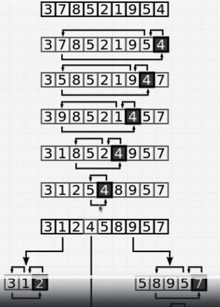
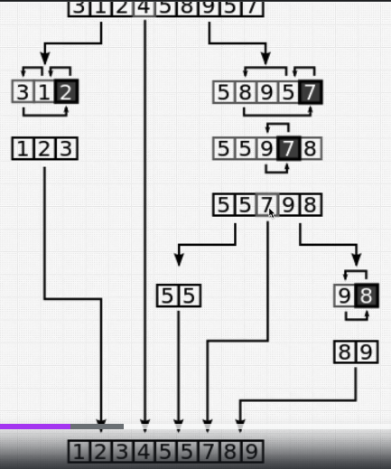

# Algorithm Sorting QuickSort

## Main concepts and definitions

### 1. What is Quick Sort?

Quick Sort is a **divide-and-conquer** algorithm that **selects a pivot element** from the input array, **partitions the array into two subarrays** according to the pivot, and then **recursively sorts the subarrays**. It is an **efficient** and **general-purpose** sorting algorithm that is widely used in practice.




### 2. Why is Quick Sort important?

Quick Sort is an important sorting algorithm because it has an **average-case time complexity of O(n log n)**, which is **optimal** for comparison-based sorting algorithms. It is also **in-place**, meaning that it **does not require additional space** beyond the input array.

## Time and Space Complexity

### Time Complexity

| Complexity | Best Case | Average Case | Worst Case |
|------------|-----------|--------------|------------|
| Time       | O(n log n)| O(n log n)   | O(n^2)     |

Quick Sort has an **average-case time complexity of O(n log n)**, where n is the number of elements in the list. This is because the algorithm **divides the list into two subarrays** at each level of recursion, resulting in a **log n** factor, and then **partitions the subarrays** in linear time.

### Space Complexity

| Complexity | Worst Case |
|------------|------------|
| Space      | O(log n)   |

Quick Sort has a **space complexity of O(log n)** in the worst case because it **requires additional space** for the recursive calls on the subarrays. This additional space is proportional to the **log n** factor due to the recursive nature of the algorithm.

## Implementation in JavaScript

Here is an example of Quick Sort implemented in JavaScript:

```javascript

const numbers = [5, 3, 8, 4, 2];

function quickSort(arr) {
    if (arr.length <= 1) {
        return arr;
    }

    const pivot = arr[arr.length - 1];
    const left = [];
    const right = [];

    for (let i = 0; i < arr.length - 1; i++) {
        if (arr[i] < pivot) {
            left.push(arr[i]);
        } else {
            right.push(arr[i]);
        }
    }

    return [...quickSort(left), pivot, ...quickSort(right)];
}

quickSort(numbers) // [2, 3, 4, 5, 8] O(n log n)
```
