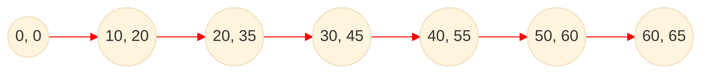
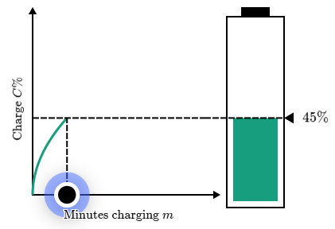
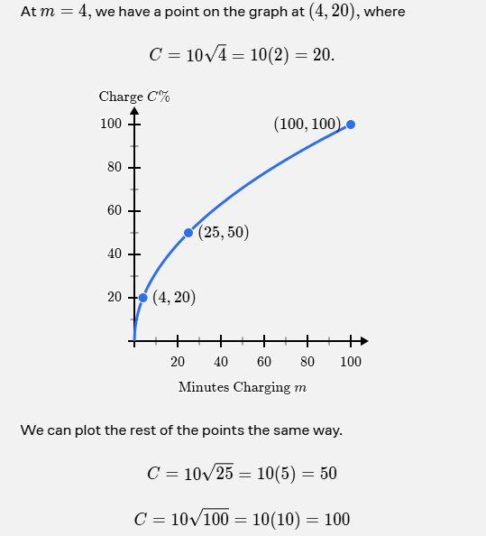
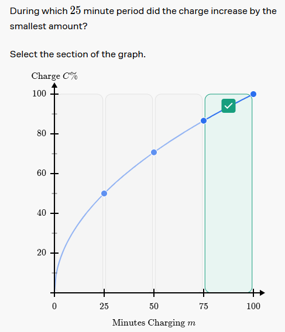

# Understanding Graphs

 
## Diminishing Returns

Some situations have diminishing returns — where fast gains are followed by slower gains.

Let's picture what diminishing returns look like when charging a phone.

- The first 10 minutes of charging might get you 20% battery.
- The next 10 minutes might get you 15% more.

Charging a phone can be modeled with the equation:

$$
\text{С} = 10\sqrt{3}
$$

Where `time` is the number of minutes charging and `T` is a constant that depends on the phone.

## Charging Graph

Here is a graph representing the charging process with x and y coordinates:

