# Geometry

## Angles in Polygons

1. an angle is formed when two lines meet.
2. Between 0 and 180 degrees.

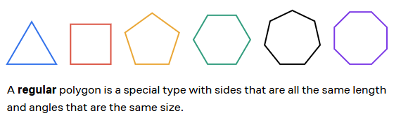

### Hexagon

1. 6 sides
2. 6 angles
3. 720 degrees
4. Each angle is 120 degrees

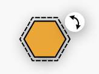

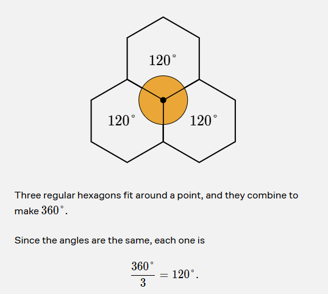

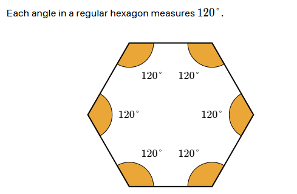

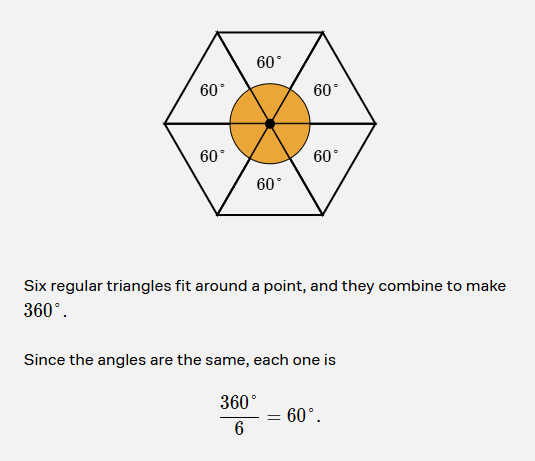

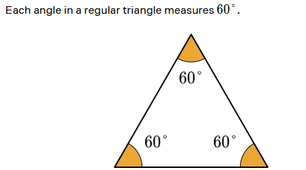

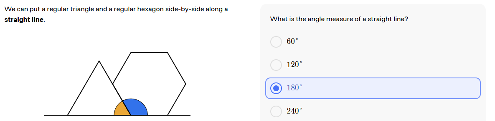

### Quadrilateral

1. 4 sides
2. 4 angles
3. 360 degrees
4. Each angle is 90 degrees

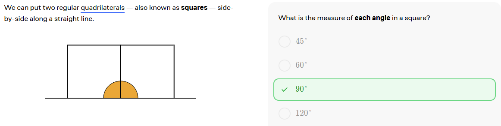

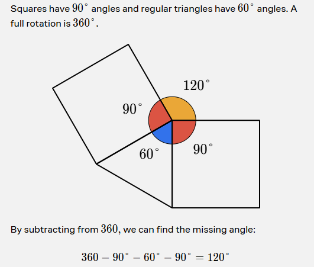

## Exterior and Interior Angles

### Exterior Polygons Angles

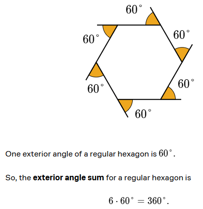

Which of these regular polygons has the greatest exterior angle sum?

1. Triangle (3 sides) = 360 degrees
2. Square (4 sides) = 360 degrees
3. Pentagon (5 sides) = 540 degrees
4. Hexagon (6 sides) = 720 degrees

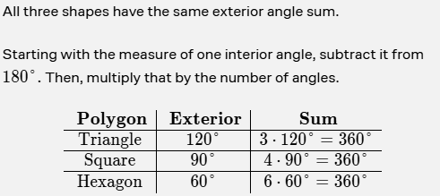

### Interior Polygons Angles

Two adjacent angles in a polygon that share a side are called **adjacent angles**.

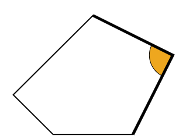